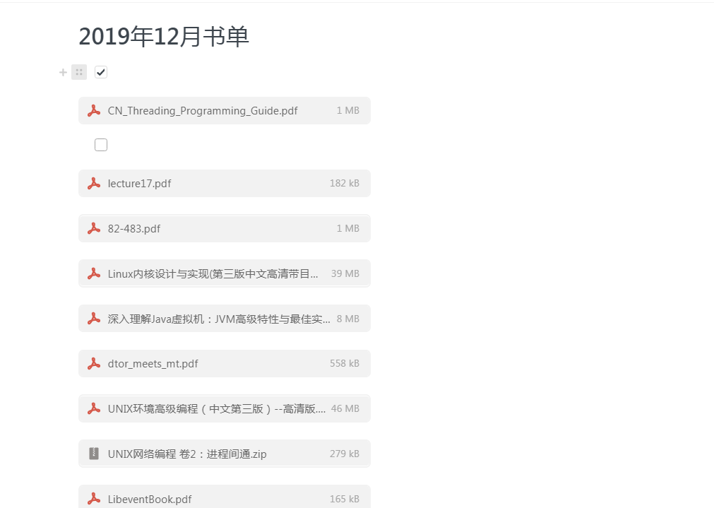

# GTD践行第13周（2020第5周） 

# 一周记录

> 越少越具体说明有可能做到，
>
> 说一大堆，看似很好，自动很懂
>
> 其实 一个一个做不到，给你一万年也做不到。
>
> 计划中的，想法和观点统统都不要

2020第5周报

工作

本周开始手工构建个人管理系统 写代码，在视频方向和AI方向

专业基础c++，一问三不知备受打击，感觉技术和其他方向没有发展

阅读技术类书籍一本 ，陈浩的<<liunx多线程服务器编程>>  从xx也到xx也

阅读非技术类一本  李笑来的<<通往财富的自由之路>> 5章节

朗读：神奇的校车和黑猫警长

# 一. **ARTS的初衷**

 

| 周一 | 周二          | 周三 | 周四       | 周五 | 周六           | 周日      |
| ---- | ------------- | ---- | ---------- | ---- | -------------- | --------- |
|      | **Algorithm** |      | **Review** |      | **Review/Tip** | **Share** |

### 1. Algorithm

> **主要是为了编程训练和学习。**每周至少做一个 leetcode 的算法题（先从Easy开始，然后再Medium，最后才Hard）。进行编程训练，如果不训练你看再多的算法书，你依然不会做算法题，看完书后，你需要训练。。

| 题目 | 分类 | 日期 |
| ---- | ---- | ---- |
|      |      |      |

### 2. Review 

> 主要是为了学习英文，如果你的英文不行，你基本上无缘技术高手。所以，需要你阅读并点评至少一篇英文技术文章，我个人最喜欢去的地方是[http://Medium.com](https://link.zhihu.com/?target=http%3A//Medium.com)

阅读：https://selenium-python.readthedocs.io/locating-elements.html#locating-elements

### 3. Tip

> 主要是为了总结和归纳你在是常工作中所遇到的知识点。学习至少一个技术技巧。你在工作中遇到的问题，踩过的坑，学习的点滴知识。

### 4.  Share

>主要是为了建立你的影响力，能够输出价值观。分享一篇有观点和思考的技术文章。

# 二 . 起床-运动-阅读

 ## 意志力实验

### step 1 思想准备：

- 为了不在收外界诱惑，你彻底放下对电视剧，综艺节目，电影，动漫

热爱，无论在好明星演员，在好剧情，在好制作。多少亿点击，

你统统说不，还有60秒短视频更加厉害，让几个月无法走出，你说不

因为看一秒，一天一夜无法方向，一个月一个星期堕落，就10年不进步

> 给你1万年你解决不了这个问题。你必须方向你喜好

- 为了不在收外界诱惑，你彻底放下对电视剧对腾讯小程序说不，无聊背后多大企业 一年挣多少亿 无聊背后多少运营商，商家 ad统统说不。他们千亿背后都是吃人血馒头

> 在不想看时候他们各种方式影响你看， 看
>
> 就为了几分钱广告费。这不是上帝，是恶魔
>
> 天底下嘴虚伪产品。在看看他们不在是高高在上。
>
> 无论他们在好，你不会任何羡慕
>
> 我就是普普通通的

### step 2 具体行动：

吃饭时候去吃饭（盯着手机不吃饭）

活动时候去活动（喜爱节目不活动）

睡觉去睡觉（拿着手机不睡觉）

重点：

1. 吃饭时候流程是什么
2. 睡觉流程是什么

### step 3 预期结果：

你完全隔离手机不行的，你上下班，你在工作，你任何地方看到各种印象 这在方面必然失败。

你自己录制短视频，不看别人短视频，他们有什么你跟踪做什么。

自己录制电影，综艺界面，动漫 做自己的导演

自己编写各种故事小说。演绎自己生活。

这个才是你要做事情。

这个才是你要做事情。

| 日期     | 晚上床不看看手机 去睡觉                          | 内容 |
| -------- | ------------------------------------------------ | ---- |
| 第一天   | 没有做到                                         | 小说 |
| 第二天   | 没有做到                                         | 小说 |
| 第三天   | 没有做到                                         | 小说 |
| 第四天   | 没有做到                                         | 小说 |
| 第五天   | 没有做到                                         | 小说 |
| check in | 这么简单事情自己，如果不去可否，依然没问题搬到。 |      |

## 1. 起床--没有记录就没有进步
### A-早睡早起床：

### 目前现状

> 晚上21 ：00关闭电脑最合适。
>
> 你为了学习调整21： 30 22： 00，23 ：00 ，
>
> 多么伟大呀
>
> 结果
>
> 因为拖延30分钟，结果白天忙碌根本无法支撑下去，心情低落，
>
> 然后思考想入非非，自控力下降，你不在运动，调整，睡前准备
>
> 耽误了，更让你之间被诱惑驱动。上床看手机解锁。
>
> 一直凌晨2点 3点，第二天早晨后悔，不起床，
>
> 舍去30分钟，换24小时平安 ，值得 21：00必须关键
>
> 更多焦虑担心。

### 期望结果

闹钟再次调整：6：30 和 7：30 各2个（以前是间隔15分钟一个 累计10个）

具体方法请看

- R90 睡眠革命

- 放松练习 神奇的睡眠

  

- 四点钟起床，最养生和高效的时间管

  

  

### 执行结果（统计）

### Week 5, 2020

| week      | Put down your phone | Keep     | Give a stretch | Dressing clothes | Reading                                 |
| --------- | ------------------- | :------- | -------------- | ---------------- | --------------------------------------- |
| Friday    | 02： 00             | no       | 10： 00        | 10： 00          | no                                      |
| Saturday  | 05： 00             | no       | 10： 00        | 11： 00          | no                                      |
| Sunday    |                     |          |                |                  |                                         |
| Monday    | 22: 00              | no       | 09： 00        | 09： 00          | 6点起床失败，开启闹钟。晚上太多原因了。 |
| Tuesday   | 22： 30  手机       | 没有执行 | 21：00         | 09： 30          | 早起计划没有执行                        |
| Wednesday | 22： 30  看小说了   | 没有执行 | 09： 00        | 09： 30          | 来不及                                  |
| Thursday  |                     |          |                |                  |                                         |

### B-防沉迷不解锁手机 ，电脑也是

### 目前现状

- 做了什么事情，让你无法控制

  我救赎-手机--腾讯视频 晚上8-凌晨3点 8个小时  (严重超时呀！！)

> 吃饭看腾讯视频，地铁看腾讯视频，走路看腾讯视频，
>
> 学习时候看腾讯视频，手机解锁上床看腾讯视频，
>
> 然后从晚上7点看到8点 9点 10点 11点 12点凌晨1点 2点。

-  在什么地方

  沙发 床+手机+电视 致命诱惑

### 期望结果：日志跟踪记录

- 防沉迷-不解锁

> 无论任何情况都监督时候都不解锁，这底线，这你重点要做事情

[意志力实验：直面自身欲望，但是不要付诸行定](https://mp.weixin.qq.com/s/Bg-a2W5_4OyR9hhy3Y6ptQ)接下来一周里可以用以下 4个步骤来应对自己强烈的欲望 

这些欲望可以是巧克力 、卡布奇诺咖啡或不停查收电子邮件 。

1 ．承认自己脑海中的欲望 ，以及渴望某种事物的感觉 。

2 ．不要马上试着转移注意力或与之争论 。接受这种想法或感觉 ，提醒自己 “白熊 ”现象和 “反弹 ”理论 。

3 ．退一步考虑 ，意识到这种想法和感觉并不受你控制 ，但你可以选择是否将这些想法付诸实践 。

4 ．记住你的目标 ，提醒自己预先作出的承诺 。正如那些学生会提醒自己 ，他们答应过不偷吃巧克力 。这个需要反复练习

具体

- 手机不解锁
- 21点关闭电脑
- 21点离开手机

### 执行结果(原因是什么)

> 没有连续坚持3天，没有坚持超过7天，没有坚持14天。坚持21天

星期六晚上 在床上看全部动漫 累加13小时，计划彻底失败。还更加严重

星期天 晚上在床上 有解锁看小说 2个小时，昨天问题忘记一干二净，

## 2. 运动----掌控跑步，你掌控生活
### 目前现状

- 自己每次都妥协，吃饭看手机上床问题，这个根本无法执行。

> 发现驼背 ，高低肩 长时间坐姿不正确，不运动导致的  。这谁责任。
>
> 说根本时间，平时没时间，周末么总有时间吧。

- 大脑可以屏蔽痛苦，让感受不到这 最可怕的失去

  > 当你走出公司，你才感觉 说不出来疲惫，为什么 自己身心暴躁焦虑，工作没有计划。

### 期望结果：

- 每天最后地铁一公里 跑步

- 每周跑步三次 3公里  5 公里 8公里  

  时间 周三 周六和周天

- 上班时间在盘起时间内 运动5分钟
- 中午 晚上 爬楼梯。

### 执行结果：（休息次数）

### Week 5, 2020

| week      | Breakfast（6：30-7：30） | Lunch(11:30-12:30) | Dinner(5:30-6:30) |
| --------- | ------------------------ | ------------------ | ----------------- |
| Monday    | 早晨晚期没休息           | 状态不好           | 状态不好          |
| Tuesday   | 状态不好                 | 状态不好           | 状态不好          |
| Wednesday | 状态不好                 | 什么都不干就累     | 状态不好          |
| Thursday  | 什么都不干就累           | 什么都不干就累     | 什么都不干就累    |
| Friday    |                          |                    |                   |
| Saturday  |                          |                    |                   |
| Sunday    |                          |                    |                   |

## 3.  阅读 ---科学合理方法

### A-计划

> 你发现这个book很用，认证看，3个月后彻底忘记，有别人批判什么都不会。什么都不会

### B-行动

- 如何证明你看了？--阅读记录app跟踪
- 什么时候开始分享？--周末
- 如何分享？--ppt记录分享到抖音上

### C-执行结果（0记录）

- 自己感觉自己发音不好，中断了

- 继续看12月的计划。

  [https://github.com/wangcy6/weekly/blob/master/%E5%91%A8%E8%AF%BB_%E6%8A%80%E6%9C%AF%E7%B1%BB.README.md](https://github.com/wangcy6/weekly/blob/master/周读_技术类.README.md)

# 三 .工作 -吃饭的饭碗

## 1. 沟通--深入剖析

### 目前现状：

> 自己说的别人都听不懂，紧张，焦虑 ；
>
> 经常打断别人说话，自己听不进去

### 期望结果：

- 说给自己听，让自己听清楚慢慢会说，用更多时间耐心说出来

  > 不害怕尴尬，大脑思路空白

- 仔细听别人讲话结果是什么，逻辑是什么，最终目的是什么

  > 你说都是废话，没有目的，没有结果 没有执行，放弃一切想说的，都是这个大脑受当时环境引起的。非自己想说的

- 上面2个并不矛盾

## 2 -切换频率鼠标

### 目前现状：

鼠标统计:平均每天点击鼠标6167次 39秒点击1次

- 画外音（完全被别人驱动后果）

> 从外人看来，你像傻子一样，打开软件，关闭软件，打开网页关闭网页， 跟小白鼠没区别。
>
> 这说明注意力很容易被其事情吸引走，并且你自己发没有发现 已经偏离轨道，很危险
>
> 没有人提醒你

- 潜意识（太容易了，不需要思考完全错误的思考方式）

> 完全靠自己感觉，不从 公司角度和规划角度做失去，这最大问题.
>
> 不停点击鼠标，处理问题没有规则流程，去分析业务，架构，技术是什么
>
> 纯把自己当成重复地下劳动力呀
>
> 一切忙碌，在10分钟，1小时，一天，一星期去没有取得任何进步

### 期望结果:一次只做一件事，按照计划做事情（繁忙）

- 盘茄时间 25分钟工作+5分钟 这个必须严格执行。

- 这个不要公司去规定，更不害怕别人嘲笑，站起来活动5分钟

- 我自己很清楚，很容易其他事情走神。别人厉害不需要那是他们事情。

  

### 执行结果（没有变化）

- 今天写一天python，但是偏离你计划，你准备知识，准备。你其实浪费一天的时间做其他事情。
- 

##  3. 意志力实验

### A-目前现状：

> 注意力高度不集中，一个点击8千次鼠标，
>
> 然不停看打开网页，关闭网页。打开聊天软件关闭聊天软件

这就是疯子，闪灵中 不停打字的疯子 

### B-期望结果 

> 心流状态

最高学习效率=15.87%，并却经过机器学习训练得出的这个比例15.87%

​	意思就说： 

> 舒适区的内容对你来说太容易

> 恐慌区的内容太难，

> 刻意练习要求你始终在二者中间一个特别小的学习区里学习 —— 这里的难度对你恰到好处。

### C-执行结果（看到变化）

连续三天没有写算法了。

