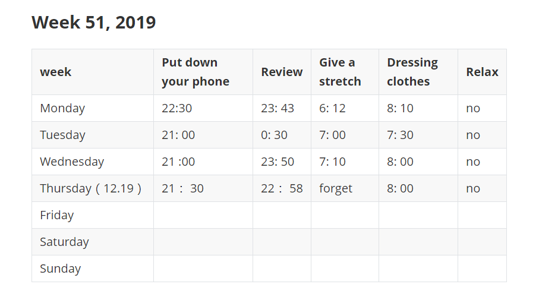
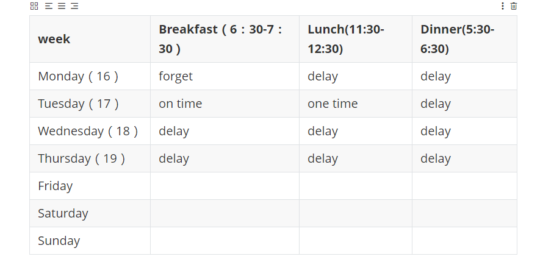

# 打卡GTD践行第七周（2019-12-11） 

# 一周记录

本周主要问题，没有科学工作和沟通方法，和计划安排。

导致一直在迷茫中

# 一. **ARTS的初衷**

  

| 周一 | 周二          | 周三 | 周四       | 周五 | 周六           | 周日      |
| ---- | ------------- | ---- | ---------- | ---- | -------------- | --------- |
|      | **Algorithm** |      | **Review** |      | **Review/Tip** | **Share** |

### 1.Algorithm

> **主要是为了编程训练和学习。**每周至少做一个 leetcode 的算法题（先从Easy开始，然后再Medium，最后才Hard）。进行编程训练，如果不训练你看再多的算法书，你依然不会做算法题，看完书后，你需要训练。。

依然停留在这里

https://github.com/wangcy6/leetcode/issues/12

### 2.Review 

> 主要是为了学习英文，如果你的英文不行，你基本上无缘技术高手。**所以，需要你阅读并点评至少一篇英文技术文章，我个人最喜欢去的地方是[http://Medium.com](https://link.zhihu.com/?target=http%3A//Medium.com)

#### malloc 如何申请内存的

英文：

https://sploitfun.wordpress.com/2015/02/10/understanding-glibc-malloc/

https://sourceware.org/glibc/wiki/MallocInternals

翻译：

[http://pwn4.fun/2016/04/11/%E6%B7%B1%E5%85%A5%E7%90%86%E8%A7%A3glibc-malloc/](http://pwn4.fun/2016/04/11/深入理解glibc-malloc/)

[https://wooyun.js.org/drops/%E6%B7%B1%E5%85%A5%E7%90%86%E8%A7%A3%20glibc%20malloc.html](https://wooyun.js.org/drops/深入理解 glibc malloc.html)

#### 摘要：

### redis集群规范

英文：https://redis.io/topics/cluster-spec

翻译：

http://www.redis.cn/topics/cluster-spec.html

http://arloor.com/posts/redis/redis-cluster/

#### 摘要

redis 源码解析：https://github.com/wangcy6/reading_code_note/tree/master/mdb/redis-unstable

- It is useful to note that while the `PFAIL` -> `FAIL` transition uses a form of agreement, the agreement used is weak:(在失败检查方面，是弱一致监测，大多数确认就可以，而不是全部)
- **The `FAIL` flag is only used as a trigger to run the safe part of the algorithm** for the slave promotion（fatl标记用来触发切换）
- Masters reply to slave vote request（其他master主机代替哨兵的角色 来做投票判断。）

​      Masters receive requests for votes in form of `FAILOVER_AUTH_REQUEST` requests from slaves.

- slave选举过程

~~~c
于挂掉的master可能会有多个slave，从而存在多个slave竞争成为master节点的过程， 其过程如下：

1.slave发现自己的master变为FAIL
2.将自己记录的集群currentEpoch加1，并广播FAILOVER_AUTH_REQUEST信息
3.其他节点收到该信息，只有master响应，判断请求者的合法性，并发送FAILOVER_AUTH

4.尝试failover的slave收集FAILOVER_AUTH_ACK
5.超过半数后变成新Master
6.广播Pong通知其他集群节点。

主节点接收到来自于从节点、要求以 FAILOVER_AUTH_REQUEST 请求的形式投票的请求。 要授予一个投票，必须要满足以下条件：

1) 在一个给定的时段（epoch）里，一个主节点只能投一次票，并且拒绝给以前时段投票：每个主节点都有一个 lastVoteEpoch 域，一旦认证请求数据包（auth request packet）里的 currentEpoch 小于 lastVoteEpoch，那么主节点就会拒绝再次投票。
  当一个主节点积极响应一个投票请求，那么 lastVoteEpoch 会相应地进行更新。
2) 一个主节点投票给某个从节点当且仅当该从节点的主节点被标记为 FAIL。
3) 如果认证请求里的 currentEpoch 小于主节点里的 currentEpoch 的话，那么该请求会被忽视掉。
    因此，主节点的回应总是带着和认证请求一致的 currentEpoch。
    如果同一个从节点在增加 currentEpoch 后再次请求投票，那么保证一个来自于主节点的、旧的延迟回复不会被新一轮选举接受。
~~~

- ## Clients and Servers roles in the Redis Cluster protocol

auto-discover other nodes(自动发起其他节点功能 类似区块的广播协议)

promote slave nodes to master（这是node作职责）

### 3. Tip

> 主要是为了总结和归纳你在是常工作中所遇到的知识点**。学习至少一个技术技巧。你在工作中遇到的问题，踩过的坑，学习的点滴知识。

- 如何在Excel中输入1显示对号“√”，输入0显示错号“X”？

~~~
1、选中B2到B9单元格，也就是你需要添加"√"和"X"的地方，然后右键并选择【设置单元格格式】。

2、将单元格的格式内容自定义为以下内容：

[=1]"√";[=0]"X"

然后保存。
~~~

### 4.  Share

>主要是为了建立你的影响力，能够输出价值观。分享一篇有观点和思考的技术文章。

如何消除痛苦

https://medium.com/s/story/read-this-if-you-feel-like-you-cant-stop-creating-problems-in-your-mind-d137a36201a7

翻译计划：

# 二 . 起床-运动-阅读 

## 1. 起床--没有记录就没有进步
### A-早睡早起床：

### 目前现状

> 晚上因为看书和运动事情从9点延迟到23点，造成第二天造成无法起床
>
> 现在主要问题是起床问题，6：00准备起床

### 期望结果

闹钟再次调整：6：30 和 7：30 各2个（以前是间隔15分钟一个 累计10个）

具体方法请看

- R90 睡眠革命

- 放松练习 神奇的睡眠

  

- 四点钟起床，最养生和高效的时间管

  

  

### 执行结果（变化）

### B-防沉迷不解锁手机 

### 目前现状

- 我救赎-手机--腾讯视频 晚上8-凌晨3点 8个小时  (严重超时呀！！)

> 吃饭看腾讯视频，地铁看腾讯视频，走路看腾讯视频，
>
> 学习时候看腾讯视频，手机解锁上床看腾讯视频，
>
> 然后从晚上7点看到8点 9点 10点 11点 12点凌晨1点 2点。

### 期望结果：日志跟踪记录

- 防沉迷-不解锁

> 无论任何情况都监督时候都不解锁，这底线，这你重点要做事情

[意志力实验：直面自身欲望，但是不要付诸行定](https://mp.weixin.qq.com/s/Bg-a2W5_4OyR9hhy3Y6ptQ)接下来一周里可以用以下 4个步骤来应对自己强烈的欲望 

这些欲望可以是巧克力 、卡布奇诺咖啡或不停查收电子邮件 。

1 ．承认自己脑海中的欲望 ，以及渴望某种事物的感觉 。

2 ．不要马上试着转移注意力或与之争论 。接受这种想法或感觉 ，提醒自己 “白熊 ”现象和 “反弹 ”理论 。

3 ．退一步考虑 ，意识到这种想法和感觉并不受你控制 ，但你可以选择是否将这些想法付诸实践 。

4 ．记住你的目标 ，提醒自己预先作出的承诺 。正如那些学生会提醒自己 ，他们答应过不偷吃巧克力 。这个需要反复练习

- 自我救赎-手机--腾讯视频 20-23点 3个小时 尤其是周末

### 执行结果(变化)

### C-切换频率鼠标

### 目前现状：

鼠标统计:平均每天点击鼠标6167次 39秒点击1次

- 画外音

> 从外人看来，你像傻子一样，打开软件，关闭软件，打开网页关闭网页， 跟小白鼠没区别。
>
> 这说明注意力很容易被其事情吸引走，并且你自己发没有发现 已经偏离轨道，很危险
>
> 没有人提醒你

- 潜意识

> 完全靠自己感觉，不从 公司角度和规划角度做失去，这最大问题.
>
> 不停点击鼠标，处理问题没有规则流程，去分析业务，架构，技术是什么
>
> 纯把自己当成重复地下劳动力呀
>
> 一切忙碌，在10分钟，1小时，一天，一星期去没有取得任何进步

### 期望结果:一次只做一件事，按照计划做事情（繁忙）

- 盘茄时间 25分钟工作+5分钟 这个必须严格执行。

- 这个不要公司去规定，更不害怕别人嘲笑，站起来活动5分钟

- 我自己很清楚，很容易其他事情走神。别人厉害不需要那是他们事情。

  

### 执行结果（变化）

## 2. 运动----掌控跑步，你掌控生活
### 目前现状

- 自己每次都妥协

> 发现驼背 ，高低肩 长时间坐姿不正确，不运动导致的  。这谁责任。
>
> 说根本时间，平时没时间，周末么总有时间吧。

- 大脑可以屏蔽痛苦，让感受不到这 最可怕的失去

  > 当你走出公司，你才感觉 说不出来疲惫，为什么 自己身心暴躁焦虑，工作没有计划。

### 期望结果：

- 每周跑步三次 ，3公里 5 公里 8公里  

  时间周三 周六和周天

- 感觉累时候，你休息一下，一天三次机会

  中午吃饭时候

  晚上吃饭时候

### 执行结果

## 3.  阅读 ---科学合理方法

### A-计划

### B-行动

- 用读书记录app跟着
- 用ppt记录分享到抖音上

### C-执行结果（看到变化

自己不敢说话，分享失败

# 三 .工作 -吃饭的饭碗

## 1. 沟通--深入剖析

### 目前现状：

> 自己说的别人都听不懂，紧张，焦虑 ；
>
> 经常打断别人说话，自己听不进去

### 期望结果：

- 说给自己听，让自己听清楚慢慢会说，用更多时间耐心说出来

  > 不害怕尴尬，大脑思路空白

- 仔细听别人讲话结果是什么，逻辑是什么，最终目的是什么

  > 你说都是废话，没有目的，没有结果 没有执行，放弃一切想说的，都是这个大脑受当时环境引起的。非自己想说的

- 上面2个并不矛盾

## 下周计划 -意志力实验

### A-目前现状：

> 注意力高度不集中，一个点击8千次鼠标，
>
> 然不停看打开网页，关闭网页。打开聊天软件关闭聊天软件

这就是疯子，闪灵中 不停打字的疯子 

### B-期望结果 

> 心流状态

最高学习效率=15.87%，并却经过机器学习训练得出的这个比例15.87%

​	意思就说： 

> 舒适区的内容对你来说太容易

> 恐慌区的内容太难，

> 刻意练习要求你始终在二者中间一个特别小的学习区里学习 —— 这里的难度对你恰到好处。

### C-执行结果（看到变化）

https://app.yinxiang.com/client/web#?n=671a47c7-fccd-457d-9fc8-69c980997b6a&s=s39&swm=true&

