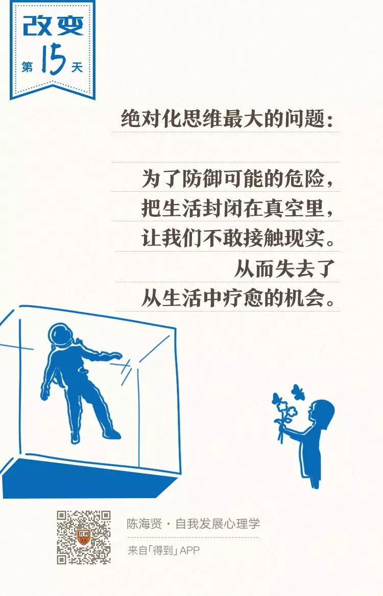
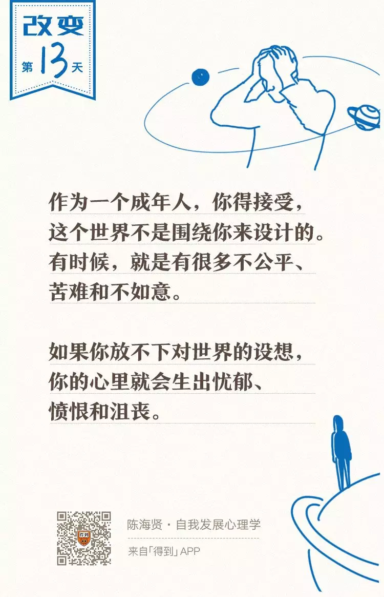

# 打卡GTD践行第三周 

### 一周记录

#### 每周阅读一本书开启

**格局 (2019年 第 39周 )**

简介

**作者:** 吴军
**出版社:** 中信出版社
**副标题:** 格局的大小决定成就的顶点

#### 每日一题开启

本周建立操作系统知识卡，根据问题来学习。

#### ARTS: leetcode系列刷题

#### 每周一总结：起床 跑步 阅读 分析

周末是个大问题。其他的都好

### 一. ARTS

#### 1.Algorithm

每周至少做一个 leetcode 的算法题

#### 2.Review 阅读 点评 英文技术文章

#### 2.1 阅读英文技术文档1篇

测试分布式系统的线性一致性

英文：http://www.anishathalye.com/2017/06/04/testing-distributed-systems-for-linearizability/

中文：http://www.sohu.com/a/191836176_268033

#### 3. Tip：学习至少一个技术技巧

#### 4.  Share

#### 4.1 分享一篇有思考的技术文章

## [分布式学习之旅（方法篇）](https://mp.weixin.qq.com/s/7CRAI3fzNAS3rIjoiYJDmw)

学习方法：三个阶段
第一个阶段：阅读书籍和论文
第二阶段： 阅读产品源码，
第三阶段：参与贡献
最终目的：解决业务中实际问题。

 #### 4.2 分享一篇有观点文章 

​    来源：自我发展心理学

[思维的三个陷阱（僵固思维，应该化思维，绝对化思维](https://mp.weixin.qq.com/s/Ug9p7Di4mgRMAnS3YcR0iw)）

### 二 . 起床-运动-阅读 执行情况跟踪

#### 1. 起床--没有记录就没有进步
##### 睡眠结果：

> 上周按时起床2次，晚起5次，本月按时起床3次，晚起20次.
>
> 本周还剩余6天挑战机会，9月份还剩余6天挑战机会,加油呀

画外音：

为什么每次执行不下去，电

脑你设定定时关机，手机你设定定时关机，最后千万原因

阻挠执行，是多巴胺过多还是自己借口

##### 结果分析：

- 每天玩手机4个小时以上  (严重超时呀！！)

> 抖音 腾讯小视频，斗鱼比赛，你感觉每周看一次影响不大，
>
> 结果整个从极限整个3个月，然后到暑假 好声音三个月，然后 中餐厅三个月 ，然后老酒馆和长安十二时辰 69集 时间这样过去了，每年如此。

画外音：

​      你就是小白鼠呀！每天注意完全不在工作上。

​      直线上升。电子上瘾

- 白天无效工作(每天频繁切换，根本没有思考，思考呢)：

> 鼠标统计:平均每天点击鼠标6167次 39秒点击1次

画外音：

 白天没有目标忙碌一天，到晚上才想很多事情呀处理，不肯睡觉

#### 2. 运动----掌控跑步，你掌控生活
##### 运动结果

> 发现驼背 ，高低肩 长时间坐姿不正确，不运动导致的  。这谁责任。

##### 结果分析：

- 平时没时间，周末么总有时间吧。

#### 3.  学习工作进展 ---科学合理方法

 https://github.com/wangcy6/weekly/issues/

##### 结果分析：

- 本周执行力不够

  采用 盘茄方法25分钟在休息5分中，自己站立工位，继续工作，结果下一个盘茄到来时候 自己为难，更不想执行。

- 本周目标不清楚

  工作为主，不是自己看学习。

#### 4. 分享--回沟通人能装下整个世界

##### 目前现状：

> 自己说的别人都听不懂，紧张，焦虑 
>

##### 结果分析

慢下来，说话慢下来。一次只说一个事情

#### 三 .下周计划 -吃饭的饭碗

操作系统和leetcode

