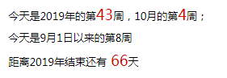
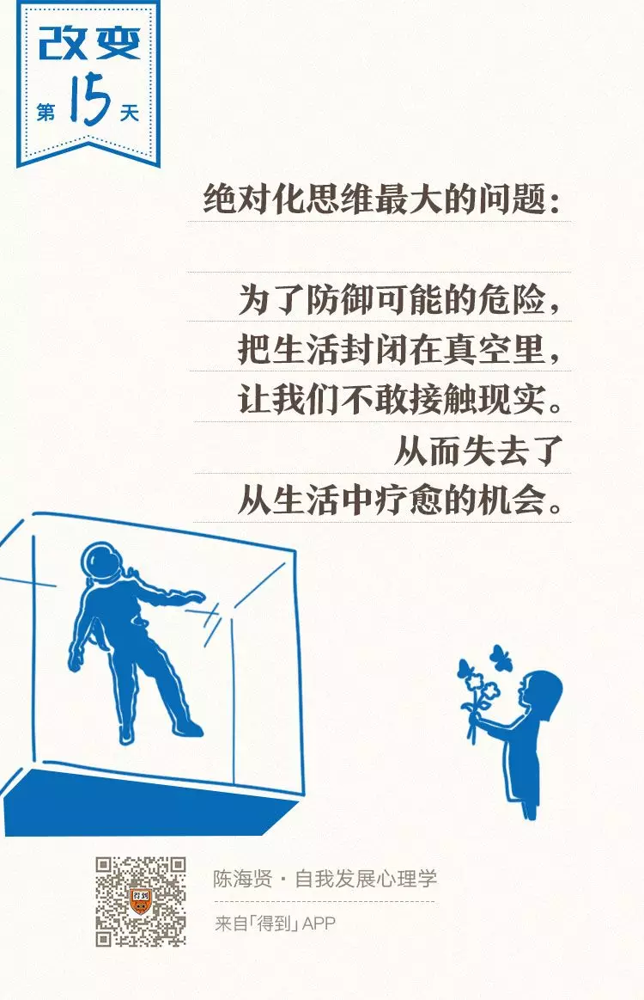
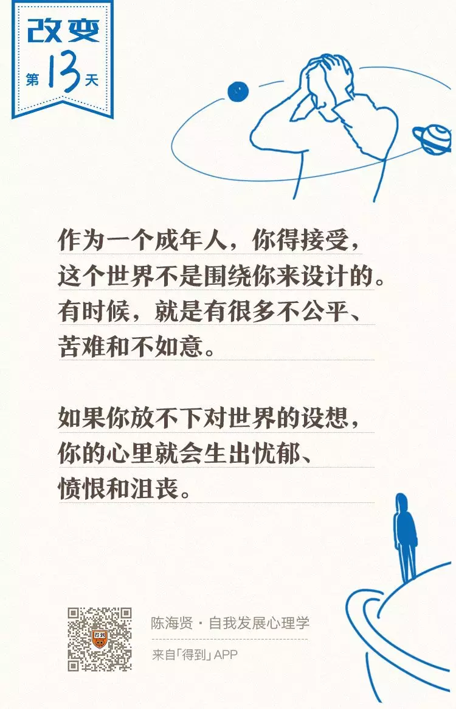

# 打卡GTD践行第四周（2019-10-25） 

### 一周记录

本周建立操作系统知识卡，根据问题来学习。

### 一. ARTS

  

## **ARTS的初衷**

- **Algorithm**。**主要是为了编程训练和学习。**每周至少做一个 leetcode 的算法题（先从Easy开始，然后再Medium，最后才Hard）。进行编程训练，如果不训练你看再多的算法书，你依然不会做算法题，看完书后，你需要训练。

- **Review：主要是为了学习英文，如果你的英文不行，你基本上无缘技术高手。**所以，需要你阅读并点评至少一篇英文技术文章，我个人最喜欢去的地方是[http://Medium.com](https://link.zhihu.com/?target=http%3A//Medium.com)（需要梯子）以及各个公司的技术blog，如Netflix的。加翻译

- **Tip：主要是为了总结和归纳你在是常工作中所遇到的知识点**。学习至少一个技术技巧。你在工作中遇到的问题，踩过的坑，学习的点滴知识。

- **Share：主要是为了建立你的影响力，能够输出价值观。**分享一篇有观点和思考的技术文章。

| 周一 | 周二          | 周三 | 周四       | 周五 | 周六           | 周日      |
| ---- | ------------- | ---- | ---------- | ---- | -------------- | --------- |
|      | **Algorithm** |      | **Review** |      | **Review/Tip** | **Share** |

#### 1.Algorithm

每周至少做一个 leetcode 的算法题

 https://github.com/wangcy6/leetcode/issues/12 

 八皇后问题答案 [https://github.com/wangcy6/leetcode/blob/master/problems/51.%20N%E7%9A%87%E5%90%8E.md](https://github.com/wangcy6/leetcode/blob/master/problems/51. N皇后.md) 

#### 2.Review 

直接阅读的是算法 里面提到回溯

#### 3. Tip：学习至少一个技术技巧

如何在Excel中输入1显示对号“√”，输入0显示错号“X”？

~~~shel
1、选中B2到B9单元格，也就是你需要添加"√"和"X"的地方，然后右键并选择【设置单元格格式】。

2、将单元格的格式内容自定义为以下内容：

[=1]"√";[=0]"X"

然后保存。
~~~

#### 4.  Share

#### 4.1 分享一篇有思考的技术文章

 #### 4.2 分享一篇有观点文章 

​    来源：自我发展心理学

[思维的三个陷阱（僵固思维，应该化思维，绝对化思维](https://mp.weixin.qq.com/s/Ug9p7Di4mgRMAnS3YcR0iw)）

### 二 . 起床-运动-阅读 执行情况跟踪

#### 1. 起床--没有记录就没有进步
##### 睡眠结果：

> 按时睡觉做到了 22点去睡觉，但是本周起床在8点起床，没有改进
>

#### 起床解决办法：闹钟再次调整：6：30 和 7：30 各2个（以前是间隔15分钟一个 累计10个）

画外音： 你六点闹钟关闭了，这给你提高自制力机会，但是自己这2周根本没有在起床

~~~
上周问题 无法早睡，
---上周问题对比为什么每次执行不下去，电

脑你设定定时关机，手机你设定定时关机，最后千万原因

阻挠执行，是多巴胺过多还是自己借口
~~~

##### 结果分析：

- 每天玩手机4个小时以上  (严重超时呀！！)

> 周末时间玩手机时间最长，斗鱼直播，抖音app还有腾讯视频。
>
> 还需要加油进一步提高。

画外音：

这说明你方法是对的，直接删除，腾讯视频无法删除，你无论任何情况都解锁

#### 解决办法：无论任何情况都监督时候都不解锁，这底线，这你重点要做事情

- 鼠标统计:平均每天点击鼠标6167次 39秒点击1次

> 从外人看来，你像傻子一样，打开软件，关闭软件，打开网页关闭网页， 跟小白鼠没区别。
>
> 这说明注意力很容易被其事情吸引走，并且你自己发没有发现 已经偏离轨道，很危险
>
> 没有人提醒你，

#### 解决办法：

盘茄时间 25分钟工作+5分钟 这个必须严格执行。

这个不要公司去规定，更不害怕别人嘲笑。

我自己很清楚，很容易其他事情走神。别人厉害不需要那是他们事情。你必须从最笨方法开始

画外音：

 白天没有目标忙碌一天，到晚上才感觉疲劳，白天不放松，晚上也睡不好。

#### 2. 运动----掌控跑步，你掌控生活
##### 运动结果

> 发现驼背 ，高低肩 长时间坐姿不正确，不运动导致的  。这谁责任。

##### 结果分析：

- 平时没时间，周末么总有时间吧。

#### 3.  学习工作进展 ---科学合理方法

##### 结果分析：

- 本周执行力不够

  采用 盘茄方法25分钟在休息5分中，自己站立工位，继续工作，结果下一个盘茄到来时候 自己为难，更不想执行。

- 本周目标不清楚

  工作为主，不是自己看学习。 

#### 4. 分享--回沟通人能装下整个世界

##### 目前现状：

> 自己说的别人都听不懂，紧张，焦虑 
>

##### 结果分析

最近一个月态度上 根本没有认真对待，自己好像忘记了这个事情，以为自己很会说。

自己处理态度就是 掩耳盗铃

### 解决办法

#### 三 .下周计划 -吃饭的饭碗

