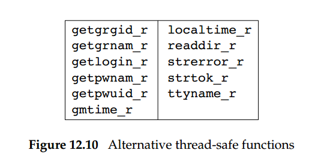
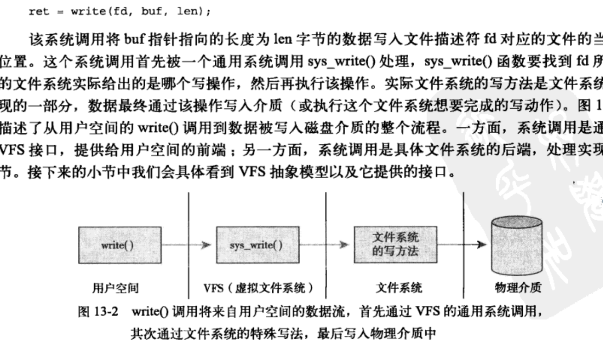
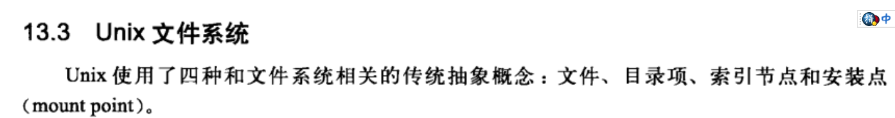
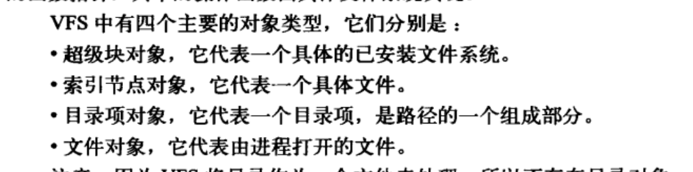

## 第一天 中断与锁（第7 ，8，9，10 章节）


### 1. 延迟处理机制


#### 中断特点

- 中断处理程序不是可[重入](https://zh.wikipedia.org/wiki/%E5%8F%AF%E9%87%8D%E5%85%A5)的。因为屏蔽了中断，根本不会发生切换。同类[自旋锁是不可重入](https://my.oschina.net/anur/blog/1573625)的
- 中断处理进程，只能采用自旋锁（短期互斥原语），不能长期互斥原语（这会导致进程睡眠）【epoll原理 不能长期阻塞】
- 随时都可能发生，异步的。


中断处理程序 ---ksoftirqd

~~~shell
ps -ef |grep ksoftirqd
root         3     2  0  2018 ?        00:00:06 [ksoftirqd/0]
root        29     2  0  2018 ?        00:00:01 [ksoftirqd/1]
root        34     2  0  2018 ?        00:00:00 [ksoftirqd/2]
root        39     2  0  2018 ?        00:00:00 [ksoftirqd/3]
root        44     2  0  2018 ?        00:00:00 [ksoftirqd/4]
root        49     2  0  2018 ?        00:00:00 [ksoftirqd/5]
root        54     2  0  2018 ?        00:00:00 [ksoftirqd/6]
root        59     2  0  2018 ?        00:00:00 [ksoftirqd/7]
~~~


#### 流程


#### 结构

~~~c
/* 用于描述一个软中断 */
struct softirq_action
{
    /* 软中断的处理函数 */        
    void    (*action)(struct softirq_action *);
};

/* 6个软中断描述符都保存在此数组 */
static struct softirq_action softirq_vec[NR_SOFTIRQS] __cacheline_aligned_in_smp;


struct tasklet_struct
{
    struct tasklet_struct *next;      /* 指向链表下一个tasklet */
    unsigned long state;              /* tasklet状态 TASKLET_STATE_SCHED表示处于链表中，TASKLET*/
                                      /* _STATE_RUN表示正在运行*/
    atomic_t count;                   /* 禁止计数器，调用tasklet_disable()会增加此数，tasklet*/
                                      /* enable()减少此数 */
    void (*func)(unsigned long);      /* 处理函数 */
    unsigned long data;               /* 处理函数使用的数据 */
};
struct tasklet_head {
    struct tasklet_struct *head;
    struct tasklet_struct **tail;
};
~~~


### 2. 锁


##### 读写锁 (ReentrantReadWriteLock)

特点

- 可重入互斥锁（ reentrant mutex ）

> 同一[线程](https://zh.wikipedia.org/wiki/线程)对其多次加锁不会产生[死锁](https://zh.wikipedia.org/wiki/死锁)。可重入互斥锁也称**递归互斥锁**  


#### 自旋锁

特点

-  不可重入锁

  > 若有同一线程两调用lock() ，会导致第二次调用lock位置进行自旋，产生了死锁 

  


------------------------------------------------华丽分隔符------------------------------------------------------------------------

**可重入性**

>  若一个[程序](https://zh.wikipedia.org/wiki/程序)或[子程序](https://zh.wikipedia.org/wiki/子程序)可以“在任意时刻被[中断](https://zh.wikipedia.org/wiki/中断)然后操作系统调度执行另外一段代码，这段代码又调用了该子程序不会出错”，则称其为**可重入**（reentrant或re-entrant）的。
>
> 即当该子程序正在[运行时](https://zh.wikipedia.org/wiki/執行期)，执行线程可以再次进入并执行它，仍然获得符合设计时预期的结果。 
>
> 若一个[函数](https://zh.wikipedia.org/wiki/函数)是可重入的，则该函数应当满足下述条件：
>
> - 不能含有静态（全局）非常量数据。
> - 不能返回静态（全局）非常量数据的地址。
> - 只能处理由调用者提供的数据。
> - 不能依赖于[单实例模式](https://zh.wikipedia.org/wiki/单实例模式)资源的锁。
> - 调用(call)的函数也必需是可重入的。
>
> 啥意思 就是 
>
> 你在执行一个函数的时候，切换出去别人在执行同样的函数，或者其他函数。而不出问题

------------------------------------------------华丽分隔符------------------------------------------------------------------------

### 改造后的自旋锁

[例子](https://kanonjz.github.io/2017/12/27/reentrantlock-and-spinlock/)

~~~java
public class SpinLock {
    private AtomicReference<Thread> owner =new AtomicReference<>();
    private int count =0;
    public void lock(){
        Thread current = Thread.currentThread();
        if(current==owner.get()) {
            count++;
            return ;
        }
        //compareAndSet(Thread expect, Thread update)
        //自旋锁的自旋就是体现在这里
        while(!owner.compareAndSet(null, current)){

        }
    }
    public void unlock (){
        Thread current = Thread.currentThread();
        if(current==owner.get()){
            if(count!=0){
                count--;
            }else{
                owner.compareAndSet(current, null);
            }

        }

    }
}
注意两点：
1. 修改之后，就可以重复进入代码区域了
~~~

### 中断与信号

## [linux可重入、异步信号安全和线程安全](https://www.cnblogs.com/alantu2018/p/8446917.html)

**不可重入的几种情况**：

使用静态数据结构，比如getpwnam，getpwuid：如果信号发生时正在执行getpwnam，信号处理程序中执行getpwnam可能覆盖原来getpwnam获取的旧值

- 调用malloc或free：如果信号发生时正在malloc（修改堆上存储空间的链接表），信号处理程序又调用malloc，会破坏内核的数据结构 new

- 使用标准IO函数，因为好多标准IO的实现都使用全局数据结构，比如printf(文件偏移是全局的)

- 函数中调用longjmp或siglongjmp：信号发生时程序正在修改一个数据结构，处理程序返回到另外一处，导致数据被部分更新。

  

  2. 不可重入函数不能由多个线程使用。

  **如果将对临界资源的访问加锁，则这个函数是线程安全的；但如果重入函数的话加锁还未释放，则会产生死锁，因此不能重入**。

  

  
  
  

### 大家都在讨论

- Java多线程系列——深入重入锁ReentrantLock 【done_很好】

  https://www.cnblogs.com/zhengbin/p/6503412.html

- 深入理解读写锁ReentrantReadWriteLock 【reading】

  [ReentrantLock的实现语义与使用场景](https://www.cnblogs.com/dongguacai/p/5992838.html)[done_good!!!!]

  https://www.cnblogs.com/dongguacai/p/5994381.html

  https://www.jianshu.com/p/4a624281235e

- https://www.cnblogs.com/charlesblc/p/6188364.html

-  https://kanonjz.github.io/2017/12/27/reentrantlock-and-spinlock/ 

- http://www.liuhaihua.cn/archives/608699.html 

-  https://my.oschina.net/anur/blog/1573625 

https://cloud.tencent.com/developer/article/1482754

### 可重入函数与不可重入函数

https://sites.google.com/site/jishutaolun/programming/reaccessablefunction

https://blog.csdn.net/feiyinzilgd/article/details/5811157


[UNIX高级环境编程第12章](https://segmentfault.com/a/1190000007787877)

https://segmentfault.com/a/1190000007787877

### 总结

**可重入性**

>  若一个[程序](https://zh.wikipedia.org/wiki/程序)或[子程序](https://zh.wikipedia.org/wiki/子程序)可以“在任意时刻被[中断](https://zh.wikipedia.org/wiki/中断)然后操作系统调度执行另外一段代码，这段代码又调用了该子程序不会出错”，则称其为**可重入**（reentrant或re-entrant）的。
>
>  即当该子程序正在[运行时](https://zh.wikipedia.org/wiki/執行期)，执行线程可以再次进入并执行它，仍然获得符合设计时预期的结果。 
>
>  若一个[函数](https://zh.wikipedia.org/wiki/函数)是可重入的，则该函数应当满足下述条件：
>
>  - 不能含有静态（全局）非常量数据。
>  - 不能返回静态（全局）非常量数据的地址。
>  - 只能处理由调用者提供的数据。
>  - 不能依赖于[单实例模式](https://zh.wikipedia.org/wiki/单实例模式)资源的锁。
>  - 调用(call)的函数也必需是可重入的。
>  - 


我的思路 1  定义 是什么 2  特点，

错误理解 忘记规则，什么不能使用全局变量就一定是可重入的。


提到多线程，多进程 ，我已经知道可以提高程序的并发，

在什么场景下使用一片模糊，反正组合使用就可以了【囫囵吞枣】，是单核的还是多核的【仔细想想还还不明白】


但是还有一个问题，可重入(*reentrance*)与线程安全(*thread-safe*)

到底什么是可重入？和线程安全有什么关系？


对于概念的准确定义，必须去维基百科查询


> 可重入概念是在单线程操作系统的时代提出的
>
> 若一个[程序](https://zh.wikipedia.org/wiki/程序)或[子程序](https://zh.wikipedia.org/wiki/子程序)可以“在任意时刻被[中断](https://zh.wikipedia.org/wiki/中断)然后操作系统调度执行另外一段代码，这段代码又调用了该子程序不会出错”，则称其为**可重入**（reentrant或re-entrant）的。
>
> 即当该子程序正在[运行时](https://zh.wikipedia.org/wiki/執行期)，执行线程可以再次进入并执行它，仍然获得符合设计时预期的结果
>
> 可重入也可称作“异步信号安全


啥意思 不是人话，看不懂。看着就是生气。

可重入就可中断。，可重入函数，描述的是函数被多次调用但是结果具有可再现性

在多线程调用时候，无论何时何地，只要输入数据相同就应产生相同的输出。

可重入函数，与多线程无关，即可重入概念并不依赖于多线程[12.5]


> If two threads call it at the same time, 
>
> they will see inconsistent results,
> because the string returned is stored in a single static buffer that is shared by all threads
> calling getenv  


 thread-safe


If a function can be safely called by multiple threads at the same time, we say that
the function is thread-safe.  


APUE中的解释，如果一个函数能够安全的同时被多个线程调用而得到正确的结果，那么，我们说这个函数是线程安全的。所谓安全，一切可能导致结果不正确的因素都是不安全的调用。




> 可重入函数未必是线程安全的；线程安全函数未必是可重入的
>
> 可重入与[线程安全](https://zh.wikipedia.org/wiki/线程安全)两个概念都关系到函数处理资源的方式。但是，他们有重大区别


啥意思 不是人话，看不懂


画外音：

我理解可重入的一定线程安全的，这个理解是错误的。

- 是线程安全的，但不是可重入的。

```c
int function()
{
 mutex_lock();
 ...
 function body
 ...
 mutex_unlock();
}
```


- 可重入函数未必是线程安全的

一个函数打开某个文件并读入数据。这个函数是可重入的，因为它的多个实例同时执行不会造成冲突；但它不是线程安全的，因为在它读入文件时可能有别的线程正在修改该文件，为了线程安全必须对文件加“同步锁”


啥意思**线程安全的可重入函数**如何写？


## 第二天 进程

### 问：进程状态


- zombile状态的 进程不会被调度，等待着被父进程/init释放最后占用资源(fd,ret)。3.5章节

  

  


## 第三天   文件系统


## 问： 请描述下write函数执行过程？

### 错误的回答

### 改进的回答







# 第四天 TCP 


https://www.cnblogs.com/JohnABC/p/7238417.html

https://segmentfault.com/a/1190000021488755

https://www.cnblogs.com/my_life/articles/5363527.html

http://blog.chinaunix.net/uid-29075379-id-3921527.html

https://www.zhihu.com/question/32255109