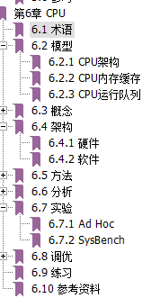
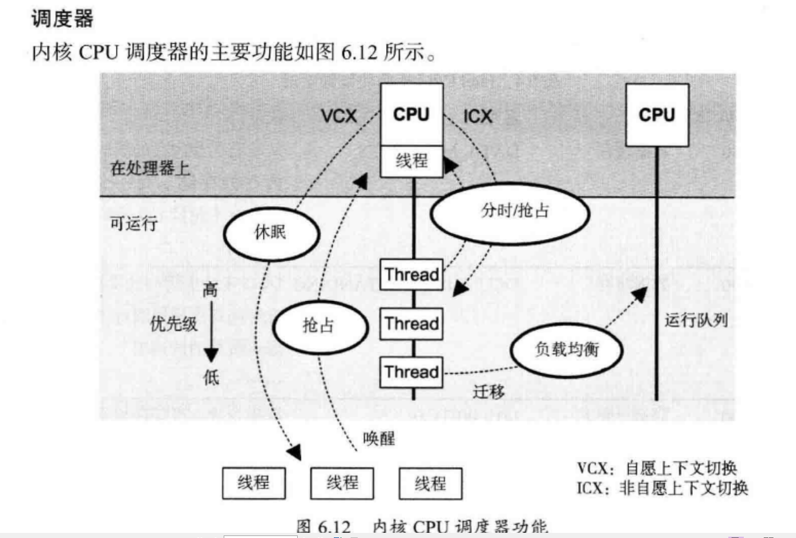
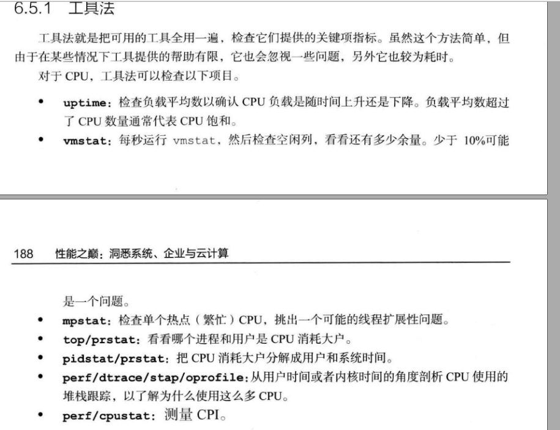
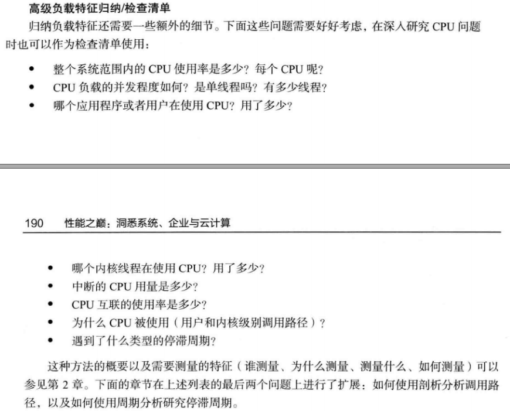
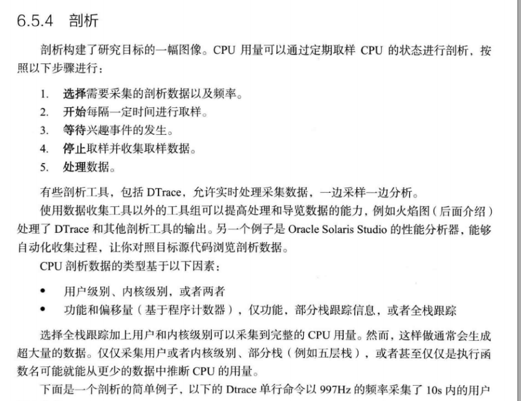
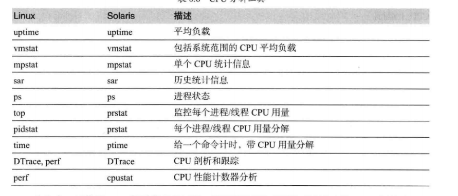

# FQA

# 基础

## 来源 性能之巅 

- 线程的调度

## 分析方法

- 工具

- 负载

- 跟踪

- [perf](http://www.brendangregg.com/perf.html)

  完整使用说明

   http://www.brendangregg.com/perf.html (大神必看)

  

~~~shell
perf record -F 99 -a -g -- sleep 30
perf report --stdio

 http://linuxperf.com/?p=36 
 $ cat /dev/zero > /dev/null
 sar -P ALL -u 2 2
 perf record -a -e cycles -o cycle.perf -g sleep 10
 perf report -i cycle.perf | more
 
 
 perf top
 perf record -g -p <pid>  ；会自动生成perf.data文件
 perf report ；会自动分析当前目录下的perf.data文件
 
    
~~~

# 案例

