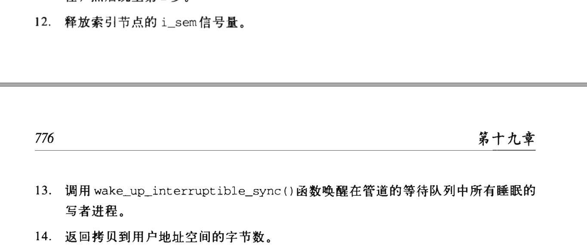

# FQA

# 基础

## 进程通信

### pipe_read()函数

#### pipe_write()

# 案例

- [perf](http://www.brendangregg.com/perf.html)

  完整使用说明

   http://www.brendangregg.com/perf.html (大神必看)

  

~~~shell
perf record -F 99 -a -g -- sleep 30
perf report --stdio

 http://linuxperf.com/?p=36 
 $ cat /dev/zero > /dev/null
 sar -P ALL -u 2 2
 perf record -a -e cycles -o cycle.perf -g sleep 10
 perf report -i cycle.perf | more
 
 
 perf top
 perf record -g -p <pid>  ；会自动生成perf.data文件
 perf report ；会自动分析当前目录下的perf.data文件
 
    
~~~

## Linux用户态命令查看线程

### top

默认top显示的是task数量，即进程。

可以利用敲"H"，来切换成线程。如下，可以看到实际上有96个线程。也可以直接利用top -H  （shift + h 命令来直接打印线程情况。 

- ps -eLf

**-e：显示系统内的所有进程信息。与-A选项功能相同。**

**-f：使用完整的（full）格式显示进程信息。还会打印命令参数，当与-L一起使用时，将添加NLWP（线程数）和LWP（线程ID）列。**

- cat /proc/4302/status

~~~shell
Name:   redis-server
State:  S (sleeping)
Tgid:   4302
Ngid:   0
Pid:    4302
PPid:   1
TracerPid:      0
Uid:    0       0       0       0
Gid:    0       0       0       0
FDSize: 256
Groups: 0 
VmPeak:   163056 kB
VmSize:   163056 kB
VmLck:         0 kB
VmPin:         0 kB
VmHWM:     11480 kB
VmRSS:      9832 kB
VmData:    44408 kB
VmStk:       136 kB
VmExe:      1564 kB
VmLib:      3036 kB
VmPTE:       104 kB
VmSwap:        0 kB
Threads:        4
SigQ:   0/63465
SigPnd: 0000000000000000
ShdPnd: 0000000000000000
SigBlk: 0000000000000000
SigIgn: 0000000000001001
SigCgt: 00000001800044ca
CapInh: 0000000000000000
CapPrm: 0000001fffffffff
CapEff: 0000001fffffffff
CapBnd: 0000001fffffffff
Seccomp:        0
Cpus_allowed:   ff
Cpus_allowed_list:      0-7
Mems_allowed:   00000000,00000000,00000000,00000000,00000000,00000000,00000000,00000000,00000000,00000000,00000000,00000000,00000000,00000000,00000000,00000000,00000000,00000000,00000000,00000000,00000000,00000000,00000000,00000000,00000000,00000000,00000000,00000000,00000000,00000000,00000000,00000001
Mems_allowed_list:      0
voluntary_ctxt_switches:        40794
~~~

[linux进程和线程排查 · 记一次JVM CPU高负载的排查办法](https://www.javatt.com/p/46446)