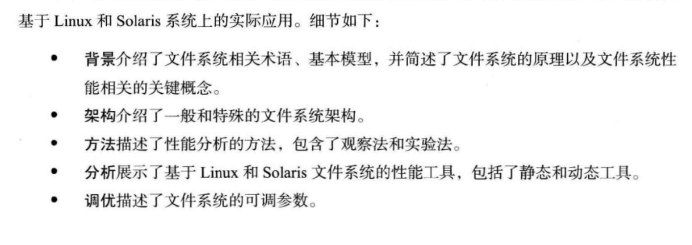
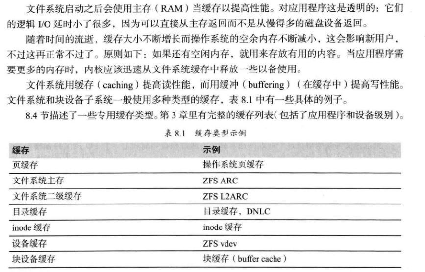
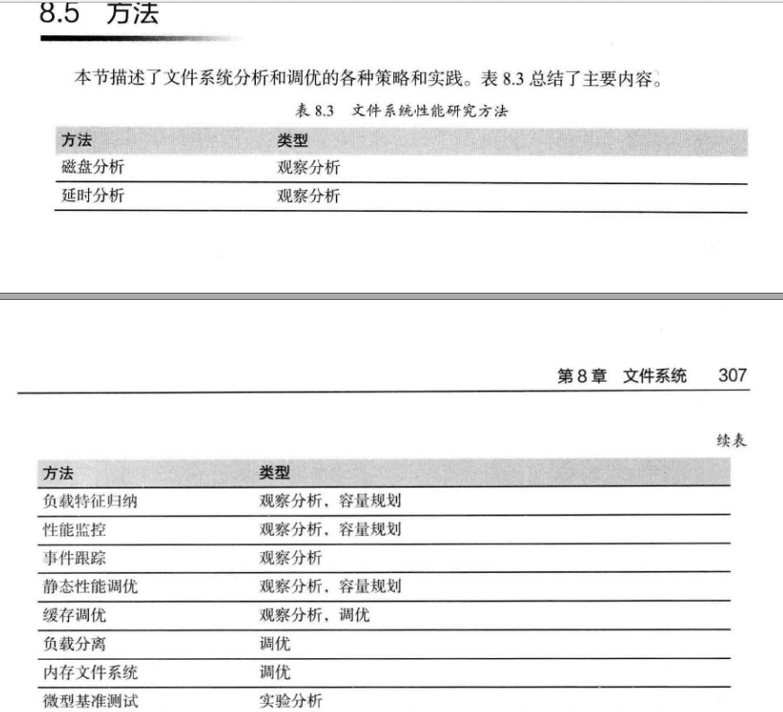
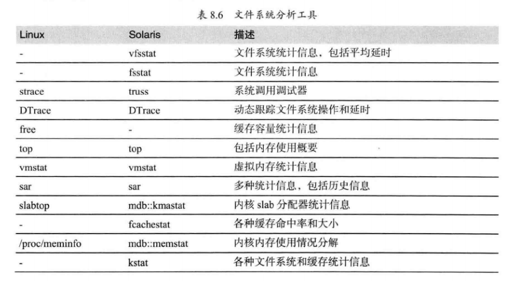

# 文件系统-知识地图


### 我的理解

小王：文件名就是文件系统呀？

小王：目录就是目录 怎么可能是文件呢？


### 第一性原理

- 为什么需要进行“格式化”呢

- 元信息数据是啥
- 文件系统对象是啥
- inode没有存储文件名，但是缓存目录文件名从哪来来，缓存数据不会自己凭空冒出来？
- ls -i 显示inode 就是 long 类型的编号 还有什么呀？
- Superblock  是啥东西？

# 索引



# 概念理解


- 缓存



## 文件系统


在 Linux 中一切皆文件。不仅普通的文件和目录，就连块设备、套接字、管道等，也都要通过统一的文件系统来管理。

  

Linux 下的文件系统主要可分为三大块：

一是上层的文件系统的系统调用，

二是虚拟文件系统 VFS(Virtual Filesystem Switch)，

三是挂载到 VFS 中的各实际文件系统


### 第一个问题：文件系统类型有哪些？

> 字符设备、块设备、网络设备


```shell
 df -h
Filesystem                Size  Used Avail Use% Mounted on
/dev/mapper/vg_root-root   19G  6.5G   12G  37% /
devtmpfs                  7.8G     0  7.8G   0% /dev
tmpfs                     7.8G     0  7.8G   0% /dev/shm
tmpfs                     7.8G  4.3G  3.6G  55% /run
tmpfs                     7.8G     0  7.8G   0% /sys/fs/cgroup
/dev/sda1                 190M  100M   77M  57% /boot
/dev/vda1                 493G  350M  467G   1% /app
tmpfs                     1.6G     0  1.6G   0% /run/user/0
tmpfs                     1.6G     0  1.6G   0% /run/user/888

tmpfs是最好的基于RAM的文件系统。是一种基于内存的文件系
/dev目录下的每一个文件都对应的是一个设备
proc文件系统为操作系统本身和应用程序之间的通信提供了一个安全的接口
https://blog.csdn.net/qq_27840681/article/details/77567094
```

.上层应用如何调用底层驱动？

# VFS

## 定义


文件系统是如何运行的 


>那么文件系统是如何运行的呢？这与操作系统的文件数据有关。较新的操作系统的文件数据
>除了文件实际内容外， 通常含有非常多的属性，
>
>例如 Linux 操作系统的文件权限（rwx） 与文
>件属性（拥有者、群组、时间参数等） 。
>
> 文件系统通常会将这两部份的数据分别存放在不同
>的区块，权限与属性放置到 inode 中，
>
>至于实际数据则放置到 data block 区块中。 另外，还
>有一个超级区块 （superblock） 会记录整个文件系统的整体信息，包括 inode 与 block 的总
>量、使用量、剩余量等 

- 构成

VFS （virtual File System）

目录项、索引节点、逻辑块以及超级块，构成了 Linux 文件系统的四大基本要素。


目录项对象 (dentry object) 


> 目录项，简称为 dentry，用来记录文件的名字、索引节点指针以及与其他目录项的关联关系。
>
> 多个关联的目录项，就构成了文件系统的目录结构。
>
> 不过，不同于索引节点，目录项是由内核维护的一个内存数据结构，所以通常也被叫做目录项缓存。
>
> 一个目录文件包含了一组目录项，目录项是放在data block中的。(参考《Unix环境高级编程》Page87)


索引节点对象 (inode object)


> 索引节点，简称为 inode，用来记录文件的元数据，
>
> 比如 inode 编号、文件大小、访问权限、修改日期、数据的位置等。
>
> 索引节点和文件一一对应，它跟文件内容一样，都会被持久化存储到磁盘中。
>
> 所以记住，索引节点同样占用磁盘空间。


文件对象 (file object)：

​	数据块是记录文件真实内容的地方

在格式化时 block 的大小就固定了，且每个 block 都有编号，以方便 inode
的记录啦 


比较：

文件系统通常会将这两部份的数据分别存放在不同
的区块，权限与属性放置到 inode 中，至于实际数据则放置到 data block 区块中 


超级块对象 (superblock object)

会记录整个文件系统的整体信息，包括 inode 与 block 的总
量、使用量、剩余量等。 

> 磁盘在执行文件系统格式化时，会被分成三个存储区域，超级块、索引节点区和数据块区。其中，
>
> 超级块，存储整个文件系统的状态。
> 索引节点区，用来存储索引节点。
> 数据块区，则用来存储文件数据。


 


- 关系：


### inode 结构

*inode* 是 UNIX 操作系统中的一种数据结构

 *inode* 指的是数据结构；而*索引编号*实际上是 inode 的标识编号


##### VFS 中的 inode 与 inode_operations 结构体


```c
struct inode { 
   ... 
   const struct inode_operations   *i_op; // 索引节点操作
   unsigned long           i_ino;      // 索引节点号
   atomic_t                i_count;    // 引用计数器
   unsigned int            i_nlink;    // 硬链接数目
   ... 
} 

struct inode_operations { 
   ... 
   int (*create) (struct inode *,struct dentry *,int, struct nameidata *); 
   int (*link) (struct dentry *,struct inode *,struct dentry *); 
   int (*unlink) (struct inode *,struct dentry *); 
   int (*symlink) (struct inode *,struct dentry *,const char *); 
   int (*mkdir) (struct inode *,struct dentry *,int); 
   int (*rmdir) (struct inode *,struct dentry *); 
   ... 
}


```


```c
struct ext4_inode { 
   ``... 
   ``__le32  i_atime;        // 文件内容最后一次访问时间
   ``__le32  i_ctime;        // inode 修改时间
   ``__le32  i_mtime;        // 文件内容最后一次修改时间
   ``__le16  i_links_count;  // 硬链接计数
   ``__le32  i_blocks_lo;    // Block 计数
   ``__le32  i_block[EXT4_N_BLOCKS];  // 指向具体的 block 
   ``... 
};
```

inode保存了文件系统中的一个**文件系统对象**（包括[文件](https://zh.wikipedia.org/wiki/计算机文件)、[目录](https://zh.wikipedia.org/wiki/目录_(文件系统))、[设备文件](https://zh.wikipedia.org/wiki/设备文件)、[socket](https://zh.wikipedia.org/wiki/Unix域套接字)、[管道](https://zh.wikipedia.org/wiki/管道_(Unix)), 等等）的元信息数据，**但不包括数据内容或者文件名**

- inode 编号

- 用来识别文件类型，以及用于 `stat C` 函数的模式信息

- 文件的链接数目

- 属主的 UID

- 属主的组 ID (GID)

- 文件的大小

- 文件所使用的磁盘块的实际数目

- 最近一次修改的时间

- 最近一次访问的时间

- 最近一次更改的时间

   都会被持久化存储到磁盘中。所以记住，索引节点同样占用磁盘空间。
   
   等等。


画外音：

通过 inode 找到数据快才是重点，这样数据库 可能存储在任何一个角落里


文件系统一开始就将 inode 与 block 规划好了，除非重新格式化 

### Superblock （超级区块） 

```
block 与 inode 的总量；

未使用与已使用的 inode / block 数量；

block 与 inode 的大小 （block 为 1, 2, 4K，inode 为 128Bytes 或 256Bytes） ；

filesystem 的挂载时间、最近一次写入数据的时间、最近一次检验磁盘 （fsck） 的时间
等文件系统的相关信息；

一个 val
id bit 数值，若此文件系统已被挂载，则 valid bit 为 0 ，若未被挂载，则 valid bit
为

dumpe2fs -h /dev/sda2

```

### 目录与文件 

> 文件名 存储在哪里?


当我们在 Linux 下的文件系统创建一个目录时(目录是文件)，文件系统会分配一个 inode 与**至少**一块 block
（根据文件数量有关系）

其中，inode 记录该目录的相关权限与属性，并可记录分配到的那块 block 号码；

而 block 则是记录在这个目录下的文件名与该文件名占用的 inode 号码数据 


- 知识点1  inode 本身并不记录文件名，文件名的记录
  是在目录的 block 当中 


- 如果我想要读取 /etc/passwd 这个文件时，
  系统是如何读取的呢？ 

### 缓存


# 案例实践


### 实验1： 查看文件系统 缓存占用情况 

- 文件系统中的目录项和索引节 

```c++
# 按下 c 按照缓存大小排序，按下 a 按照活跃对象数排序 

$ slabtop 
Active / Total Objects (% used)    : 277970 / 358914 (77.4%) 
Active / Total Slabs (% used)      : 12414 / 12414 (100.0%) 
Active / Total Caches (% used)     : 83 / 135 (61.5%) 
Active / Total Size (% used)       : 57816.88K / 73307.70K (78.9%) 
Minimum / Average / Maximum Object : 0.01K / 0.20K / 22.88K 

  OBJS ACTIVE  USE OBJ SIZE  SLABS OBJ/SLAB CACHE SIZE NAME 
69804  23094   0%    0.19K   3324       21     13296K dentry 
16380  15854   0%    0.59K   1260       13     10080K inode_cache 
58260  55397   0%    0.13K   1942       30      7768K kernfs_node_cache 
   485    413   0%    5.69K     97        5      3104K task_struct 
  1472   1397   0%    2.00K     92       16      2944K kmalloc-2048 
    
   dentry 行表示目录项缓存，inode_cache 行，表示 VFS 索引节点缓存，其余的则是各种文件系统的索引节点缓存。
    
 目录项和索引节点占用了最多的 Slab 缓存。

不过它们占用的内存其实并不大，加起来也只有 23MB 左右
    
```


-  free 输出的 Cache，是页缓存和可回收 Slab 缓存的和  （vmstat free）

~~~shell

$ cat /proc/meminfo | grep -E "SReclaimable|Cached" 
Cached:           748316 kB 
SwapCached:            0 kB 
SReclaimable:     179508 kB 


procs -----------memory---------- ---swap-- -----io---- -system-- ------cpu-----
 r  b   swpd   free   buff  cache   si   so    bi    bo   in   cs us sy id wa st
 1  0  81196 13122800 239084 2126152    0    0     0     1    0    0  1  0 99  0  0
~~~

```powershell


cat /proc/meminfo
MemTotal:       16267884 kB
MemFree:        13119460 kB
MemAvailable:   13798228 kB
Buffers:          240324 kB
Cached:          1648252 kB
SwapCached:         9644 kB
Active:           802676 kB
Inactive:        1733356 kB
Active(anon):     510300 kB
Inactive(anon):  1449420 kB
Active(file):     292376 kB
Inactive(file):   283936 kB
Unevictable:           0 kB
Mlocked:               0 kB
SwapTotal:       1048572 kB
SwapFree:         967376 kB
Dirty:               108 kB
Writeback:             0 kB
AnonPages:        639208 kB
Mapped:           109460 kB
Shmem:           1312244 kB
Slab:             478768 kB
SReclaimable:     355860 kB
SUnreclaim:       122908 kB
KernelStack:        5376 kB
PageTables:        10860 kB
NFS_Unstable:          0 kB
Bounce:                0 kB
WritebackTmp:          0 kB
CommitLimit:     9182512 kB
Committed_AS:    3782272 kB
VmallocTotal:   34359738367 kB
VmallocUsed:       34736 kB
VmallocChunk:   34359698684 kB
HardwareCorrupted:     0 kB
AnonHugePages:    253952 kB
HugePages_Total:       0
HugePages_Free:        0
HugePages_Rsvd:        0
HugePages_Surp:        0
Hugepagesize:       2048 kB
DirectMap4k:      108416 kB
DirectMap2M:    10377216 kB
DirectMap1G:     8388608 kB
```


### 实验2：指标



s

- iostat 整体

  


- 进程

~~~shell

$ pidstat -d 1 
13:39:51      UID       PID   kB_rd/s   kB_wr/s kB_ccwr/s iodelay  Command 
13:39:52      102       916      0.00      4.00      0.00       0  rsyslogd

用户 ID（UID）和进程 ID（PID）  。
每秒读取的数据大小（kB_rd/s） ，单位是 KB。
每秒发出的写请求数据大小（kB_wr/s） ，单位是 KB。
每秒取消的写请求数据大小（kB_ccwr/s） ，单位是 KB。
块 I/O 延迟（iodelay），包括等待同步块 I/O 和换入块 I/O 结束的时间，单位是时钟周期。

~~~


- sar

~~~shell

# sar -B 
Linux 3.10.0-327.el7.x86_64 (vm-10-115-37-45)   10/29/2019      _x86_64_        (8 CPU)
12:00:01 AM  pgpgin/s pgpgout/s   fault/s  majflt/s  pgfree/s pgscank/s pgscand/s pgsteal/s    %vmeff
12:10:01 AM      0.00      6.51   1217.27      0.00    375.57      0.00      0.00      0.00      0.00

-B     Report paging statistics.  The following values are displayed:

  pgpgin/s
                     Total number of kilobytes the system paged in from disk per second.

              pgpgout/s
                     Total number of kilobytes the system paged out to disk per second.

              fault/s
                     Number  of  page faults (major + minor) made by the system per second.  This is not a count of page faults that generate I/O, because some page
                     faults can be resolved without I/O.

              majflt/s
                     Number of major faults the system has made per second, those which have required loading a memory page from disk.

              pgfree/s
                     Number of pages placed on the free list by the system per second.

              pgscank/s
                     Number of pages scanned by the kswapd daemon per second.

              pgscand/s
                     Number of pages scanned directly per second.

              pgsteal/s
                     Number of pages the system has reclaimed from cache (pagecache and swapcache) per second to satisfy its memory demands.

              %vmeff
                     Calculated as pgsteal / pgscan, this is a metric of the efficiency of page reclaim. If it is near 100% then almost every page  coming  off  the
                     tail  of  the  inactive  list is being reaped. If it gets too low (e.g. less than 30%) then the virtual memory is having some difficulty.  This
                     field is displayed as zero if no pages have been scanned during the interval of time.
~~~


# 参考

 https://github.com/freelancer-leon/notes/blob/master/kernel/vfs.md 

https://wizardforcel.gitbooks.io/vbird-linux-basic-4e/content/59.html

https://www.cnblogs.com/xiaojiang1025/p/6363626.html