# 文件系统-知识地图


阅读相关书籍

- Linux 0.11内核完全注释
- Linux内核设计与实现(第三版中文高清带目录)
- Linux设备驱动程序.
- Understanding the Linux Kernel, 3rd Editio
- Linux.Kernel.Cache
- MySQL技术内幕(InnoDB存储引擎)第2版.
- 性能之巅  洞悉系统、企业与云计算(完整版)


找不到电子版book


# 第一性原理

- mysql 有b+作为索引，为什么liunx文件系统不用b+索引结构，采用inode下面一个固定大小数组来表示？

- 为什么需要进行“格式化”呢

- ls -i 显示inode 就是 long 类型的编号 还有什么呀？

- 文件存储在哪里呀？内存还是磁盘

- 什么是缓存呀

  


# 概念理解s


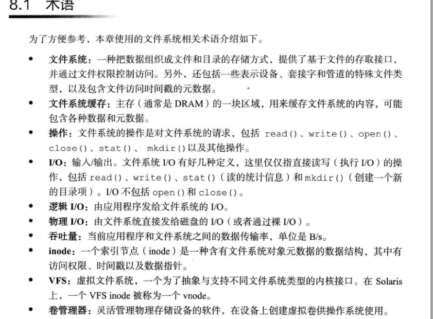

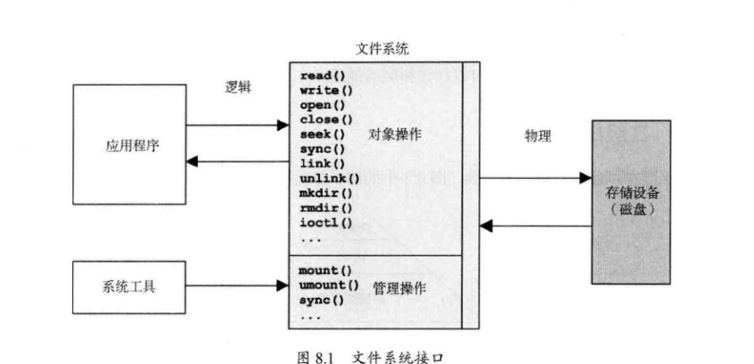

- 缓存

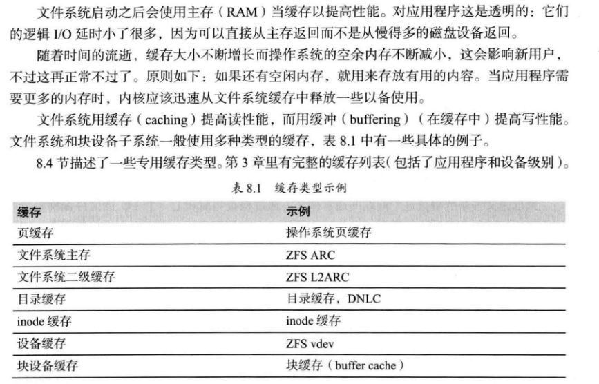

## 文件系统


在 Linux 中一切皆文件。不仅普通的文件和目录，就连块设备、套接字、管道等，也都要通过统一的文件系统来管理。

  

Linux 下的文件系统主要可分为三大块：

一是上层的文件系统的系统调用，

二是虚拟文件系统 VFS(Virtual Filesystem Switch)，

三是挂载到 VFS 中的各实际文件系统

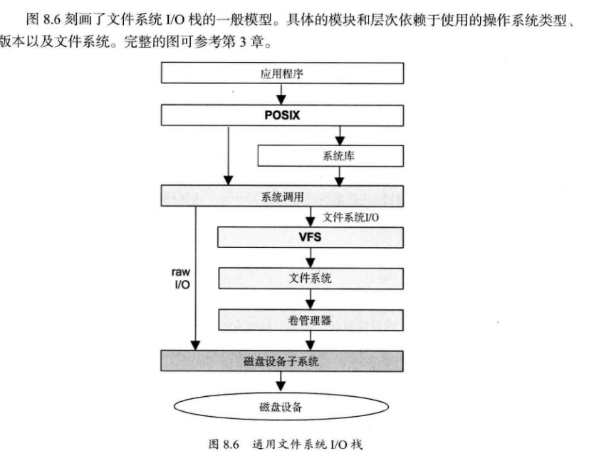


### 第一个问题：文件系统类型有哪些？

> 字符设备、块设备、网络设备


```shell
 df -h
Filesystem                Size  Used Avail Use% Mounted on
/dev/mapper/vg_root-root   19G  6.5G   12G  37% /
devtmpfs                  7.8G     0  7.8G   0% /dev
tmpfs                     7.8G     0  7.8G   0% /dev/shm
tmpfs                     7.8G  4.3G  3.6G  55% /run
tmpfs                     7.8G     0  7.8G   0% /sys/fs/cgroup
/dev/sda1                 190M  100M   77M  57% /boot
/dev/vda1                 493G  350M  467G   1% /app
tmpfs                     1.6G     0  1.6G   0% /run/user/0
tmpfs                     1.6G     0  1.6G   0% /run/user/888

tmpfs是最好的基于RAM的文件系统。是一种基于内存的文件系
/dev目录下的每一个文件都对应的是一个设备
proc文件系统为操作系统本身和应用程序之间的通信提供了一个安全的接口
https://blog.csdn.net/qq_27840681/article/details/77567094
```

.上层应用如何调用底层驱动？

# VFS

## 组成


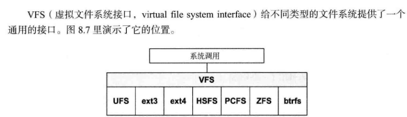文件系统是如何运行的 


>那么文件系统是如何运行的呢？这与操作系统的文件数据有关。较新的操作系统的文件数据
>除了文件实际内容外， 通常含有非常多的属性，
>
>例如 Linux 操作系统的文件权限（rwx） 与文
>件属性（拥有者、群组、时间参数等） 。
>
> 文件系统通常会将这两部份的数据分别存放在不同
>的区块，权限与属性放置到 inode 中，
>
>至于实际数据则放置到 data block 区块中。 另外，还
>有一个超级区块 （superblock） 会记录整个文件系统的整体信息，包括 inode 与 block 的总
>量、使用量、剩余量等 

- 构成

VFS （virtual File System）

目录项、索引节点、逻辑块以及超级块，构成了 Linux 文件系统的四大基本要素。


目录项对象 (dentry object) 


> 目录项，简称为 dentry，用来记录文件的名字、索引节点指针以及与其他目录项的关联关系。
>
> 多个关联的目录项，就构成了文件系统的目录结构。
>
> 不过，不同于索引节点，目录项是由内核维护的一个内存数据结构，所以通常也被叫做目录项缓存。
>
> 一个目录文件包含了一组目录项，目录项是放在data block中的。(参考《Unix环境高级编程》Page87)


索引节点对象 (inode object)


> 索引节点，简称为 inode，用来记录文件的元数据，
>
> 比如 inode 编号、文件大小、访问权限、修改日期、数据的位置等。
>
> 索引节点和文件一一对应，它跟文件内容一样，都会被持久化存储到磁盘中。
>
> 所以记住，索引节点同样占用磁盘空间。


文件对象 (file object)：

​	数据块是记录文件真实内容的地方

在格式化时 block 的大小就固定了，且每个 block 都有编号，以方便 inode
的记录啦 


比较：

文件系统通常会将这两部份的数据分别存放在不同
的区块，权限与属性放置到 inode 中，至于实际数据则放置到 data block 区块中 


超级块对象 (superblock object)

会记录整个文件系统的整体信息，包括 inode 与 block 的总
量、使用量、剩余量等。 

> 磁盘在执行文件系统格式化时，会被分成三个存储区域，超级块、索引节点区和数据块区。其中，
>
> 超级块，存储整个文件系统的状态。
> 索引节点区，用来存储索引节点。
> 数据块区，则用来存储文件数据。

- 关系：


### 1. inode 结构


 每个inode保存了文件系统中的一个**文件系统对象**（包括[文件](https://zh.wikipedia.org/wiki/计算机文件)、[目录](https://zh.wikipedia.org/wiki/目录_(文件系统))、[设备文件](https://zh.wikipedia.org/wiki/设备文件)、[socket](https://zh.wikipedia.org/wiki/Unix域套接字)、[管道](https://zh.wikipedia.org/wiki/管道_(Unix)), 等等）的元信息数据，但不包括数据内容或者文件名[[1\]](https://zh.wikipedia.org/wiki/Inode#cite_note-1)。 


 文件系统创建（格式化）时，就把存储区域分为两大连续的存储区域。

一个用来保存文件系统对象的元信息数据，这是由inode组成的表，

 每个inode节点的大小，一般是128字节或256字节。inode节点的总数，

在格式化时就给定，一般是每1KB或每2KB就设置一个inode。

> 假定在一块1GB的硬盘中，每个inode节点的大小为128字节，
>
> 每1KB就设置一个inode，那么inode table的大小就会达到128MB，占整块硬盘的12.8%。 


另一个用来保存“文件系统对象”的内容数据，划分为512字节的扇区，以及由8个扇区组成的4K字节的块。块是读写时的基本单位。一个文件系统的inode的总数是固定的。

这限制了该文件系统所能存储的文件系统对象的总数目。典型的实现下，所有inode占用了文件系统1%左右的存储容量。 

> 一个数据快大小4k，一个inode节点256字节，根本装不下快，因此不包括数据内容


小王： 你明白了吧  inode 不仅仅是 *inode 编号*  


ls -i src
30933073 github.com

30933073 是而*索引编号*实际上是 inode 的标识编号，

因此也称其为 *inode 编号* 或者*索引编号*。

索引编号只是文件相关信息中一项重要的内容 


##### VFS 中的 inode 与 inode_operations 结构体


```c
struct inode { 
   ... 
   const struct inode_operations   *i_op; // 索引节点操作
   unsigned long           i_ino;      // 索引节点号
   atomic_t                i_count;    // 引用计数器
   unsigned int            i_nlink;    // 硬链接数目
   ... 
} 

struct inode_operations { 
   ... 
   int (*create) (struct inode *,struct dentry *,int, struct nameidata *); 
   int (*link) (struct dentry *,struct inode *,struct dentry *); 
   int (*unlink) (struct inode *,struct dentry *); 
   int (*symlink) (struct inode *,struct dentry *,const char *); 
   int (*mkdir) (struct inode *,struct dentry *,int); 
   int (*rmdir) (struct inode *,struct dentry *); 
   ... 
}


```


```c
struct ext4_inode { 
   ``... 
   ``__le32  i_atime;        // 文件内容最后一次访问时间
   ``__le32  i_ctime;        // inode 修改时间
   ``__le32  i_mtime;        // 文件内容最后一次修改时间
   ``__le16  i_links_count;  // 硬链接计数
   ``__le32  i_blocks_lo;    // Block 计数
   ``__le32  i_block[EXT4_N_BLOCKS];  // 指向具体的 block 
   ``... 
};
```


画外音：

通过 inode 找到数据快才是重点，这样数据库 可能存储在任何一个角落里


文件系统一开始就将 inode 与 block 规划好了，除非重新格式化 

#### Superblock （超级区块） 

```
block 与 inode 的总量；

未使用与已使用的 inode / block 数量；

block 与 inode 的大小 （block 为 1, 2, 4K，inode 为 128Bytes 或 256Bytes） ；

filesystem 的挂载时间、最近一次写入数据的时间、最近一次检验磁盘 （fsck） 的时间
等文件系统的相关信息；

一个 val
id bit 数值，若此文件系统已被挂载，则 valid bit 为 0 ，若未被挂载，则 valid bit
为

dumpe2fs -h /dev/sda2

```

### 2. 目录项对象（directory entry）

> 存储在哪里


> 什么是目录项 ，如何读取的

   / ,/etc,/etc/passwd 都是目录项

 


- node 本身并不记录文件名，文件名的记录 是在目录文件中

  

### 3. 缓存

- 缓存类型 

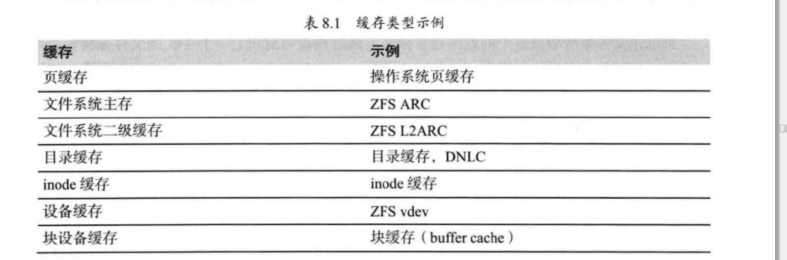

- 页缓存

  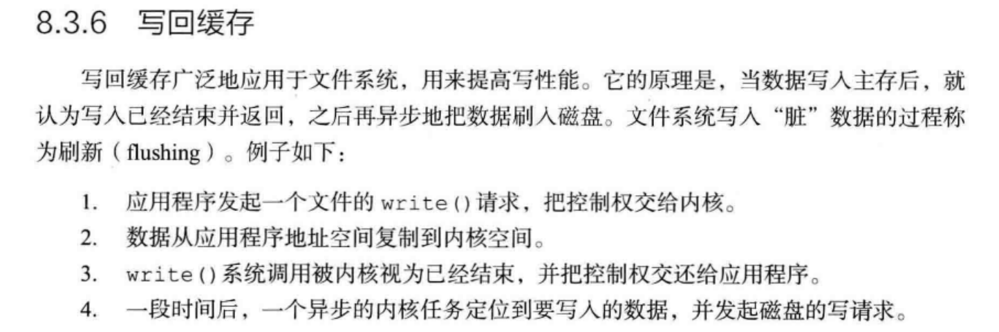


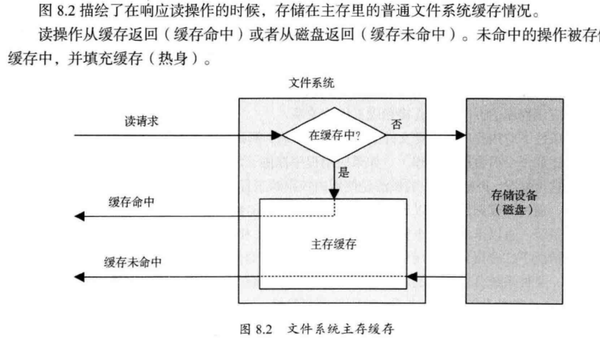


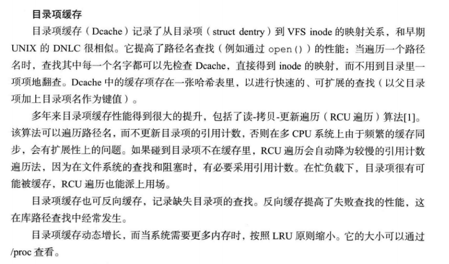-

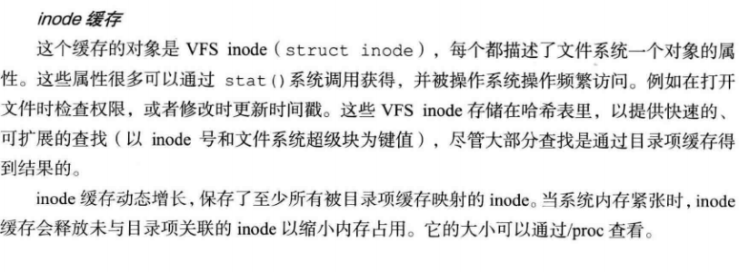

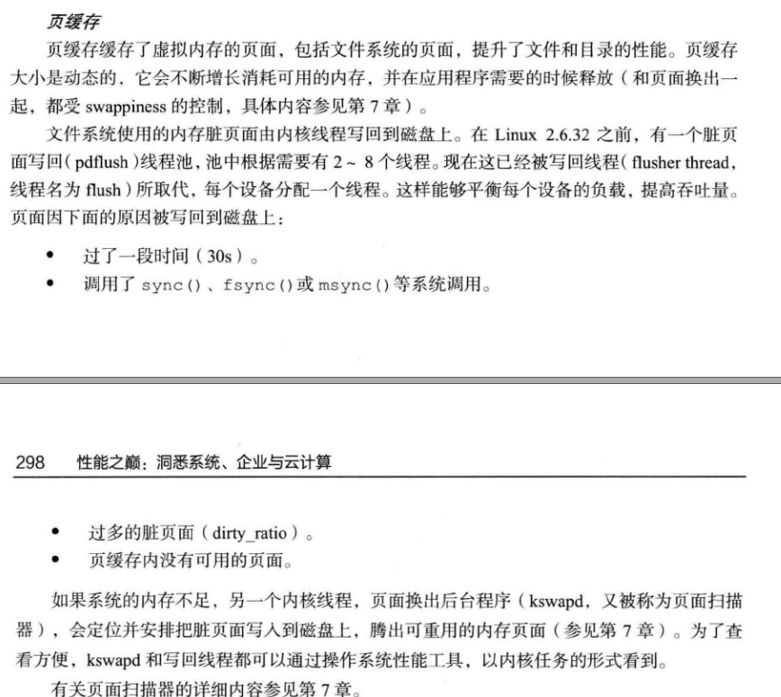


 ### 4 Linux 内核中文件 Cache 管理的机制

 http://www.ilinuxkernel.com/files/Linux.Kernel.Cache.pdf 


### 概念回顾

 文件 Cache 是文件数据在内存中的副本 ,

文件 Cache 分为两个层面，一是 Page Cache，  另一个 Buffer Cache

- Page

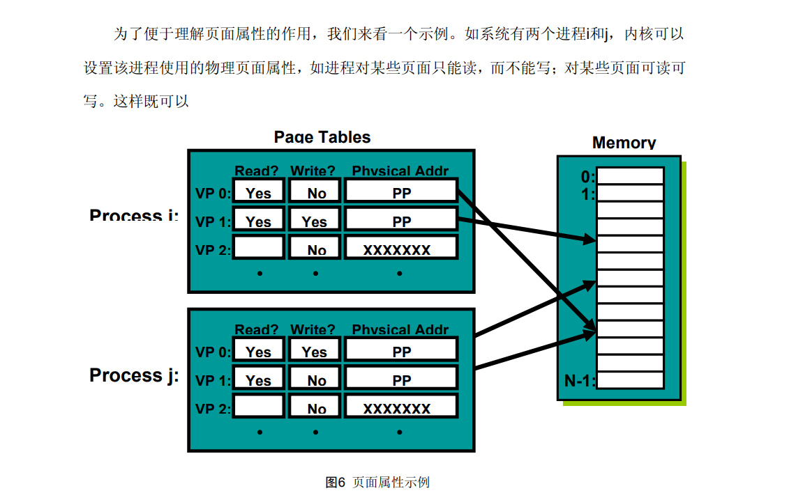

- 内存管理系统和 VFS 只与 Page Cache 交互 

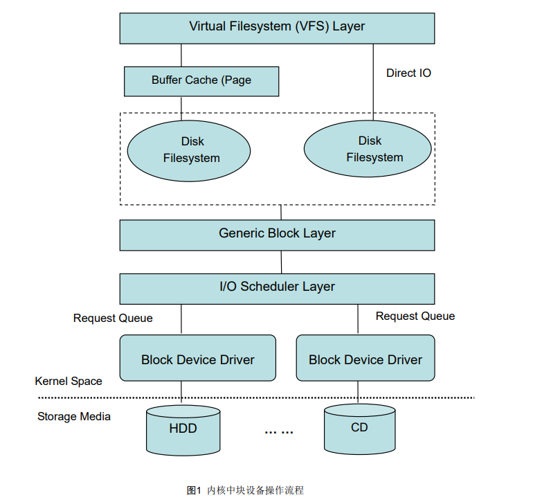

 

-  Page Cache、Buffer Cache、文件以及磁盘之间的关系 

   文件的每个数据块最多只能对应一个 Page Cache 项 ，

    页面Cache中的每页所包含的数据是属于某个文件 

  

  

-  每一个 Page Cache 包含若干 Buffer Cache 


  

-   **Page cache和Buffer cache的区别** 

  

  磁盘的操作有逻辑级（文件系统）和物理级（磁盘块），这两种Cache就是分别缓存逻辑和物理级数据的。

  

  > 假设我们通过文件系统操作文件，那么文件将被缓存到Page Cache，
  >
  > 如果需要刷新文件的时候，Page Cache将交给Buffer Cache去完成，因为Buffer Cache就是缓存磁盘块的。

  

  Page cache实际上是针对文件系统的，是文件的缓存，在文件层面上的数据会缓存到page cache。文件的逻辑层需要映射到实际的物理磁盘，这种映射关系由文件系统来完成。当page cache的数据需要刷新时，page cache中的数据交给buffer cache 

  

# 案例实践


### 实验1： 查看文件系统 占用情况 

- 文件系统中的目录项和索引节 

```c++
# 按下 c 按照缓存大小排序，按下 a 按照活跃对象数排序 

$ slabtop 
Active / Total Objects (% used)    : 277970 / 358914 (77.4%) 
Active / Total Slabs (% used)      : 12414 / 12414 (100.0%) 
Active / Total Caches (% used)     : 83 / 135 (61.5%) 
Active / Total Size (% used)       : 57816.88K / 73307.70K (78.9%) 
Minimum / Average / Maximum Object : 0.01K / 0.20K / 22.88K 

  OBJS ACTIVE  USE OBJ SIZE  SLABS OBJ/SLAB CACHE SIZE NAME 
69804  23094   0%    0.19K   3324       21     13296K dentry 
16380  15854   0%    0.59K   1260       13     10080K inode_cache 
58260  55397   0%    0.13K   1942       30      7768K kernfs_node_cache 
   485    413   0%    5.69K     97        5      3104K task_struct 
  1472   1397   0%    2.00K     92       16      2944K kmalloc-2048 
    
   dentry 行表示目录项缓存，inode_cache 行，表示 VFS 索引节点缓存，其余的则是各种文件系统的索引节点缓存。
    
 目录项和索引节点占用了最多的 Slab 缓存。

不过它们占用的内存其实并不大，加起来也只有 23MB 左右
    
```


-  free 输出的 Cache，是页缓存和可回收 Slab 缓存的和  （vmstat free）

~~~shell

$ cat /proc/meminfo | grep -E "SReclaimable|Cached" 
Cached:           748316 kB 
SwapCached:            0 kB 
SReclaimable:     179508 kB 


procs -----------memory---------- ---swap-- -----io---- -system-- ------cpu-----
 r  b   swpd   free   buff  cache   si   so    bi    bo   in   cs us sy id wa st
 1  0  81196 13122800 239084 2126152    0    0     0     1    0    0  1  0 99  0  0
~~~

```powershell


cat /proc/meminfo
MemTotal:       16267884 kB
MemFree:        13119460 kB
MemAvailable:   13798228 kB
Buffers:          240324 kB
Cached:          1648252 kB
SwapCached:         9644 kB
Active:           802676 kB
Inactive:        1733356 kB
Active(anon):     510300 kB
Inactive(anon):  1449420 kB
Active(file):     292376 kB
Inactive(file):   283936 kB
Unevictable:           0 kB
Mlocked:               0 kB
SwapTotal:       1048572 kB
SwapFree:         967376 kB
Dirty:               108 kB
Writeback:             0 kB
AnonPages:        639208 kB
Mapped:           109460 kB
Shmem:           1312244 kB
Slab:             478768 kB
SReclaimable:     355860 kB
SUnreclaim:       122908 kB
KernelStack:        5376 kB
PageTables:        10860 kB
NFS_Unstable:          0 kB
Bounce:                0 kB
WritebackTmp:          0 kB
CommitLimit:     9182512 kB
Committed_AS:    3782272 kB
VmallocTotal:   34359738367 kB
VmallocUsed:       34736 kB
VmallocChunk:   34359698684 kB
HardwareCorrupted:     0 kB
AnonHugePages:    253952 kB
HugePages_Total:       0
HugePages_Free:        0
HugePages_Rsvd:        0
HugePages_Surp:        0
Hugepagesize:       2048 kB
DirectMap4k:      108416 kB
DirectMap2M:    10377216 kB
DirectMap1G:     8388608 kB
```


-  可以用stat命令，查看某个文件的inode信息 

~~~shell
 stat cmd.txt 
  File: ‘cmd.txt’
  Size: 131             Blocks: 8          IO Block: 4096   regular file
Device: fd00h/64768d    Inode: 482         Links: 1
Access: (0644/-rw-r--r--)  Uid: (    0/    root)   Gid: (    0/    root)
Access: 2019-01-22 17:22:54.685741395 +0800
Modify: 2019-01-22 16:34:25.993178846 +0800
Change: 2019-01-22 16:34:25.993178846 +0800
 Birth: -

stat - display file or file system status

stat -f cmd.txt 
  File: "cmd.txt"
    ID: 37fc5f360777ebb Namelen: 255     Type: ext2/ext3
Block size: 4096       Fundamental block size: 4096
Blocks: Total: 4817666    Free: 2971792    Available: 2748308
Inodes: Total: 1227328    Free: 1148127


df -i
Filesystem                 Inodes  IUsed    IFree IUse% Mounted on
/dev/mapper/vg_root-root  1227328  79201  1148127    7% /
devtmpfs                  2030909    422  2030487    1% /dev
tmpfs                     2033485      1  2033484    1% /dev/shm

~~~


- 是否缓存 1631-->112

~~~shell
To free pagecache:
# echo 1 > /proc/sys/vm/drop_caches
To free dentries and inodes:
# echo 2 > /proc/sys/vm/drop_caches
To free pagecache, dentries and inodes:
# echo 3 > /proc/sys/vm/drop_caches


root@work:~# free -m
              total        used        free      shared  buff/cache   available
Mem:           2009         276         101           3        1631        1545
Swap:           425     

root@work:~# echo 3 > /proc/sys/vm/drop_caches
root@work:~# free -m
              total        used        free      shared  buff/cache   available
Mem:           2009         250        1646           1         112        1628
Swap:

命令slabtop查看slab占用情况

Slab的两个主要作用：
Slab对小对象进行分配，不用为每个小对象分配一个页，节省了空间。
内核中一些小对象创建析构很频繁，Slab对这些小对象做缓存，可以重复利用一些相同的对象，减少内存分配次

https://fivezh.github.io/2017/06/25/Linux-slab-info/

[root@vm-10-115-37-60 bin]#  cat /proc/slabinfo |awk '{print $1,$3*$4/1024,"KB"}' | sort -k2 -n | tail
sysfs_dir_cache 2019.94 KB
kmalloc-1024 2080 KB
kmalloc-2048 2304 KB
kmalloc-4096 2528 KB
buffer_head 6515.74 KB
ext4_inode_cache 8439.27 KB
inode_cache 9396.84 KB
radix_tree_node 11705.1 KB
shmem_inode_cache 91290 KB
dentry 309050 KB


~~~

- nmon

~~~shell
wget http://sourceforge.net/projects/nmon/files/nmon16e_mpginc.tar.gz
tar -zxvf nmon16e_mpginc.tar.gz
cp nmon_x86_64_centos7 /usr/local/bin/nmon
cd /usr/local/bin
chmod 777 nmon

~~~

-  vmtouch

 http://ohmycat.me/2017/12/05/vmtouch.html 


 祝玩得开心！ 


# 参考

[1]  https://github.com/freelancer-leon/notes/blob/master/kernel/vfs.md 

https://wizardforcel.gitbooks.io/vbird-linux-basic-4e/content/59.html

https://www.cnblogs.com/xiaojiang1025/p/6363626.html

[2]  directory entry cache (dcache). 是什么  https://www.kernel.org/doc/ols/2002/ols2002-pages-289-300.pdf

[3] 一次FIND命令导致的内存问题排查  https://ixyzero.com/blog/archives/3231.html 

[4] 什么是PAGECACHE/DENTRIES/INODES?  https://ixyzero.com/blog/archives/3233.html 

[5]  free  https://zhuanlan.zhihu.com/p/35277219 

[6] Linux Used内存到底哪里去了？  http://blog.yufeng.info/archives/2456 

[7] x86 CPU中逻辑地址到物理地址映射过程  http://ilinuxkernel.com/?p=448 

[8]  https://zh.wikipedia.org/wiki/Inode 

[9]  http://www.ruanyifeng.com/blog/2011/12/inode.html 


 

