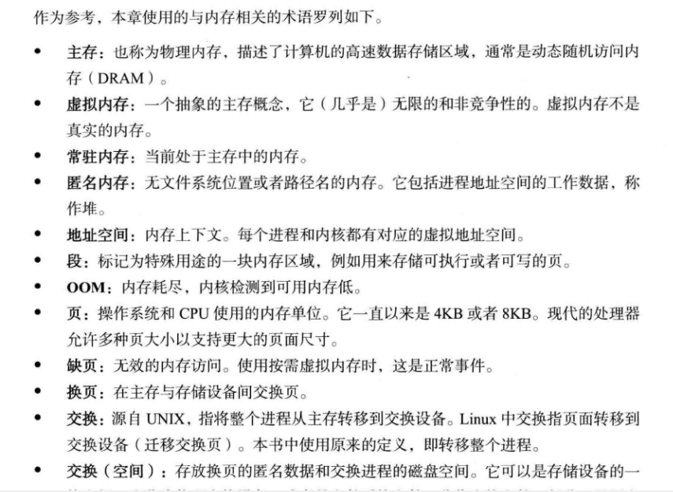
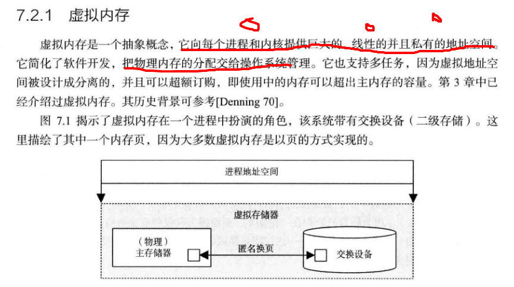
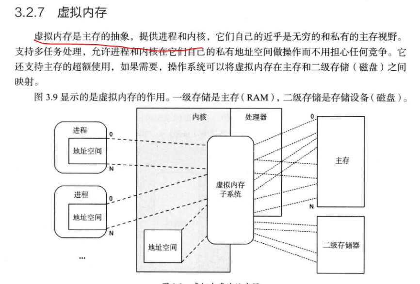
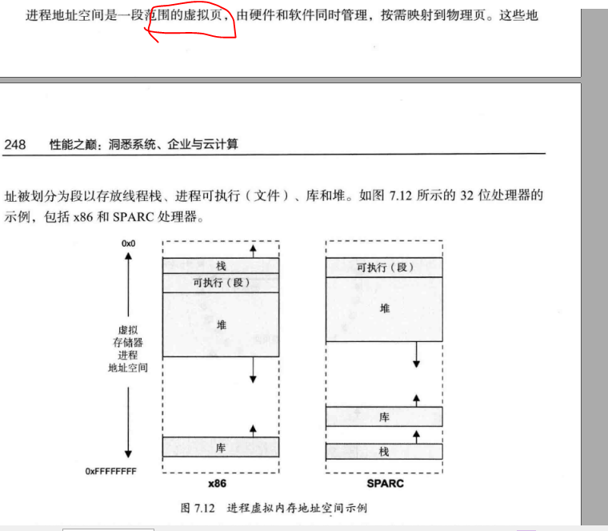
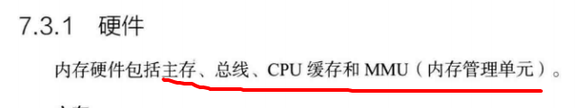
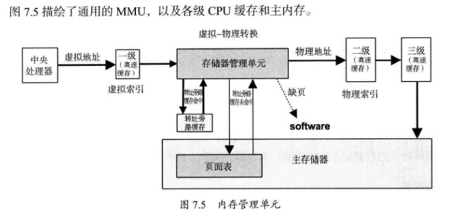
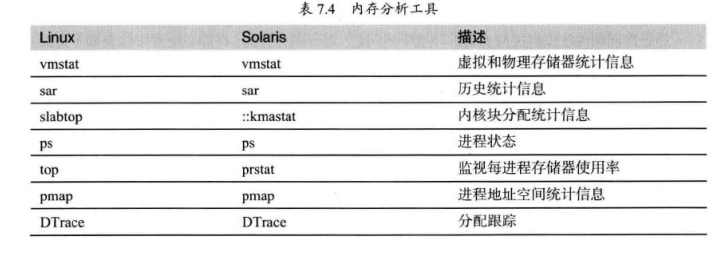

# 资料

  [Linux中的虚拟内存系统](https://app.yinxiang.com/shard/s39/nl/8226829/72805ed3-e659-4310-bf67-bad3d4dfea70)  


# 内存管理

  

  


# 虚拟内存（概念）

- 术语

  

- 虚拟内存是真正的内存，而是模拟出来内存一样功能（不担心竞争）





  

    

  

  

  

  








- 内存回收kswapd


- 内存分配


# 手动实验（指标）

  

 


   



### 查看进程的内存占用情况


​    cat /proc/$pid/map

```
fishcried@kali:~$ pmap -x 4751
4751:   -bash
Address           Kbytes     RSS   Dirty Mode   Mapping
0000000000400000     916     716       0 r-x-- bash
......
00007fffaa366000     132      32      32 rw--- [ stack ]
00007fffaa3c5000       8       4       0 r-x-- [ anon ]
ffffffffff600000       4       0       0 r-x-- [ anon ]
---------------- ------ ------ ------
total kB           23560    6548    4684
```

| Address  | Kbytes | Rss                  | Dirty  | Mode Mapping |      |
| :------- | :----- | :------------------- | :----- | :----------- | :--- |
| 起始地址 | 大小   | 实际占用物理内存大小 | 脏页数 | 权限         | 名字 |

`pmap`命令读取了`/proc/pid/maps`和`/porc/pid/smaps`文件.可以直接查看以上两个文件.smaps的格式更为详细可读.


```
cat /proc/25282/status
VmRSS: 113612 kB 表示占用的物理内存
```


```shell
# 首先清理缓存

$ echo 3 > /proc/sys/vm/drop_caches

# 运行dd命令读取文件
$ dd if=/dev/sda1 of=/dev/null bs=1M count=1024
/dev/zero在类UNIX系统中是一个特殊的设备文件，当你读它的时候，它会提供无限的空字符（NULL, ASCII NUL, 0x00）
# 通过读取随机设备，生成一个 500MB 大小的文件 
$ dd if=/dev/urandom of=/tmp/file bs=1M count=500k


 strace -c dd if=/dev/sda1 of=/dev/null bs=1k count=5000k
```


- slabtop - display kernel slab cache information in real time

~~~shell
[root@vm-10-115-37-60 tmp]# slabtop 
 Active / Total Objects (% used)    : 544976 / 2097754 (26.0%)
 Active / Total Slabs (% used)      : 91582 / 91582 (100.0%)
 Active / Total Caches (% used)     : 76 / 99 (76.8%)
 Active / Total Size (% used)       : 179469.16K / 472463.97K (38.0%)
 Minimum / Average / Maximum Object : 0.01K / 0.22K / 8.00K

  OBJS ACTIVE  USE OBJ SIZE  SLABS OBJ/SLAB CACHE SIZE NAME                   
1648836 166695  10%    0.19K  78516       21    314064K dentry
136608 136571  99%    0.66K   5692       24     91072K shmem_inode_cache
 66963  31605  47%    0.10K   1717       39      6868K buffer_head
 31424  23189  73%    0.06K    491       64      1964K kmalloc-64
 21056   8266  39%    0.57K    752       28     12032K radix_tree_node
 18468  18468 100%    0.11K    513       36      2052K sysfs_dir_cache
 18020  10667  59%    0.05K    212       85       848K shared_policy_node
 15708  15011  95%    0.04K    154      102       616K ext4_extent_status
 15687  15687 100%    0.58K    581       27      9296K inode_cache
 11648  11648 100%    0.03K     91      128       364K jbd2_revoke_record_s
 11322  10762  95%    0.08K    222       51       888K selinux_inode_security
  9139   8478  92%    0.21K    247       37      1976K vm_area_struct
  8463   7481  88%    1.02K    273       31      8736K ext4_inode_cache
  7350   7181  97%    0.09K    175       42       700K kmalloc-96
  7168   7168 100%    0.01K     14      512        56K kmalloc-8
  6976   6976 100%    0.06K    109       64       436K anon_vma
  5376   5376 100%    0.02K     21      256        84K kmalloc-16
  4512   3491  77%    0.12K    141       32       564K kmalloc-128
  4170   4170 100%    0.13K    139       30       556K ext4_groupinfo_4k
  3744   2733  72%    0.25K    117       32       936K kmalloc-256
  3712   3712 100%    0.06K     58       64       232K ext4_free_data
  3549   3265  91%    0.19K    169       21       676K kmalloc-192
  3072   3072 100%    0.50K     96       32      1536K kmalloc-512
  2700   2700 100%    0.11K     75       36       300K jbd2_journal_head
  2688   2688 100%    0.03K     21      128        84K kmalloc-32
  2409   2409 100%    0.05K     33       73       132K uhci_urb_priv
~~~


###  系统内存占用情况


~~~shell

cat /proc/meminfo
MemTotal:       16267884 kB
MemFree:        10894124 kB
MemAvailable:   13744648 kB
Buffers:          347620 kB
Cached:          3637524 kB
SwapCached:         9644 kB
Active:          2514784 kB
Inactive:        2114072 kB
Active(anon):     611716 kB
Inactive(anon):  1389456 kB
Active(file):    1903068 kB
Inactive(file):   724616 kB
Unevictable:           0 kB
Mlocked:               0 kB
SwapTotal:       1048572 kB
SwapFree:         967376 kB


cat /proc/slabinfo
slabinfo - version: 2.1
# name            <active_objs> <num_objs> <objsize> <objperslab> <pagesperslab> : tunables <limit> <batchcount> <sharedfactor> : slabdata <active_slabs> <num_slabs> <sharedavail>
nf_conntrack_ffff880234058000     75     75    320   25    2 : tunables    0    0    0 : slabdata      3      3      0
nf_conntrack_ffffffff81a25e00    728    850    320   25    2 : tunables    0    0    0 : slabdata     34     34      0
isofs_inode_cache     50     50    640   25    4 : tunables    0    0    0 : slabdata      2      2      0
ext4_groupinfo_4k   4170   4170    136   30    1 : tunables    0    0    0 : slabdata    139    139      0
ext4_inode_cache   67022  67022   1048   31    8 : tunables    0    0    0 : slabdata   2162   2162      0
ext4_xattr           690    690     88   46    1 : tunables    0    0    0 : slabdata     15     15      0
ext4_free_data      3712   3712     64   64    1 : tunables    0    0    0 : slabdata     58     58      0
ext4_allocation_context    256    256    128   32    1 : tunables    0    0    0 : slabdata      8      8      0
ext4_io_end          969   1020     80   51    1 : tunables    0    0    0 : slabdata     20     20      0
ext4_extent_status  97410  97410     40  102    1 : tunables    0    0    0 : slabdata    955    955      0
jbd2_journal_handle    680    680     48   85    1 : tunables    0    0    0 : slabdata      8      8      0
jbd2_journal_head   2052   2052    112   36    1 : tunables    0    0    0 : slabdata     57     57      0
jbd2_revoke_table_s    256    256     16  256    1 : tunables    0    0    0 : slabdata      1      1      0
jbd2_revoke_record_s  13184  13184     32  128    1 : tunables    0    0    0 : slabdata    103    103      0
scsi_cmd_cache       288    288    448   36    4 : tunables    0    0    0 : slabdata      8      8      0
kcopyd_job             0      0   3312    9    8 : tunables    0    0    0 : slabdata      0      0      0
dm_uevent              0      0   2608   12    8 : tunables    0    0    0 : slabdata      0      0      0
dm_rq_target_io        0      0    136   30    1 : tunables    0    0    0 : slabdata      0      0      0
UDPLITEv6              0      0   1152   28    8 : tunables    0    0    0 : slabdata      0      0      0
UDPv6                224    224   1152   28    8 : tunables    0    0    0 : slabdata      8      8      0
tw_sock_TCPv6        128    128    256   32    2 : tunables    0    0    0 : slabdata      4      4      0
TCPv6                120    120   2112   15    8 : tunables    0    0    0 : slabdata      8      8      0
uhci_urb_priv       1825   1825     56   73    1 : tunables    0    0    0 : slabdata     25     25      0
cfq_queue            280    280    232   35    2 : tunables    0    0    0 : slabdata      8      8      0
bsg_cmd                0      0    312   26    2 : tunables    0    0    0 : slabdata      0      0      0
mqueue_inode_cache    180    180    896   36    8 : tunables    0    0    0 : slabdata      5      5      0
hugetlbfs_inode_cache     52     52    608   26    4 : tunables    0    0    0 : slabdata      2      2      0
configfs_dir_cache    230    230     88   46    1 : tunables    0    0    0 : slabdata      5      5      0
dquot                768    768    256   32    2 : tunables    0    0    0 : slabdata     24     24      0
kioctx                 0      0    576   28    4 : tunables    0    0    0 : slabdata      0      0      0
userfaultfd_ctx_cache      0      0    128   32    1 : tunables    0    0    0 : slabdata      0      0      0
pid_namespace         60     60   2176   15    8 : tunables    0    0    0 : slabdata      4      4      0
user_namespace         0      0    280   29    2 : tunables    0    0    0 : slabdata      0      0      0
posix_timers_cache      0      0    248   33    2 : tunables    0    0    0 : slabdata      0      0      0
UDP-Lite               0      0   1024   32    8 : tunables    0    0    0 : slabdata      0      0      0
RAW                 1008   1394    960   34    8 : tunables    0    0    0 : slabdata     41     41      0
UDP                  256    256   1024   32    8 : tunables    0    0    0 : slabdata      8      8      0
tw_sock_TCP          288    480    256   32    2 : tunables    0    0    0 : slabdata     15     15      0
TCP                  361    459   1920   17    8 : tunables    0    0    0 : slabdata     27     27      0
blkdev_queue         210    300   2088   15    8 : tunables    0    0    0 : slabdata     20     20      0
blkdev_requests      462    609    384   21    2 : tunables    0    0    0 : slabdata     29     29      0
blkdev_ioc           312    312    104   39    1 : tunables    0    0    0 : slabdata      8      8      0
fsnotify_event_holder   1360   1360     24  170    1 : tunables    0    0    0 : slabdata      8      8      0
fsnotify_event       442    442    120   34    1 : tunables    0    0    0 : slabdata     13     13      0
sock_inode_cache     890   1000    640   25    4 : tunables    0    0    0 : slabdata     40     40      0
net_namespace         28     28   4608    7    8 : tunables    0    0    0 : slabdata      4      4      0
shmem_inode_cache 145887 145896    680   24    4 : tunables    0    0    0 : slabdata   6079   6079      0
Acpi-ParseExt       3552   3976     72   56    1 : tunables    0    0    0 : slabdata     71     71      0
Acpi-Namespace      1122   1122     40  102    1 : tunables    0    0    0 : slabdata     11     11      0
~~~


# 参考

[1]  http://lday.me/2019/09/09/0023_linux_page_cache_and_buffer_cache/ 

