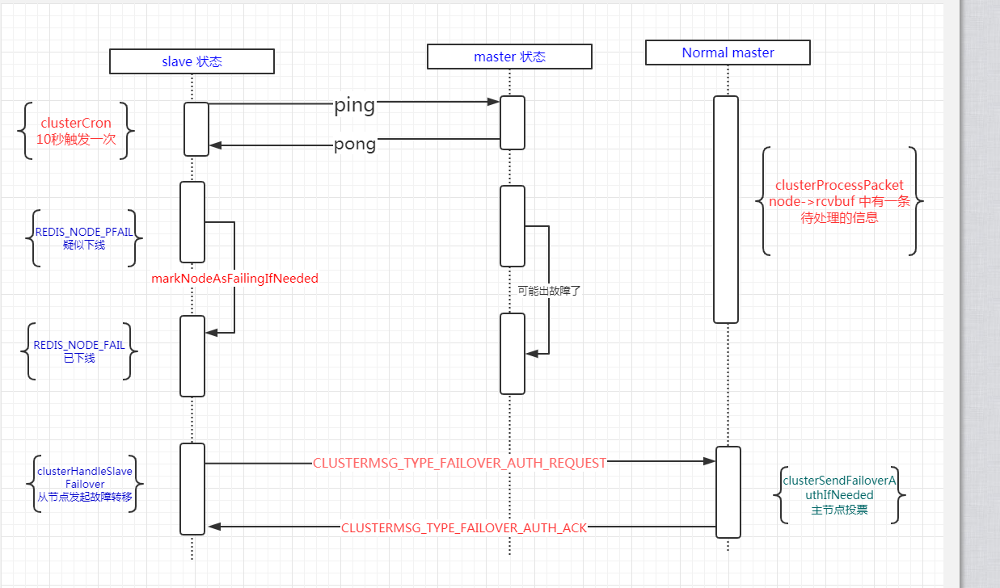

# FAQ

- 选举过程中，候选人如果意识到自己选举失败？

# study

## day1

### 1. Leader 当选后为什么要立即同步一个 no-op 日志？

图中 S1~S5 为集群中的 5 个节点，粗线框表示当前是 leader 角色。每个方框表示一条日志，方框内的数字代表日志的 term。

现在假设没有 no-op 日志，会出现什么问题

1. (a) 图，S1 为 Leader，将**黄色**的日志 2 同步到了 S2 节点，突然就崩溃了
2. (b) 图，S5 当选，将**蓝色**的日志 3 追加到本地日志序列，又突然崩溃了
3. (c) 图，S1 重新当选，追加了一条**红色的新日志** 4 到本地，然后又开始同步往期日志，将黄色的日志 2 又同步到了 S3. 这时黄色的节点 2 已经同步到了 majority，但是还来不及 commit，又突然奔溃了。
4. (d1) 图，S5 重新当选，并开始同步往期日志，蓝色的日志 3 到所有的节点。结果黄色日志 2 被抹平了，虽然它已经被同步到了大多数节点。

遇到这种情况就会导致一条日志虽然被同步到了大多数节点，但是还有被抹去的可能。

如果我们走 (d2) 图，leader 不去单独同步往期的日志，而是通过先同步当前任期内的红色日志 4 到所有节点，就不会导致黄色的节点 2 被抹去。因为 leader 会采用后退重试法来将自己的日志序列同步到所有的 Follower。在尝试同步**红色节点 4 的过程中连带黄色的节点 2** 一起同步了。

例子中是因为 S1 重新当选后立即收到了客户端的指令才有了红色的日志 4。但是如果 Leader 刚刚当选时，客户端处于闲置状态没有向 Leader 发送任何指令，也就没有红色的日志 4，那该怎么办呢？

Raft 算法要求 Leader 当选后立即追加一条 **no-op 的特殊内部日志**，并立即同步到其它节点。这样就可以连带往期日志一起同步了，保障了日志的安全性。

### day2

### day3 日志复制

With this mechanism, a leader does not need to take any
special actions to restore log consistency when it comes to
power  

Committing entries from previous terms  

To eliminate problems like the one in Figure 8, Raft
never commits log entries from previous terms by counting replicas. Only log entries from the leader’s current
term are committed by counting replicas; once an entry
from the current term has been committed in this way,
then all prior entries are committed indirectly because
of the Log Matching Property.  

## 参考

https://juejin.im/post/5af066f1f265da0b715634b9

1. Raft服务器支持多个客户端并发连接
2. 一致性模块负责接收客户端的消息，追加到本地日志中
3. 一致性模块负责复制日志到其它服务器节点
4. 本地日志commit成功后立即应用到状态机
5. 客户端可以直接查询本地状态机的状态

https://blog.wangjunfeng.com/post/raft/