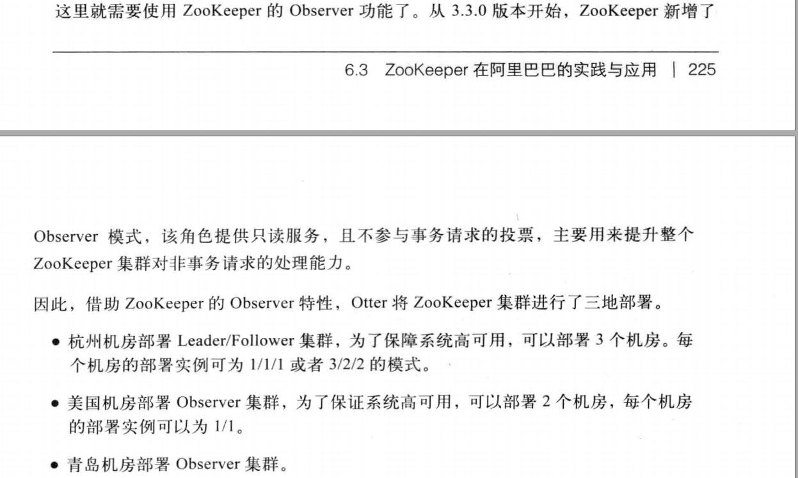

##  协调者ZooKeeper

### 一、这个技术出现的背景、初衷和要达到什么样的目标或是要解决什么样的问题

从集中式部署业务架构到 分布式部署，Master-Worker架构 改造过程中，必然涉及数据一致性问题

2pc，3pc都没很好解决这个问题，ZooKeeper 站出来解决这个问题。

- 应用的协调服务。

- 分布式应用的协调服务。

- 协调分布式应用的服务的服务(中间件)

> 使用**Zoo keeper** ，一个普通服务 做很少改造机就能升级为分布式服务，协调应用直接数据一致性问题。
>
> ZooKeeper is  coordination service for distributed applications.

ZooKeeper 是伴随Hadoop产生的， 而Hadoop生态系统中，很多项目都是以动物来命名，如Pig，Hive等， 似乎像一个动物园，这样就得到动物园管家的名称”ZooKeeper”

### 二、这个技术的优势和劣势分别是什么 

#### 劣势

- ### 服务缺乏可扩展性

微服务相关的项目都纷纷抛弃ZK转投etcd，可见其确实有可取之处，也可以看出一个项目的易用的重要性有时候甚至高于稳定性和功能

可扩展性不足，ZK集群不支持在线动态添加机器或替换机器

- 不适合用于大容量存储。

  > 对于大容量存储 ，我们完全可以考虑使用数据库或者分布式文件系统等

### 三、这个技术适用的场景。任何技术都有其适用的场景，离开了这个场景

　**Zookeeper** 是一个基于 [Google Chubby](https://static.googleusercontent.com/media/research.google.com/zh-CN//archive/chubby-osdi06.pdf) 论文实现的一款解决分布式数据一致性问题的开源实现，方便了依赖 Zookeeper 的应用实现 

- 数据发布 / 订阅

- 负载均衡

- 服务注册与发现

- 分布式协调

- 事件通知

- 集群管理

- Leader 选举

- 分布式锁和队列

### 四、技术的组成部分和关键点。

- ZAB 协议是为分布式协调服务 Zookeeper 专门设计的一种支持崩溃恢复的原子广播协议.专为ZK设计的

  > 2pc和3pc的分析中可以看出，出现不一致的情况都是因为执行rollback操作导致的，同步阻塞本来就性能差，而且还要等待所有的参与者回复才能做出决策，这导致性能更差。
  >
  > Zab在汲取了这些经验后，其在设计上不允许执行rollback操作，协调者(zab中是leader)发出的请求，参与者(zab中是Follower)要么同意，要么丢弃，且协调者在收到一半的回复后，就能做出决策，发出提交申请，同样在得到一半的回复后，能够完成事务
  >
  > zk很好的解决了2pc和3pc的各种问题，且也不会有单点问题

### 五、技术的底层原理和关键实现

### 六、已有的实现和它之间的对比

| 产品      | 一致性 | 角色                                  |      |      |
| --------- | ------ | ------------------------------------- | ---- | ---- |
|           |        |                                       |      |      |
| ZooKeeper | 过半   | leader,followers,Observer（只读节点） |      |      |
|           |        |                                       |      |      |

http://www.jasongj.com/zookeeper/fastleaderelection/

https://mp.weixin.qq.com/s?__biz=MzI4MTY5NTk4Ng==&mid=2247489041&idx=1&sn=b58745994c0c98662e2330c966b5036f&source=41#wechat_redirect

https://juejin.im/post/5b924b0de51d450e9a2de615

https://zyt505050.gitee.io/2019/02/20/zookeeper-gai-lan/