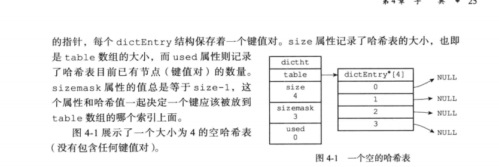
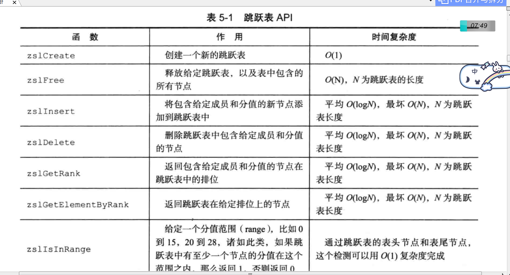
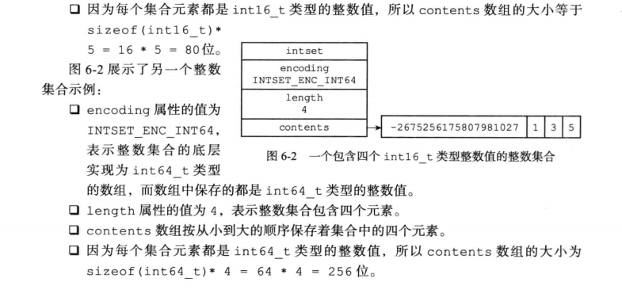
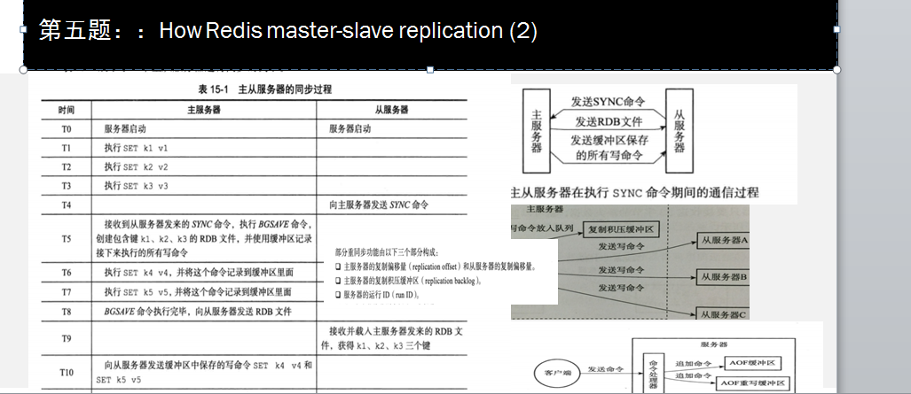

---

title: "redis必须掌握几个知识点"
date: 2019-12-02
description: "redis学习过程"
draft: false
tags: ["redis"]
categories: ["数据库"]
---


# 版本

> 最新特性是什么

| 版本                   | 发布日期     | 其中一个特性                        |
| ---------------------- | ------------ | ----------------------------------- |
| **Redis2.8**           | 2013年11月22 | 一个key的类型和编码类型是什么？save |
| **Redis3.0（里程碑）** | 2015年4月1日 | 集群方案是什么                      |
| **Redis5.0**           | 2018年10月17 |                                     |
| **Redis6.0**           |              | 多线程                              |


### 源码阅读参考

- https://github.com/huangz1990/redis-3.0-annotated
- https://redissrc.readthedocs.io/en/latest/


# FQA


- 一个key的类型和编码类型是什么？
- redis集群方案
-  save 与 bgsave？
- 


# 第一天 what is Redis 

## 学习资料

#### [Redis Cluster Specification](https://redis.io/topics/cluster-spec)

目标：


## Redis Cluster goals

Redis Cluster is a distributed implementation of Redis with the following goals, in order of importance in the design:

- High performance and linear scalability up to 1000 nodes. There are no proxies, asynchronous replication is used, and no merge operations are performed on values.

> 最高扩展到1000个节点，拿到不能超过吗、为什么这样说

- Acceptable degree of write safety: the system tries (in a best-effort way) to retain all the writes originating from clients connected with the majority of the master nodes. Usually there are small windows where acknowledged writes can be lost. Windows to lose acknowledged writes are larger when clients are in a minority partition.
- Availability: Redis Cluster is able to survive partitions where the majority of the master nodes are reachable and there is at least one reachable slave for every master node that is no longer reachable. Moreover using *replicas migration*, masters no longer replicated by any slave will receive one from a master which is covered by multiple slaves.

### Redis 5.0.8 集群[搭建](https://www.jianshu.com/p/dfc6656d4287)


| Host    | Address      | Port | Port |
| ------- | ------------ | ---- | ---- |
| server1 | 10.115.37.44 | 7001 | 7004 |
| server2 | 10.115.37.45 | 7002 | 7005 |
| server3 | 10.115.37.46 | 7003 | 7006 |


验证集群。

在server1上连接集群的7001端口的节点，具体如下。

```css
/usr/local/redis-5.0.8/src/redis-cli -h 10.115.37.44 -c -p 7001

/usr/local/redis-5.0.8/src/redis-cli -h 10.115.37.45 -c -p 7002
[root@server1 ~]# redis-cli -h 192.168.65.151 -c -p 7002
192.168.65.151:7002> get yan
-> Redirected to slot [13290] located at 192.168.65.152:7003
"ning"
192.168.65.152:7003>
```

## Redis监控服务安装部署（RedisLive）

二话不说先上图，能看上再玩，看不上略过，网上各种监控软件还得用自己喜欢的不是！

项目地址：https://github.com/nkrode/RedisLive


### 1、环境依赖

- 一些环境依赖，如：yum install gcc g++ zlib zlib-devel openssl openssl-devel

- 安装python2.7+环境

- 安装setuptools：

  - wget --no-check-certificate https://pypi.python.org/packages/source/s/setuptools/setuptools-19.6.tar.gz#md5=c607dd118eae682c44ed146367a17e26
  - 进入setuptools目录，执行python setup.py install

- 安装pip：

  - pip install --upgrade pip

    Successfully installed pip-20.0.2

  - 

- 安装redislive需要的一些依赖（tornado，redis，python-dateutil，argparse），期间有可能需要升级pip，看情况调整

  - pip install tornado==2.1.1

  - pip install python-dateutil==1.5

  - pip install argparse==1.2.1

  - pip install redis==2.10.6 

    pip uninstall redis (这个特别注意下，不管你实际用的什么版本redis)

    

- 下载redislive源代码，解压配置redis-liver-conf文件

  git clone https://github.com/kumarnitin/RedisLive.git

  cd /usr/local/RedisLive/src

  ```shell
  {
  	"RedisServers":
  	[ 
  		{
    			"server": "10.115.37.44",
    			"port" : 7001
  		},
  		{
    			"server": "10.115.37.44",
    			"port" : 7004
  		},
  		{
    			"server": "10.115.37.45",
    			"port" : 7002
  		},
  		{
    			"server": "10.115.37.45",
    			"port" : 7005
  		},
  		{
    			"server": "10.115.37.46",
    			"port" : 7003
  		},
  		{
    			"server": "10.115.37.46",
    			"port" : 7006
  		}
  			
  	],
  
  	"DataStoreType" : "redis",
  
  	"RedisStatsServer":
  	{
  		"server" : "10.115.37.44",
  		"port" : 6385
  	},
  	
  	"SqliteStatsStore" :
  	{
  		"path":  "/opt/redis-cluster/data/redislive.db"
  	}
  }
  
  ```

  ##### 2 启动服务

  ###### 2.1 启动监控服务

  

  ```jsx
  $./redis-monitor.py --duration=30 & 
  ```

  duration参数指定了监控服务的运行时间，单位为秒。

  ###### 2.2 将监控服务设置为定时任务

  由于redis-monitor.py脚本采用向 Redis 实例发送 MONITOR 命令和 INFO 命令的方式来取得监控数据，而 MONITOR 命令对于 Redis 实例的性能有较大影响，因此，对于生产环境下的redis-monitor.py的部署，需要设置一个较适宜的duration参数，并使用 crontab 来定时执行该脚本。
   首先可以创建一个定时任务文件，方便统一管理定时任务。

  

  ```bash
  $sudo vim /etc/davecron
  #将监控服务的定时任务写入到定时任务的文件中
  *\1 * * * * python /usr/local/RedisLive/src/redis-monitor.py --duration 30 >/dev/null 2>&1
  #1分钟运行一次监控服务，监控服务一次运行30秒
  ```

  启动定时任务

  

  ```bash
  $sudo crontab /etc/rootcron
  ```

  ###### 2.3 启动Web服务

  

  ```ruby
  cd/usr/local/RedisLive/src/
  ./redis-live.py &
  http://10.115.37.44:8888/index.html
  ```

  

  


## 学习输出


### #1 陈咬金第一斧  模型什么


### #2 陈咬金第二斧  数据状态是什么


### 1 FAIL状态


~~~c
A PFAIL condition is escalated to a FAIL condition when the following set of conditions are met:

Some node, that we'll call A, has another node B flagged as PFAIL.
Node A collected, via gossip sections, information about the state of B from the point of view of the majority of masters in the cluster.
The majority of masters signaled the PFAIL or FAIL condition within NODE_TIMEOUT * FAIL_REPORT_VALIDITY_MULT time. (The validity factor is set to 2 in the current implementation, so this is just two times the NODE_TIMEOUT time).
If all the above conditions are true, Node A will:

Mark the node as FAIL.
Send a FAIL message to all the reachable nodes.
~~~


### 2 slave 发起投票条件

~~~shell
于挂掉的master可能会有多个slave，从而存在多个slave竞争成为master节点的过程， 其过程如下：

1.slave发现自己的master变为FAIL
2.将自己记录的集群currentEpoch加1，并广播FAILOVER_AUTH_REQUEST信息
3.其他节点收到该信息，只有master响应，判断请求者的合法性，并发送FAILOVER_AUTH

4.尝试failover的slave收集FAILOVER_AUTH_ACK
5.超过半数后变成新Master
6.广播Pong通知其他集群节点。

A slave starts an election when the following conditions are met:

1 The slave's master is in FAIL state.
2 The master was serving a non-zero number of slots.
3 The slave replication link was disconnected from the master for no longer than a given amount of time, in order to ensure the promoted slave's data is reasonably fresh. 
This time is user configurable.


~~~


### 3 主节点投票条件

~~~scss
主节点接收到来自于从节点、要求以 FAILOVER_AUTH_REQUEST 请求的形式投票的请求。 
要授予一个投票，必须要满足以下条件：

1) 在一个给定的时段（epoch）里，一个主节点只能投一次票，并且拒绝给以前时段投票：每个主节点都有一个 lastVoteEpoch 域，一旦认证请求数据包（auth request packet）里的 currentEpoch 小于 lastVoteEpoch，那么主节点就会拒绝再次投票。
  当一个主节点积极响应一个投票请求，那么 lastVoteEpoch 会相应地进行更新。
2) 一个主节点投票给某个从节点当且仅当该从节点的主节点被标记为 FAIL。
3) 如果认证请求里的 currentEpoch 小于主节点里的 currentEpoch 的话，那么该请求会被忽视掉。
    因此，主节点的回应总是带着和认证请求一致的 currentEpoch。
    如果同一个从节点在增加 currentEpoch 后再次请求投票，那么保证一个来自于主节点的、旧的延迟回复不会被新一轮选举接受。
    

For a vote to be granted the following conditions need to be met:

1.  A master only votes a single time for a given epoch, and refuses to vote for older epochs: every master has a lastVoteEpoch field and will refuse to vote again as long as the currentEpoch in the auth request packet is not greater than the lastVoteEpoch. 
    When a master replies positively to a vote request, the lastVoteEpoch is updated accordingly, and safely stored on disk.

2.  A master votes for a slave only if the slave's master is flagged as FAIL.

3.  Auth requests with a currentEpoch that is less than the master currentEpoch are ignored. Because of this the master reply will always have the same currentEpoch as the auth request. If the same slave asks again to be voted, incrementing the currentEpoch, it is guaranteed that an old delayed reply from the master can not be accepted for the new vote.

/* Vote for the node asking for our vote if there are the conditions. */
// 在条件满足的情况下，为请求进行故障转移的节点 node 进行投票，支持它进行故障转移
///主节点投票
void clusterSendFailoverAuthIfNeeded(clusterNode *node, clusterMsg *request) {

    // 请求节点的主节点
    clusterNode *master = node->slaveof;

    // 请求节点的当前配置纪元
    uint64_t requestCurrentEpoch = ntohu64(request->currentEpoch);

    // 请求节点想要获得投票的纪元
    uint64_t requestConfigEpoch = ntohu64(request->configEpoch);

    // 请求节点的槽布局
    unsigned char *claimed_slots = request->myslots;
    int force_ack = request->mflags[0] & CLUSTERMSG_FLAG0_FORCEACK;
    int j;

    /* IF we are not a master serving at least 1 slot, we don't have the
     * right to vote, as the cluster size in Redis Cluster is the number
     * of masters serving at least one slot, and quorum is the cluster
     * size + 1 */

    // 如果节点为从节点，或者是一个没有处理任何槽的主节点，
    // 那么它没有投票权
    if (nodeIsSlave(myself) || myself->numslots == 0) return;

    /* Request epoch must be >= our currentEpoch. */
    // 请求的配置纪元必须大于等于当前节点的配置纪元
    if (requestCurrentEpoch < server.cluster->currentEpoch) return;

    /* I already voted for this epoch? Return ASAP. */
    // 已经投过票了
    if (server.cluster->lastVoteEpoch == server.cluster->currentEpoch) return;

    /* Node must be a slave and its master down.
     * The master can be non failing if the request is flagged
     * with CLUSTERMSG_FLAG0_FORCEACK (manual failover). */
    if (nodeIsMaster(node) || master == NULL ||
        (!nodeFailed(master) && !force_ack)) return;

    /* We did not voted for a slave about this master for two
     * times the node timeout. This is not strictly needed for correctness
     * of the algorithm but makes the base case more linear. */
    // 如果之前一段时间已经对请求节点进行过投票，那么不进行投票
    if (mstime() - node->slaveof->voted_time < server.cluster_node_timeout * 2)
        return;

    /* The slave requesting the vote must have a configEpoch for the claimed
     * slots that is >= the one of the masters currently serving the same
     * slots in the current configuration. */
    for (j = 0; j < REDIS_CLUSTER_SLOTS; j++) {

        // 跳过未指派节点
        if (bitmapTestBit(claimed_slots, j) == 0) continue;

        // 查找是否有某个槽的配置纪元大于节点请求的纪元
        if (server.cluster->slots[j] == NULL ||
            server.cluster->slots[j]->configEpoch <= requestConfigEpoch)
        {
            continue;
        }

        // 如果有的话，说明节点请求的纪元已经过期，没有必要进行投票
        /* If we reached this point we found a slot that in our current slots
         * is served by a master with a greater configEpoch than the one claimed
         * by the slave requesting our vote. Refuse to vote for this slave. */
        return;
    }

    /* We can vote for this slave. */
    // 为节点投票
    clusterSendFailoverAuth(node);
    // 更新时间值
    server.cluster->lastVoteEpoch = server.cluster->currentEpoch;
    node->slaveof->voted_time = mstime();
}
~~~


### 4. Redis Cluster数据分片机制


A 问题（读三遍）：Redis的数据如何平滑扩容? 


关键词：扩容，还有平滑

为了使得集群能够水平扩展，首要解决的问题就是如何将整个数据集按照一定的规则分配到多个节点上，

平滑扩容是一种[在线水平扩容方式](https://help.aliyun.com/document_detail/52132.html?spm=a2c4g.11186623.4.2.527e5096Ac5fpB)，既把原有的分库平滑迁移到新添加的 RDS 实例上


扩展 ：nginx，Strom等其他任何一个服务上 


B 思考：


常用的数据分片的方法有：范围分片，哈希分片，[一致性哈希算法](https://yikun.github.io/2016/06/09/%E4%B8%80%E8%87%B4%E6%80%A7%E5%93%88%E5%B8%8C%E7%AE%97%E6%B3%95%E7%9A%84%E7%90%86%E8%A7%A3%E4%B8%8E%E5%AE%9E%E8%B7%B5/)和**虚拟哈希槽**等

范围分片:一旦固定，范围就无法改变

 哈希分片，如果想增加一个节点，整个集群的数据完全打破，这就是问题

Redis Cluster 采用[虚拟哈希槽分区](https://www.cnblogs.com/lowmanisbusy/p/10993748.html)，所有的键根据哈希函数映射到 0 ~ 16383 整数槽内，计算公式：slot = CRC16(key) & 16383。

每一个节点负责维护一部分槽以及槽所映射的键值数据

c 回答

- 一个大数据拆分不同小数据，slot，分批迁移。

- 集群状态，清楚知道每个sloat位置

  


### #2 陈咬金第二斧  clusterCron 过程

每间隔 100 毫秒执行一次

1.  向集群中的所有断线或者未连接节点发送CLUSTERMSG_TYPE_PING 消息

2. 隔一秒钟,随机5个节点发送CLUSTERMSG_TYPE_PING 信息 

3. 遍历所有节点，检查是否需要将某个节点标记为下线

   3.1.如果tcp链接断开，释放链接，下次会在1步骤中重新建立链接

   3.2 如果该链接没有发送过ping，没有随机到，发送ping 信息

   **3.3 计算当前时间和该节点上次发送ping时间，如果超过cluster_node_timeout** 

     **标记 REDIS_NODE_PFAIL 疑似下线标记**

   3.3 如果从节点没有在复制主节点，那么对从节点进行设置【why】

   3.4  从节点发起故障转移  clusterHandleSlaveFailover

   clusterHandleManualFailover  --表示没看懂

   clusterHandleSlaveMigration --表示没看懂

   3.5 更新集群的节点状态信息 ！！！！ ---REDIS_NODE_PFAIL  REDIS_CLUSTER_FAIL

   

   ~~~c
       /* Compute the cluster size, that is the number of master nodes
        * serving at least a single slot.
        *
        * At the same time count the number of unreachable masters with
        * at least one node. */
       // 统计在线并且正在处理至少一个槽的 master 的数量，
       // 以及下线 master 的数量
       {
           dictIterator *di;
           dictEntry *de;
   
           server.cluster->size = 0;
           di = dictGetSafeIterator(server.cluster->nodes);
           while((de = dictNext(di)) != NULL) {
               clusterNode *node = dictGetVal(de);
   
               if (nodeIsMaster(node) && node->numslots) {
                   server.cluster->size++;
                   if (node->flags & (REDIS_NODE_FAIL|REDIS_NODE_PFAIL))
                       unreachable_masters++;
               }
           }
           dictReleaseIterator(di);
       }
   
   /* If we can't reach at least half the masters, change the cluster state
        * to FAIL, as we are not even able to mark nodes as FAIL in this side
        * of the netsplit because of lack of majority.
        *
        * 如果不能连接到半数以上节点，那么将我们自己的状态设置为 FAIL
        * 因为在少于半数节点的情况下，节点是无法将一个节点判断为 FAIL 的。
        */
       {
           int needed_quorum = (server.cluster->size / 2) + 1;
   
           if (unreachable_masters >= needed_quorum) {
               new_state = REDIS_CLUSTER_FAIL;
               among_minority_time = mstime();
           }
       }
   ~~~

   

##### clusterHandleSlaveFailover 故障转移流程


- 如果没有像其他节点发起投票 clusterRequestFailoverAuth

-   如果当前节点获得了足够多的投票，那么对下线主节点进行故障转移

   将当前节点的身份由从节点改为主节点

  让从节点取消复制，成为新的主节点

  **接收所有主节点负责处理的槽**

  更新集群配置纪元

  更新节点状态

  并保存配置文件

   

# 第二天：what is clusterCron 

### A 学习资料：

> clusterCron

### B 学习输出：有限状态机


有限状态机是个十分有用的模型，可以用来模拟世界上大部分的事物，其有三个特征：

1. 状态总数（state）是有限的。
2. 任一时刻，只处在一种状态之中。
3. 某种条件下，会从一种状态转变（transition）到另一种状态。


[JavaScript与有限状态机](http://www.ruanyifeng.com/blog/2013/09/finite-state_machine_for_javascript.html)

[一个有特色的有限状态机](https://colobu.com/2016/12/24/a-featured-fsm/)

[TCP Operational Overview and the TCP Finite State Machine (FSM)](http://www.tcpipguide.com/free/t_TCPOperationalOverviewandtheTCPFiniteStateMachineF-2.htm)

https://www.youtube.com/watch?v=Qa6csfkK7_I


##### #陈咬金第一斧  模型什么

##### #陈咬金第二斧  状态状态是什么

##### #陈咬金第三斧  有什么用


## 第三天： 内存模型（对象的类型与编码）


#### zset

#### #1【插入操作】

> zskiplistNode *zslInsert(zskiplist *zsl, double score, robj *obj)


文字描述：

- 在各个层查找节点的插入位置 存储  zskiplistNode *update[ZSKIPLIST_MAXLEVEL]
- level = zslRandomLevel()
- 插入节点


~~~c
/*
 * 创建一个成员为 obj ，分值为 score 的新节点，
 * 并将这个新节点插入到跳跃表 zsl 中。
 * 
 * 函数的返回值为新节点。
 *
 * T_wrost = O(N^2), T_avg = O(N log N)
 */
zskiplistNode *zslInsert(zskiplist *zsl, double score, robj *obj) {
    zskiplistNode *update[ZSKIPLIST_MAXLEVEL], *x;
    unsigned int rank[ZSKIPLIST_MAXLEVEL];
    int i, level;

    redisAssert(!isnan(score));

    // 在各个层查找节点的插入位置
    // T_wrost = O(N^2), T_avg = O(N log N)
    x = zsl->header;
    for (i = zsl->level-1; i >= 0; i--) {

        /* store rank that is crossed to reach the insert position */
        // 如果 i 不是 zsl->level-1 层
        // 那么 i 层的起始 rank 值为 i+1 层的 rank 值
        // 各个层的 rank 值一层层累积
        // 最终 rank[0] 的值加一就是新节点的前置节点的排位
        // rank[0] 会在后面成为计算 span 值和 rank 值的基础
        rank[i] = i == (zsl->level-1) ? 0 : rank[i+1];

        // 沿着前进指针遍历跳跃表
        // T_wrost = O(N^2), T_avg = O(N log N)
        while (x->level[i].forward &&
            (x->level[i].forward->score < score ||
                // 比对分值
                (x->level[i].forward->score == score &&
                // 比对成员， T = O(N)
                compareStringObjects(x->level[i].forward->obj,obj) < 0))) {

            // 记录沿途跨越了多少个节点
            rank[i] += x->level[i].span;

            // 移动至下一指针
            x = x->level[i].forward;
        }
        // 记录将要和新节点相连接的节点
        update[i] = x;
    }

    /* we assume the key is not already inside, since we allow duplicated
     * scores, and the re-insertion of score and redis object should never
     * happen since the caller of zslInsert() should test in the hash table
     * if the element is already inside or not. 
     *
     * zslInsert() 的调用者会确保同分值且同成员的元素不会出现，
     * 所以这里不需要进一步进行检查，可以直接创建新元素。
     */

    // 获取一个随机值作为新节点的层数
    // T = O(N)
    level = zslRandomLevel();

    // 如果新节点的层数比表中其他节点的层数都要大
    // 那么初始化表头节点中未使用的层，并将它们记录到 update 数组中
    // 将来也指向新节点
    if (level > zsl->level) {

        // 初始化未使用层
        // T = O(1)
        for (i = zsl->level; i < level; i++) {
            rank[i] = 0;
            update[i] = zsl->header;
            update[i]->level[i].span = zsl->length;
        }

        // 更新表中节点最大层数
        zsl->level = level;
    }

    // 创建新节点
    x = zslCreateNode(level,score,obj);

    // 将前面记录的指针指向新节点，并做相应的设置
    // T = O(1)
    for (i = 0; i < level; i++) {
        
        // 设置新节点的 forward 指针
        x->level[i].forward = update[i]->level[i].forward;
        
        // 将沿途记录的各个节点的 forward 指针指向新节点
        update[i]->level[i].forward = x;

        /* update span covered by update[i] as x is inserted here */
        // 计算新节点跨越的节点数量
        x->level[i].span = update[i]->level[i].span - (rank[0] - rank[i]);

        // 更新新节点插入之后，沿途节点的 span 值
        // 其中的 +1 计算的是新节点
        update[i]->level[i].span = (rank[0] - rank[i]) + 1;
    }

    /* increment span for untouched levels */
    // 未接触的节点的 span 值也需要增一，这些节点直接从表头指向新节点
    // T = O(1)
    for (i = level; i < zsl->level; i++) {
        update[i]->level[i].span++;
    }

    // 设置新节点的后退指针
    x->backward = (update[0] == zsl->header) ? NULL : update[0];
    if (x->level[0].forward)
        x->level[0].forward->backward = x;
    else
        zsl->tail = x;

    // 跳跃表的节点计数增一
    zsl->length++;

    return x;
}
~~~


## 第四天： **发布-订阅（Publish-Subscribe）**

#### 参考资料


https://juejin.im/post/59fef3846fb9a0450f215096

#### 输出


## 第五天 一个完整Socket过程


### 5.1 参考资料

- Unix网络编程卷1

- https://www.infoq.cn/article/communication-redis-clientserver

Redis client/server 交互步骤分为以下 6 个步骤：

一、Client 发起 socket 连接

二、Server 接受 socket 连接

三、客户端 开始写入

四、server 端接收写入

五、server 返回写入结果

六、Client 收到返回结


### 5.2 理解输出


##### #陈咬金第一斧  模型什么

##### #陈咬金第二斧  状态状态是什么

~~~c++
typedef struct aeEventLoop {

    // 已注册的文件事件
    aeFileEvent *events; /* Registered events */
    // 已就绪的文件事件
    aeFiredEvent *fired; /* Fired events */  着2个有什么关系？
    // 时间事件
    aeTimeEvent *timeEventHead;
} aeEventLoop;

readQueryFromClient
    
sendReplyToClient
    https://stackoverflow.com/questions/28098563/errno-after-accept-in-linux-socket-programming


~~~


- https://www.infoq.cn/article/communication-redis-clientserver


##### #陈咬金第三斧  有什么用

 

# 第六天 crash 如何查看指标


#陈咬金第一斧  解决crash思路是什么

##### #陈咬金第二斧  步骤是什么

##### #陈咬金第三斧  有什么用


### #陈咬金第二斧 执行步骤是什么  info

~~~
https://www.cnblogs.com/nulige/p/10708900.html

Redis-5.0.5
wget http://download.redis.io/releases/redis-5.0.5.tar.gz

启动:
systemctl start redis.service
配置：/etc/redis.conf
redis-cli

127.0.0.1:6379> info
# Server
redis_version:3.2.3
redis_git_sha1:00000000
redis_git_dirty:0
redis_build_id:672aed6eb816ad6c
redis_mode:standalone
os:Linux 3.10.0-327.el7.x86_64 x86_64
arch_bits:64
multiplexing_api:epoll Redis  所使用的事件处理机制
gcc_version:4.8.5 Redis 所使用的事件处理机制
process_id:24414 服务器进程的 PID
run_id:f7397d0e9c3d60ac64376365c905ff14f14b3118 Redis 服务器的随机标识符（用于 Sentinel 和集群）
tcp_port:6379
uptime_in_seconds:145
uptime_in_days:0
hz:10
lru_clock:1579188
executable:/usr/bin/redis-server
config_file:/etc/redis.conf

# Clients
connected_clients:1
client_longest_output_list:0
client_biggest_input_buf:0
blocked_clients:0

# Memory
used_memory:813096 由 Redis 分配器分配的内存总量，以字节（byte）为单位
used_memory_human:794.04K 以人类可读的格式返回 Redis 分配的内存总量
used_memory_rss:5943296 
从操作系统的角度，返回 Redis 已分配的内存总量（俗称常驻集大小）。这个值和top 、 ps 等命令的输出一致。


mem_allocator:jemalloc-3.6.0

# Persistence
loading:0
rdb_changes_since_last_save:0
rdb_bgsave_in_progress:0
rdb_last_save_time:1578637347
rdb_last_bgsave_status:ok
rdb_last_bgsave_time_sec:-1
rdb_current_bgsave_time_sec:-1
aof_enabled:0
aof_rewrite_in_progress:0
aof_rewrite_scheduled:0
aof_last_rewrite_time_sec:-1
aof_current_rewrite_time_sec:-1
aof_last_bgrewrite_status:ok
aof_last_write_status:ok

# Stats
total_connections_received:1
total_commands_processed:3
instantaneous_ops_per_sec:0
total_net_input_bytes:134
total_net_output_bytes:5929399
instantaneous_input_kbps:0.00
instantaneous_output_kbps:0.00
rejected_connections:0
sync_full:0
sync_partial_ok:0
sync_partial_err:0
expired_keys:0
evicted_keys:0
keyspace_hits:0
keyspace_misses:0
pubsub_channels:0
pubsub_patterns:0
latest_fork_usec:0
migrate_cached_sockets:0

# Replication
role:master
connected_slaves:0
master_repl_offset:0
repl_backlog_active:0
repl_backlog_size:1048576
repl_backlog_first_byte_offset:0
repl_backlog_histlen:0

# CPU
used_cpu_sys:0.11
used_cpu_user:0.04
used_cpu_sys_children:0.00
used_cpu_user_children:0.00

# Cluster
cluster_enabled:0
~~~


- ## 延迟时间 

  ```
  Redis-cli --latency -h 127.0.0.1 -p 6379
  ```


- used_memory_rss含义

  ```
  https://redis.io/commands/info
  
  When rss >> used, a large difference means there is memory fragmentation (internal or external), 说明碎片率严重
  
  When used >> rss, it means part of Redis memory has been swapped off by the operating system: 
  
  Redis进程内消耗主要包括：自身内存（少，3M 忽视掉）+对象内存（数据多，没办法）+缓冲内存（客户端缓冲、复制积压缓冲区、AOF缓冲区。）+内存碎片（比如当保存5KB对象时jemalloc可能会采用8KB的块存储，而剩下的3KB空间变为了内存碎片不能再分配给其他对象存储） 
  频繁做更新操作
  大量过期键删除
  
  
  
  ```


题外话：

- 什么是内存碎片？（占用了被使用，无法再次分配）

- 如何判断内存碎片是否对我的应用程序有问题？什么样的计划最容易受到影响？

  malloc返回null

- 处理内存碎片的常用方法有哪些？

**ptmalloc的缺陷：** *不定期分配长生命周期的内存容易造成内存碎片，不利于回收。* 多线程锁开销大， 需要避免多线程频繁分配释放。 * 内存从thread的areana中分配， 内存不能从一个arena移动到另一个arena， 就是说如果多线程使用内存不均衡，容易导致内存的浪费

tcmalloc内存碎片

不理解

malloc_trim


# 第七天  Set编码方式有哪些？

## 7.1 输出

----------begin - 精华的三句话---

#陈咬金第一斧  如何解决

> task: 通过[阅读Redis设计](http://redisbook.com/preview/object/object.html)，然后延伸到后面的每个章节。
>
> 

##### #陈咬金第二斧  一共2中

> intset：就是有序的数组
>
> hashtable
>
> 你说quiklis错误，错误 问集合不是有序集合。

#陈咬金第三斧  看源码

~~~c
127.0.0.1:6379> SADD fruits "apple" "banana" "cherry"
(integer) 3
127.0.0.1:6379> object encoding fruits 
"hashtable"  只有key 没有value
 
127.0.0.1:6379>  SADD numbers 1 3 5
(integer) 0
127.0.0.1:6379> object encoding numbers
"intset"
    
集合对象的编码可以是 intset 或者 hashtable
 redis> EVAL "for i=1, 512 do redis.call('SADD', KEYS[1], i) end" 1 integers
(nil)

redis> SCARD integers
(integer) 512

redis> OBJECT ENCODING integers
"intset"   
 
    redis> SADD integers 10086
(integer) 1

redis> SCARD integers
(integer) 513

redis> OBJECT ENCODING integers
"hashtable"
    
当集合对象可以同时满足以下两个条件时， 对象使用 intset 编码：
集合对象保存的所有元素都是整数值；
集合对象保存的元素数量不超过 512 个；
~~~


----------end - 精华的在上面 ---

## 7.2 记录过程，完全乱序，大家跳过


### 陈咬金第一斧  如何解决

>  进展1 :看1-6章节 编码方式 就是底层数据结构


#### 第四章 字典

~~~c++
/*
 * 哈希表
 *
 * 每个字典都使用两个哈希表，从而实现渐进式 rehash 。
 */
typedef struct dictht {
    
    // 哈希表数组
    dictEntry **table;

    // 哈希表大小
    unsigned long size;
    
    // 哈希表大小掩码，用于计算索引值
    // 总是等于 size - 1
    unsigned long sizemask;

    // 该哈希表已有节点的数量
    unsigned long used;

} dictht;


/*
 * 字典
 */
typedef struct dict {

    // 类型特定函数
    dictType *type;

    // 私有数据
    void *privdata;

    // 哈希表
    dictht ht[2];

    // rehash 索引
    // 当 rehash 不在进行时，值为 -1
    int rehashidx; /* rehashing not in progress if rehashidx == -1 */

    // 目前正在运行的安全迭代器的数量
    int iterators; /* number of iterators currently running */

} dict;

~~~




#### 5 章跳跃表


~~~c++

/*
 * 跳跃表
 */
typedef struct zskiplist {

    // 表头节点和表尾节点
    struct zskiplistNode *header, *tail;

    // 表中节点的数量
    unsigned long length;

    // 表中层数最大的节点的层数
    int level;

} zskiplist;

/* ZSETs use a specialized version of Skiplists */
/*
 * 跳跃表节点
 */
typedef struct zskiplistNode {

    // 成员对象
    robj *obj;

    // 分值
    double score;

    // 后退指针
    struct zskiplistNode *backward;

    // 层
    struct zskiplistLevel {

        // 前进指针
        struct zskiplistNode *forward;

        // 跨度
        unsigned int span;

    } level[];

} zskiplistNode;

typedef struct zset {

    // 字典，键为成员，值为分值
    // 用于支持 O(1) 复杂度的按成员取分值操作
    dict *dict;

    // 跳跃表，按分值排序成员
    // 用于支持平均复杂度为 O(log N) 的按分值定位成员操作
    // 以及范围操作
    zskiplist *zsl;

} zset;
~~~




zskiplistNode *zslInsert(

// 获取一个随机值作为新节点的层数
    // T = O(N)
    level = zslRandomLevel();

~~~ c++

/* Returns a random level for the new skiplist node we are going to create.
 *
 * 返回一个随机值，用作新跳跃表节点的层数。
 *
 * The return value of this function is between 1 and ZSKIPLIST_MAXLEVEL
 * (both inclusive), with a powerlaw-alike distribution where higher
 * levels are less likely to be returned. 
 *
 * 返回值介乎 1 和 ZSKIPLIST_MAXLEVEL 之间（包含 ZSKIPLIST_MAXLEVEL），
 * 根据随机算法所使用的幂次定律，越大的值生成的几率越小。
 *
 * T = O(N)
 */
int zslRandomLevel(void) {
    int level = 1;

    while ((random()&0xFFFF) < (ZSKIPLIST_P * 0xFFFF))
        level += 1;

    return (level<ZSKIPLIST_MAXLEVEL) ? level : ZSKIPLIST_MAXLEVEL;
}
//#define ZSKIPLIST_P 0.25      /* Skiplist P = 1/4 */
~~~


#### 6章节 整数集合


整数集合（intset）是集合键的底层实现之一：

 当一个集合只包含整数值元素， 并且这个集合的元素数量不多时， Redis 就会使用整数集合作为集合键的底层实现。

- 相同类型


~~~c++
127.0.0.1:6379> SADD numbers 1 2 3 4 5
(integer) 5
127.0.0.1:6379> object encoding numbers
"intset"
 
    
127.0.0.1:6379> SADD str "1" "2" "399999999999999999999999999999999999999999999999999999999999"
(integer) 1
127.0.0.1:6379> object encoding str
"hashtable"
    
    
阅读：
typedef struct intset {
    
    // 编码方式
    uint32_t encoding;

    // 集合包含的元素数量
    uint32_t length;

    // 保存元素的数组
    int8_t contents[];

} intset;
    
intset *intsetAdd(intset *is, int64_t value, uint8_t *success) {
   
    
    
~~~




第七章 压缩列表

```
SADD fruits "apple" "banana" "cherry"
```

http://zhangtielei.com/posts/blog-redis-ziplist.html

- 里面数据有不同类型，不能数组表述
- /* Zip structure related defaults */
  #define REDIS_HASH_MAX_ZIPLIST_ENTRIES 512
  #define REDIS_HASH_MAX_ZIPLIST_VALUE 64
  #define REDIS_LIST_MAX_ZIPLIST_ENTRIES 512
  #define REDIS_LIST_MAX_ZIPLIST_VALUE 64
  #define REDIS_SET_MAX_INTSET_ENTRIES 512
  #define REDIS_ZSET_MAX_ZIPLIST_ENTRIES 128
  #define REDIS_ZSET_MAX_ZIPLIST_VALUE 64


### 陈咬金第二斧  给出有几种，不多不漏？

 

### 陈咬金第三斧  看源码


| 对象所使用的底层数据结构             | 编码常量                    | OBJECT ENCODING 命令输出 |
| :----------------------------------- | :-------------------------- | :----------------------- |
| 整数                                 | `REDIS_ENCODING_INT`        | `"int"`                  |
| `embstr` 编码的简单动态字符串（SDS） | `REDIS_ENCODING_EMBSTR`     | `"embstr"`               |
| 简单动态字符串                       | `REDIS_ENCODING_RAW`        | `"raw"`                  |
| 字典                                 | `REDIS_ENCODING_HT`         | `"hashtable"`            |
| 双端链表                             | `REDIS_ENCODING_LINKEDLIST` | `"linkedlist"`           |
| 压缩列表                             | `REDIS_ENCODING_ZIPLIST`    | `"ziplist"`              |
| 整数集合                             | `REDIS_ENCODING_INTSET`     | `"intset"`               |
| 跳跃表和字典                         | `REDIS_ENCODING_SKIPLIST`   | `"skiplist"`             |

实现了**基于链表的“二分查找”。跳表是一种动态数据结构，支持快速的插入、删除、查找操作，时间复杂度都是 O(logn)。**


跳表使用**空间换时间**的设计思路，通过构建**多级索引**来提高查询的效率，实现了**基于链表的“二分查找”。跳表是一种动态数据结构，支持快速的插入、删除、查找操作，时间复杂度都是 O(logn)。**

**跳表的空间复杂度是 O(n)。**不过，跳表的实现非常灵活，可以通过**改变索引构建策略，有效平衡执行效率和内存消耗。**虽然跳表的代码实现并不简单，但是作为一种动态数据结构，比起红黑树来说，实现要简单多了。所以很多时候，我们**为了代码的简单、易读，比起红黑树，我们更倾向用跳表。**


~~~c++
/* Objects encoding. Some kind of objects like Strings and Hashes can be
 * internally represented in multiple ways. The 'encoding' field of the object
 * is set to one of this fields for this object. */
#define OBJ_ENCODING_RAW 0        /* Raw representation */
#define OBJ_ENCODING_INT 1        /* Encoded as integer */
#define OBJ_ENCODING_HT 2         /* Encoded as hash table */
#define OBJ_ENCODING_ZIPMAP 3     /* Encoded as zipmap */
#define OBJ_ENCODING_LINKEDLIST 4 /* No longer used: old list encoding. */
#define OBJ_ENCODING_ZIPLIST 5    /* Encoded as ziplist */
#define OBJ_ENCODING_INTSET 6     /* Encoded as intset */
#define OBJ_ENCODING_SKIPLIST 7   /* Encoded as skiplist */
#define OBJ_ENCODING_EMBSTR 8     /* Embedded sds string encoding */
#define OBJ_ENCODING_QUICKLIST 9  /* Encoded as linked list of ziplists */
#define OBJ_ENCODING_STREAM 10    /* Encoded as a radix tree of listpacks *
~~~


## 7.3 扩展 Zset编码类型

#陈咬金第一斧  如何解决

> task: 通过[阅读Redis设计](http://redisbook.com/preview/object/object.html)，然后延伸到后面的每个章节。

##### #陈咬金第二斧  一个工2个

> ziplist
>
> qucklist
>
> 你说ht错误的，你object encoding xx，根本ht这个类型。

#陈咬金第三斧  看源码

| 类型           | 编码                      | 对象                                                 |
| :------------- | :------------------------ | :--------------------------------------------------- |
| `REDIS_STRING` | `REDIS_ENCODING_INT`      | 使用整数值实现的字符串对象。                         |
| `REDIS_STRING` | `REDIS_ENCODING_EMBSTR`   | 使用 `embstr` 编码的简单动态字符串实现的字符串对象。 |
| `REDIS_STRING` | `REDIS_ENCODING_RAW`      | 使用简单动态字符串实现的字符串对象。                 |
| `REDIS_LIST`   | quicklist                 | 使用压缩列表实现的列表对象。                         |
| `REDIS_LIST`   | `quicklist`               | 使用双端链表实现的列表对象。                         |
| `REDIS_HASH`   | `REDIS_ENCODING_ZIPLIST`  | 使用压缩列表实现的哈希对象。                         |
| `REDIS_HASH`   | `REDIS_ENCODING_HT`       | 使用字典实现的哈希对象。                             |
| `REDIS_SET`    | `REDIS_ENCODING_INTSET`   | 使用整数集合实现的集合对象。                         |
| `REDIS_SET`    | `REDIS_ENCODING_HT`       | 使用字典实现的集合对象。                             |
| `REDIS_ZSET`   | `REDIS_ENCODING_ZIPLIST`  | 使用压缩列表实现的有序集合对象。                     |
| `REDIS_ZSET`   | `REDIS_ENCODING_SKIPLIST` | 使用跳跃表和字典实现的有序集合对象。                 |

【是列表 不是链表】

~~~shell
ZADD price 8.5 apple 5.0 banana 6.0 cherry
OBJECT encoding price
"ziplist"

"ziplist"
127.0.0.1:6379> SET number 10086
OK
127.0.0.1:6379> type number
string
127.0.0.1:6379> object encoding number
"int"

 SET story "Long, long, long ago there lived a king ..."
OK
127.0.0.1:6379> OBJECT ENCODING story
"embstr"
~~~

`embstr` 编码的字符串对象在执行命令时， 产生的效果和 `raw` 编码的字符串对象执行命令时产生的效果是相同的， 但使用 `embstr` 编码的字符串对象来保存短字符串值有以下好处：

1. `embstr` 编码将创建字符串对象所需的内存分配次数从 `raw` 编码的两次降低为一次。
2. 释放 `embstr` 编码的字符串对象只需要调用一次内存释放函数， 而释放 `raw` 编码的字符串对象需要调用两次内存释放函数。
3. 因为 `embstr` 编码的字符串对象的所有数据都保存在一块连续的内存里面， 所以这种编码的字符串对象比起 `raw` 编码的字符串对象能够更好地利用缓存带来的优势。

| 值                                                           | 编码                |
| :----------------------------------------------------------- | :------------------ |
| 可以用 `long` 类型保存的整数。                               | `int`               |
| 可以用 `long double` 类型保存的浮点数。                      | `embstr` 或者 `raw` |
| 字符串值， 或者因为长度太大而没办法用 `long` 类型表示的整数， 又或者因为长度太大而没办法用 `long double` 类型表示的浮点数。 |                     |

##### 为什么有序集合需要同时使用跳跃表和字典来实现？

在理论上来说， 有序集合可以单独使用字典或者跳跃表的其中一种数据结构来实现， 但无论单独使用字典还是跳跃表， 在性能上对比起同时使用字典和跳跃表都会有所降低。

举个例子， 如果我们只使用字典来实现有序集合， 那么虽然以 O(1) 复杂度查找成员的分值这一特性会被保留， 但是， 因为字典以**无序**的方式来保存集合元素， 

所以每次在执行范围型操作 —— 比如 ZRANK 、 ZRANGE 等命令时， 程序都需要对字典保存的所有元素进行排序， 完成这种排序需要至少 O(N \log N) 时间复杂度， 以及额外的 O(N) 内存空间 （因为要创建一个数组来保存排序后的元素）。

另一方面， 如果我们只使用跳跃表来实现有序集合， 那么跳跃表执行范围型操作的所有优点都会被保留， 但因为没有了字典， 所以根据成员查找分值这一操作的复杂度将从 O(1) 上升为 O(\log N) 。

因为以上原因， 为了让有序集合的查找和范围型操作都尽可能快地执行，

 Redis 选择了同时使用字典和跳跃表两种数据结构来实现有序集合。


举个例子， 在列表对象包含的元素比较少时， Redis 使用压缩列表作为列表对象的底层实现：

- 因为压缩列表比双端链表更节约内存， 并且在元素数量较少时， 在内存中以连续块方式保存的压缩列表比起双端链表可以更快被载入到缓存中；
- 随着列表对象包含的元素越来越多， 使用压缩列表来保存元素的优势逐渐消失时， 对象就会将底层实现从压缩列表转向功能更强、也更适合保存大量元素的双端链表上面；

字符串对象的编码可以是 `int` 、 `raw` 或者 `embstr` 

哈希对象的编码可以是 `ziplist` 或者 `hashtable` 。

集合对象的编码可以是 `intset` 或者 `hashtable` 。


```
ziplist
skiplist
```


## 7.4 一句话总结

~~~c++
/* Object types */
// 对象类型
#define REDIS_STRING 0
#define REDIS_LIST 1
#define REDIS_SET 2
#define REDIS_ZSET 3
#define REDIS_HASH 4

/* Objects encoding. Some kind of objects like Strings and Hashes can be
 * internally represented in multiple ways. The 'encoding' field of the object
 * is set to one of this fields for this object. */
// 对象编码
#define REDIS_ENCODING_RAW 0     /* Raw representation */
#define REDIS_ENCODING_INT 1     /* Encoded as integer */
#define REDIS_ENCODING_HT 2      /* Encoded as hash table */
#define REDIS_ENCODING_ZIPMAP 3  /* Encoded as zipmap */
#define REDIS_ENCODING_LINKEDLIST 4 /* Encoded as regular linked list */
#define REDIS_ENCODING_ZIPLIST 5 /* Encoded as ziplist */
#define REDIS_ENCODING_INTSET 6  /* Encoded as intset */
#define REDIS_ENCODING_SKIPLIST 7  /* Encoded as skiplist */
#define REDIS_ENCODING_EMBSTR 8  /* Embedded sds string encoding */
~~~

http://redisbook.com/preview/object/set.html

集合对象的编码可以是 `intset` 或者 `hashtable` 。

有序集合的编码可以是 `ziplist` 或者 `skiplist` 。


# 第八天： save

## 8.1 任务与输出

\#陈咬金第一斧： 如何解决？，思路必须正确。

• 阅读redis设计第10章节 RDB 持久化，第11章节 AOF 持久化

• rdbSaveBackground

#陈咬金第二斧 **：实际操作中最关心的一个？不知道根本无法操作**

-Redis 服务器保存和载入 RDB 文件的方法

-不同类型不同编码是如何存储的。

\-

\# 陈咬金第三斧：解决了一个什么问题？最值得学习一点是，是你不清楚，不是别人。

  持久化过中，如果有新业务来怎么办？


## 8.2  过程


- save：会阻塞redis服务器进程，直到创建RDB文件完毕为止；（在此期间进程不能处理任何请求）
- bgsave：fork一个子进程来创建RDB文件，父进程可以继续处理命令请求


其中 `SAVE` 命令在执行时会直接阻塞当前的线程，由于 Redis 是 [单线程](https://draveness.me/whys-the-design-redis-single-thread) 的，

所以 `SAVE` 命令会直接阻塞来自客户端的所有其他请求，这在很多时候对于需要提供较强可用性保证的 Redis 服务都是无法接受的。


我们往往需要 `BGSAVE` 命令在后台生成 Redis 全部数据对应的 RDB 文件，当我们使用 `BGSAVE` 命令时，Redis 会立刻 `fork` 出一个子进程，子进程会执行『将内存中的数据以 RDB 格式保存到磁盘中』这一过程，


而 Redis 服务在 `BGSAVE` 工作期间仍然可以处理来自客户端的请求。


1. 为什么 `fork` 之后的子进程能够获取父进程内存中的数据？
2. `fork` 函数是否会带来额外的性能开销，这些开销我们怎么样才可以避免？

既然 Redis 选择使用了 `fork` 的方式来解决快照持久化的问题，那就说明这两个问题已经有了答案，首先 `fork` 之后的子进程是可以获取父进程内存中的数据的，而 `fork` 带来的额外性能开销相比阻塞主线程也一定是可以接受的，只有同时具备这两点，Redis 最终才会选择这样的方案。


- `fork` 发生时两者的内存空间有着完全相同的内容，对内存的写入和修改、文件的映射都是独立的，两个进程不会相互影响

- 【你对别人这么说，别人根本不去理会，别人根本不懂，他们上面】

写时拷贝（Copy-on-Write）的出现就是为了解决这一问题，就像我们在这一节开头介绍的，写时拷贝的主要作用就是**将拷贝推迟到写操作真正发生时** 【这个优化测试，别忘记fork本质，这个特性可以不知道】


~~~c++
void saveCommand(redisClient *c) {

    // 执行 
    if (rdbSave(server.rdb_filename) == REDIS_OK) {
        addReply(c,shared.ok);
    } else {
        addReply(c,shared.err);
    }
}

void bgsaveCommand(redisClient *c) {

    // 执行 BGSAVE
 if (rdbSaveBackground(server.rdb_filename) == REDIS_OK) {
        addReplyStatus(c,"Background saving started");

    } else {
        addReply(c,shared.err);
    }
}


int rdbSaveBackground(char *filename) {
    pid_t childpid;
    long long start;

    // 如果 BGSAVE 已经在执行，那么出错
    if (server.rdb_child_pid != -1) return REDIS_ERR;
       //child 
    if ((childpid = fork()) == 0) {
        int retval;

        /* Child */

        // 关闭网络连接 fd
        closeListeningSockets(0);

        // 设置进程的标题，方便识别
        redisSetProcTitle("redis-rdb-bgsave");

        // 执行保存操作
        retval = rdbSave(filename);

        // 打印 copy-on-write 时使用的内存数
        if (retval == REDIS_OK) {
            size_t private_dirty = zmalloc_get_private_dirty();

            if (private_dirty) {
                redisLog(REDIS_NOTICE,
                    "RDB: %zu MB of memory used by copy-on-write",
                    private_dirty/(1024*1024));
            }
        }

        // 向父进程发送信号
        exitFromChild((retval == REDIS_OK) ? 0 : 1);

    } else {

        /* Parent */

        // 计算 fork() 执行的时间
        server.stat_fork_time = ustime()-start;

        // 如果 fork() 出错，那么报告错误
        if (childpid == -1) {
            server.lastbgsave_status = REDIS_ERR;
            redisLog(REDIS_WARNING,"Can't save in background: fork: %s",
                strerror(errno));
            return REDIS_ERR;
        }

        // 打印 BGSAVE 开始的日志
        redisLog(REDIS_NOTICE,"Background saving started by pid %d",childpid);

     

        // 关闭自动 rehash
        updateDictResizePolicy();

        return REDIS_OK;
    }

    return REDIS_OK; /* unreached */
}
* Save a key-value pair, with expire time, type, key, value.
 *
 * 将键值对的键、值、过期时间和类型写入到 RDB 中。
 *
 * On error -1 is returned.
 *
 * 出错返回 -1 。
 *
 * On success if the key was actually saved 1 is returned, otherwise 0
 * is returned (the key was already expired). 
 *
 * 成功保存返回 1 ，当键已经过期时，返回 0 。
 */
int rdbSaveKeyValuePair(rio *rdb, robj *key, robj *val,
                        long long expiretime, long long now)
{


    /* Save type, key, value 
     *
     * 保存类型，键，值
     */
    if (rdbSaveObjectType(rdb,val) == -1) return -1;
    if (rdbSaveStringObject(rdb,key) == -1) return -1;
    if (rdbSaveObject(rdb,val) == -1) return -1;
~~~

~~~c


~~~

### rdbSaveObjectType

~~~c++

/* Save the object type of object "o". 
 *
 * 将对象 o 的类型写入到 rdb 中
 */
int rdbSaveObjectType(rio *rdb, robj *o) {

    switch (o->type) {

    case REDIS_STRING:
        return rdbSaveType(rdb,REDIS_RDB_TYPE_STRING);

    case REDIS_LIST:
        if (o->encoding == REDIS_ENCODING_ZIPLIST)
            return rdbSaveType(rdb,REDIS_RDB_TYPE_LIST_ZIPLIST);
        else if (o->encoding == REDIS_ENCODING_LINKEDLIST)
            return rdbSaveType(rdb,REDIS_RDB_TYPE_LIST);
        else
            redisPanic("Unknown list encoding");

    case REDIS_SET:
        if (o->encoding == REDIS_ENCODING_INTSET)
            return rdbSaveType(rdb,REDIS_RDB_TYPE_SET_INTSET);
        else if (o->encoding == REDIS_ENCODING_HT)
            return rdbSaveType(rdb,REDIS_RDB_TYPE_SET);
        else
            redisPanic("Unknown set encoding");

    case REDIS_ZSET:
        if (o->encoding == REDIS_ENCODING_ZIPLIST)
            return rdbSaveType(rdb,REDIS_RDB_TYPE_ZSET_ZIPLIST);
        else if (o->encoding == REDIS_ENCODING_SKIPLIST)
            return rdbSaveType(rdb,REDIS_RDB_TYPE_ZSET);
        else
            redisPanic("Unknown sorted set encoding");

    case REDIS_HASH:
        if (o->encoding == REDIS_ENCODING_ZIPLIST)
            return rdbSaveType(rdb,REDIS_RDB_TYPE_HASH_ZIPLIST);
        else if (o->encoding == REDIS_ENCODING_HT)
            return rdbSaveType(rdb,REDIS_RDB_TYPE_HASH);
        else
            redisPanic("Unknown hash encoding");

    default:
        redisPanic("Unknown object type");
    }

    return -1; /* avoid warning */
}
~~~


### rdbSaveObject

~~~c
/* Save a Redis object. Returns -1 on error, 0 on success. 
 *
 * 将给定对象 o 保存到 rdb 中。
 *
 * 保存成功返回 rdb 保存该对象所需的字节数 ，失败返回 0 。
 *
 * p.s.上面原文注释所说的返回值是不正确的
 */
int rdbSaveObject(rio *rdb, robj *o) {
    int n, nwritten = 0;

    // 保存字符串对象
    if (o->type == REDIS_STRING) {
        /* Save a string value */
        if ((n = rdbSaveStringObject(rdb,o)) == -1) return -1;
        nwritten += n;

    // 保存列表对象
    } else if (o->type == REDIS_LIST) {
        /* Save a list value */
        if (o->encoding == REDIS_ENCODING_ZIPLIST) {
            size_t l = ziplistBlobLen((unsigned char*)o->ptr);

            // 以字符串对象的形式保存整个 ZIPLIST 列表
            if ((n = rdbSaveRawString(rdb,o->ptr,l)) == -1) return -1;
            nwritten += n;
        } else if (o->encoding == REDIS_ENCODING_LINKEDLIST) {
            list *list = o->ptr;
            listIter li;
            listNode *ln;

            if ((n = rdbSaveLen(rdb,listLength(list))) == -1) return -1;
            nwritten += n;

            // 遍历所有列表项
            listRewind(list,&li);
            while((ln = listNext(&li))) {
                robj *eleobj = listNodeValue(ln);
                // 以字符串对象的形式保存列表项
                if ((n = rdbSaveStringObject(rdb,eleobj)) == -1) return -1;
                nwritten += n;
            }
        } else {
            redisPanic("Unknown list encoding");
        }

    // 保存集合对象
    } else if (o->type == REDIS_SET) {
        /* Save a set value */
        if (o->encoding == REDIS_ENCODING_HT) {
            dict *set = o->ptr;
            dictIterator *di = dictGetIterator(set);
            dictEntry *de;

            if ((n = rdbSaveLen(rdb,dictSize(set))) == -1) return -1;
            nwritten += n;

            // 遍历集合成员
            while((de = dictNext(di)) != NULL) {
                robj *eleobj = dictGetKey(de);
                // 以字符串对象的方式保存成员
                if ((n = rdbSaveStringObject(rdb,eleobj)) == -1) return -1;
                nwritten += n;
            }
            dictReleaseIterator(di);
        } else if (o->encoding == REDIS_ENCODING_INTSET) {
            size_t l = intsetBlobLen((intset*)o->ptr);

            // 以字符串对象的方式保存整个 INTSET 集合
            if ((n = rdbSaveRawString(rdb,o->ptr,l)) == -1) return -1;
            nwritten += n;
        } else {
            redisPanic("Unknown set encoding");
        }

    // 保存有序集对象
    } else if (o->type == REDIS_ZSET) {
        /* Save a sorted set value */
        if (o->encoding == REDIS_ENCODING_ZIPLIST) {
            size_t l = ziplistBlobLen((unsigned char*)o->ptr);

            // 以字符串对象的形式保存整个 ZIPLIST 有序集
            if ((n = rdbSaveRawString(rdb,o->ptr,l)) == -1) return -1;
            nwritten += n;
        } else if (o->encoding == REDIS_ENCODING_SKIPLIST) {
            zset *zs = o->ptr;
            dictIterator *di = dictGetIterator(zs->dict);
            dictEntry *de;

            if ((n = rdbSaveLen(rdb,dictSize(zs->dict))) == -1) return -1;
            nwritten += n;

            // 遍历有序集
            while((de = dictNext(di)) != NULL) {
                robj *eleobj = dictGetKey(de);
                double *score = dictGetVal(de);

                // 以字符串对象的形式保存集合成员
                if ((n = rdbSaveStringObject(rdb,eleobj)) == -1) return -1;
                nwritten += n;

                // 成员分值（一个双精度浮点数）会被转换成字符串
                // 然后保存到 rdb 中
                if ((n = rdbSaveDoubleValue(rdb,*score)) == -1) return -1;
                nwritten += n;
            }
            dictReleaseIterator(di);
        } else {
            redisPanic("Unknown sorted set encoding");
        }

    // 保存哈希表
    } else if (o->type == REDIS_HASH) {

        /* Save a hash value */
        if (o->encoding == REDIS_ENCODING_ZIPLIST) {
            size_t l = ziplistBlobLen((unsigned char*)o->ptr);

            // 以字符串对象的形式保存整个 ZIPLIST 哈希表
            if ((n = rdbSaveRawString(rdb,o->ptr,l)) == -1) return -1;
            nwritten += n;

        } else if (o->encoding == REDIS_ENCODING_HT) {
            dictIterator *di = dictGetIterator(o->ptr);
            dictEntry *de;

            if ((n = rdbSaveLen(rdb,dictSize((dict*)o->ptr))) == -1) return -1;
            nwritten += n;

            // 迭代字典
            while((de = dictNext(di)) != NULL) {
                robj *key = dictGetKey(de);
                robj *val = dictGetVal(de);

                // 键和值都以字符串对象的形式来保存
                if ((n = rdbSaveStringObject(rdb,key)) == -1) return -1;
                nwritten += n;
                if ((n = rdbSaveStringObject(rdb,val)) == -1) return -1;
                nwritten += n;
            }
            dictReleaseIterator(di);

        } else {
            redisPanic("Unknown hash encoding");
        }

    } else {
        redisPanic("Unknown object type");
    }

    return nwritten;
}
~~~


得到：

>  遍历这个结构，然后获取每个元素顺序存起来


~~~c
/* Write a sequence of commands able to fully rebuild the dataset into
 * "filename". Used both by REWRITEAOF and BGREWRITEAOF.
 *
 * 将一集足以还原当前数据集的命令写入到 filename 指定的文件中。
 *
 * 这个函数被 REWRITEAOF 和 BGREWRITEAOF 两个命令调用。
 * （REWRITEAOF 似乎已经是一个废弃的命令）
 *
 * In order to minimize the number of commands needed in the rewritten
 * log Redis uses variadic commands when possible, such as RPUSH, SADD
 * and ZADD. However at max REDIS_AOF_REWRITE_ITEMS_PER_CMD items per time
 * are inserted using a single command. 
 *
 * 为了最小化重建数据集所需执行的命令数量，
 * Redis 会尽可能地使用接受可变参数数量的命令，比如 RPUSH 、SADD 和 ZADD 等。
 *
 * 不过单个命令每次处理的元素数量不能超过 REDIS_AOF_REWRITE_ITEMS_PER_CMD 。
 */
int rewriteAppendOnlyFile(char *filename) {
   
 if (o->type == REDIS_STRING) {
                /* Emit a SET command */
                char cmd[]="*3\r\n$3\r\nSET\r\n";
                if (rioWrite(&aof,cmd,sizeof(cmd)-1) == 0) goto werr;
                /* Key and value */
                if (rioWriteBulkObject(&aof,&key) == 0) goto werr;
                if (rioWriteBulkObject(&aof,o) == 0) goto werr;
            } else if (o->type == REDIS_LIST) {
                if (rewriteListObject(&aof,&key,o) == 0) goto werr;
            } else if (o->type == REDIS_SET) {
                if (rewriteSetObject(&aof,&key,o) == 0) goto werr;
            } else if (o->type == REDIS_ZSET) {
                if (rewriteSortedSetObject(&aof,&key,o) == 0) goto werr;
            } else if (o->type == REDIS_HASH) {
                if (rewriteHashObject(&aof,&key,o) == 0) goto werr;
            } else {
                redisPanic("Unknown object type");
            }
~~~


### AOF

- 你不可能写入个key ，做一次快照，系统也收不了呀？如果一直写呢

1. AOF 文件写入流程
   - 客户度请求写入aof_buf 
   - 文本事件和网络事件循环处理


2. AOF and RDB persistence can be enabled at the same time without problems.

3 AOF 重写

我一直以为是对历史的aof文件进行整理感到困惑，自己一直想不通历史aof 文件不能随机

前后运动。排序等操作，不然怎么合并

现在aof重写 直接从内存读取，然后copy一次的。

4、 bgrewriteaof",bgrewriteaofCommand,


AOF 重写事件 属于 redis AE循环事件吗？

真正情况是我不清楚，不知道。但

但是你意识上，对别表述上 把当成定时事件了。

最后造成天壤之别的 理解，完全理解错误了。

不清楚，然后想当然做法，让停止过去无法进步。

说明：不敢独自探索，完全听别人告诉什么是什么。

网上文章怎么说技术什么。

---起码停下来，思考，不着急回答，

浮躁心理，感觉太难自己跳过了

忽视很多东西。

你任务不可能不管用。


## 8.3 蚊帐

https://redis.io/topics/persistence


# 解密Redis持久化

http://oldblog.antirez.com/post/redis-persistence-demystified.html

https://justjavac.com/nosql/2012/04/13/redis-persistence-demystified.html

https://justjavac.com/nosql/2012/04/13/redis-persistence-demystified.html

However even when using the more advanced persistence mode that Redis provides, called "AOF", 


Redis的RDB文件也是Redis主从同步内部实现中的一环。

但是，我们可以很明显的看到，RDB有他的不足，就是一旦数据库出现问题，那么我们的RDB文件中保存的数据并不是全新的，从上次RDB文件生成到Redis停机这段时间的数据全部丢掉了。在某些业务下，这是可以忍受的，我们也推荐这些业务使用RDB的方式进行持久化，因为开启RDB的代价并不高。但是对于另外一些对数据安全性要求极高的应用，无法容忍数据丢失的应用，RDB就无能为力了，所以Redis引入了另一个重要的持久化机制：AOF 日志。


Redis snapshotting is the simplest Redis persistence mode


The Append Only File, usually called simply AOF, is the main Redis persistence option.


Once the rewrite is terminated, the temporary file is synched on disk with fsync and is used to overwrite the old AOF file. 


You may wonder what happens to data that is written to the server while the rewrite is in progress. 

This **new data** is simply also written to the old (current) AOF file, and **at the same time** queued into an in-memory buffer,


 so that when the new AOF is ready we can write this missing part inside it, and finally replace the old AOF file with the new one. 


 您可能想知道在重写过程中写入服务器的数据会发生什么情况。

 这些新数据也被简单地写入旧的(当前的) AOF 文件，同时排队进入内存缓冲区，

这样当新的 AOF 准备好时，我们就可以在其中写入这个缺失的部分，

并最终用新的 AOF 文件替换旧的 AOF 文件

https://www.toutiao.com/a1661858461586509/




client-output-buffer-limit slave设置，当这个值太小会导致主从复制链接断开 

https://github.com/antirez/redis/issues/1400


- rewriteAppendOnlyFileBackground

在aofrewrite过程中，如果redis本身数据量较大子进程执行时间较长，或者写入流量较高，就会导致aof-rewrite-buffer积攒较多，父进程就要进行大量写磁盘操作，这对于redis来说显然是不够高效的。

http://mysql.taobao.org/monthly/2018/12/06/#


# 第九天

# [Distributed locks with Redis](https://redis.io/topics/distlock)

​	


## 参考


# bug


https://github.com/antirez/redis/issues/4102


- 8
- http://redisbook.com/preview/object/hash.html

http://redisbook.com/preview/object/set.html

- glibc STL 造成的疑似“内存泄漏

http://blog.sina.com.cn/s/blog_4aebc38c0102vkdm.html

http://blog.sina.com.cn/s/blog_ae9847da0101bu16.html

http://blog.sina.com.cn/s/blog_ae9847da0101bu16.html

GetHeapGrowthStacks

https://redis.io/commands/memory-malloc-stats

https://stackoverflow.com/questions/9238964/get-the-amount-of-memory-allocated-by-malloc

https://www.cnblogs.com/curo0119/p/8652920.html

- memory malloc-stats


https://imfox.io/2016/01/26/redis-performance/

https://github.com/DIYgod/RSSHub/issues/1834

https://groups.google.com/forum/#!topic/redis-db/dY07-dRyHz4

http://blog.maihaoche.com/zhuang-tai-ji-si-wei/

https://shinley.gitbooks.io/statemachine/28persisting-state-machine.html

http://www.web-lovers.com/redis-source-replication.html

https://cloud.tencent.com/developer/article/1084794

https://www.zhihu.com/question/51836333

https://www.cnblogs.com/youxin/p/3693252.html

