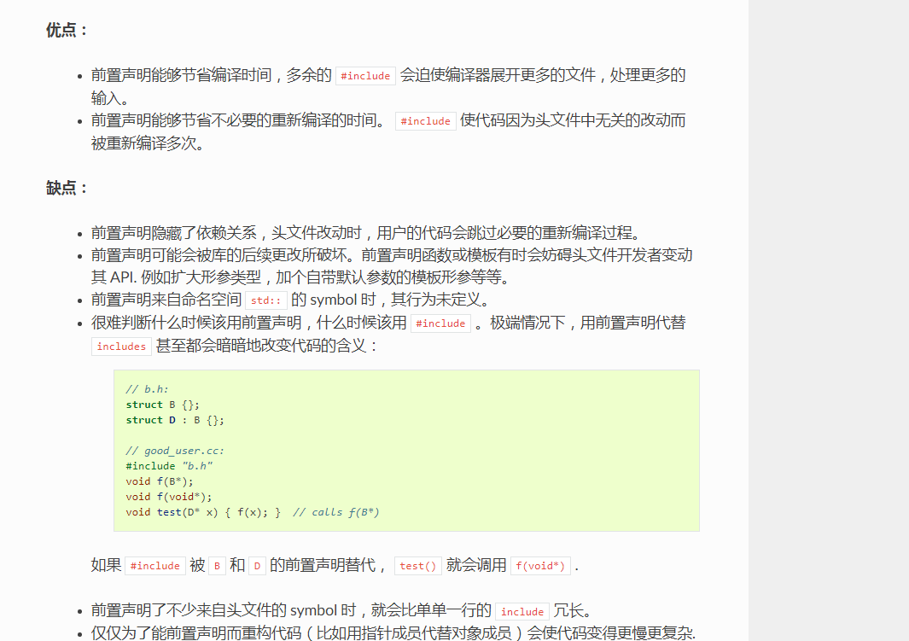

# Effective C++ 31：最小化文件之间的编译依赖

>  分享最实用的经验 ， 希望每一位来访的朋友都能有所收获！ 

### Item 31: Minimize compilation dependencies between files.

曾听老师讲过，每天上班的第一件事就是下载最新代码开始编译，然后可以有半个小时去喝杯咖啡。。。

 这是C++特殊的一点，即使你在保持接口不变的情况下只改了**类的内部实现**，其他的项目文件仍然可能需要**重新编译**。

C++的Class不仅规约了外部接口，也给出了内部实现：

~~~c++
class Person{
public:
    // 外部接口
    Person(const string& name);
    string name() const;
private:
    // 内部实现
    string _name;
    Date _birthday;
};
~~~

基于Person的内部实现，它的类定义文件中应该包含这样的代码：

`include<string>`
`include"date.h"`

> <string>中定义了string类，date.h中定义了Date类。

这些include在编译前都是要拷贝进来的！这使得Person与这些头文件产生了**编译依赖**。 只要这些头文件（以及它们依赖的文件）中的类定义发生改动，Person类便需要重新编译。

你可能会想到，在Person文件中，只引入string和Date的声明而不引入定义不就解决问题了么： 这样当我们更改Date的内部实现时Person便不会知道，也就不需要重新编译了。这个思路写出来的代码是这样的：

~~~c++
class string;
class Date;
class Person{
    ...
};
Person p;
~~~

编译通过不了！首先string是一个typedef：basic_string<char>，你需要声明更多的东西才能合法地声明这样一个string。 

另外当**编译器**运行到Person p;时要为Person分配空间，需要知道Person的**大小**，而Person的大小依赖于Date的大小。

 所以编译器需要知道Date的内部实现！只声明Date是不够的。

### 使用指针代替对象

一个去除编译依赖的办法是：依赖项使用指针而不是对象，同时依赖于类的声明而非定义。

比如我们把_birthday改成指针，并声明class Date;：

~~~c++
class Date;
class Person{
    ...
private:
    Date* _birthday;
}

~~~

编译器为Person分配空间时，

为其中的_birthday分配指**针大小的空间**即可，不必知道Date的内部实现，此时只需要提供Date的声明即可。 

Person依赖于Date的声明而不是定义，于是date.h不再是Person的编译依赖了。

-  另外，如果你只是在返回值或者参数用到了Date，也不需要引入Date的定义，声明它即可：

class Date;
Date d;
void func(Date d);
虽说对象作为函数参数还是传递引用比较好（见Item 20：传递常量引用比传值更好），但即使你传递的是对象，也不需要给出它的内部实现。

### 单独地提供声明

既然我们希望依赖于声明而非定义，那么我们需要为每个类单独地提供声明文件，和定义文件。

 比如date.h便需要分为两个文件，一个是声明class Date;，一个是定义class Date{}。

~~~c++
// file: datefwd.h
class Date;

// file: date.h
class Date{
    ...
};
~~~

我们在Person中include"datefwd.h"即可，这样解除Person和Date内部实现（定义在date.h中）之间的编译依赖。

### 使用句柄类

C++中接口声明和内部实现必须同时引入， 但在Java等语言中便不存在这个问题。因为所有对象都是引用，比如Person中的Date只是一个引用，Person的大小与Date的实现无关， 只需要为Date分配一个引用大小的空间即可。在C++中，我们也可以使用"pImpl idiom"来实现这个策略：

~~~c++
class Person{
public:
    Person(string& name);
    string name() const;
private:
    shared_ptr<PersonImpl> pImpl;
};
Person::Person(string& name): pImpl(new PersonImpl(name)){}
string Person::name(){
    return pImpl->name();
}
~~~

相当于把实现放到了另外一个类中PersonImpl，这样的Person类称为句柄类（Handle class）。 这样，当PersonImpl的内部实现发生改变时，依赖于Person的代码不再需要重新编译了。

### 使用接口类

还记得虚函数吗？除了句柄类，还有另外一个方式来移除编译依赖：接口类。

在Java或C#中有接口的概念， 一个类可以实现若干个接口。

但在C++中只有类的概念，但我们可以用只包含虚函数的类来定义一个接口：

~~~ c++
class Person{
public:
    virtual ~Person();
    virtual string name() const = 0;
    virtual string birthday() const = 0;
};
~~~

接口类中的成员函数定义为纯虚函数即可，因为接口类中我们当然不打算放一个方法的实现进去。

这个Person接口类包含纯虚函数，是一个抽象类。

**客户不能实例化它，只能使用它的引用和指针**。 

然而客户一定需要某种方法来获得一个实例，

比如工厂方法（见Item 13或者虚构造函数。 它们动态地创建对象，并返回对象指针（最好是智能指针，见Item 18）。

比如Person有一个实体类叫做RealPerson，那么Person中可以提供一个工厂方法create()：

~~~c++
class Person{
public:
    static shared_ptr<Person> create(string& name);
};
shared_ptr<Person> Person::create(string& name){
    return shared_ptr<Person>(new RealPerson(name));
}
...
shared_ptr<Person> p(Person::create("alice"));
~~~

### 总结

最小化编译依赖的一般做法是依赖于声明而非定义，这个想法可以通过句柄类或接口类来实现。

库的声明应当包括“完整的”和“只有声明的”两种形式。

接口类和句柄类的设计隐藏了类的实现细节，减小了实现细节的改动对客户的影响。 但无论是接口类还是句柄类，都会造成一些代价：

多一个pImpl指针的空间、虚函数表指针的空间、寻找虚函数的时间、间接调用的时间。

确实有人会因为这些代价而拒绝使用这些先进的技术，你会发现很难说服他们。

这一点即便是Scott Meyers也没有办法：

If so, you’re reading the wrong book.

### 补充

类和函数设计指导原则

C++是典型的面向对象编程语言，软件工程界已经有很多OOP原则来指导我们编写大规模的，高可扩展的，可维护性的代码：

- 高内聚，低耦合的基本原则

- SOLID原则

- 迪米特法则

- “Tell，Don’t ask”原则

- 组合/聚合复用原则

  

### 参考

- [本周阅读：深度探索C++对象模型](https://mp.weixin.qq.com/s/pAoIe9m2Oat7d8c_ZW5Qyg) [多态是接口编程基础]

- [c++系列之一构造函数](https://mp.weixin.qq.com/s/z246VYFrR9zDzIWZTS5yWA)

-  http://www.ruanyifeng.com/blog/2014/11/compiler.html 
-  https://zhaoyan.website/blog/ 
-  https://www.zhihu.com/question/20630104 
-  C/C++编译和链接模型分析 https://imzlp.me/posts/27118/ 
-  https://www.cnblogs.com/clover-toeic/p/3728026.html [ 在没看懂前面添加2个子 哪里？？前置声明函数或模板有时会妨碍头文件开发者变动其 API. 例如扩大形参类型 ]
-  https://www.jianshu.com/p/f8789390f1ee [在没看懂前面添加2个子 哪里？？]
- [解决C++中类的交叉引用](http://ganghelloworld.github.io/C_plus_plus/2012/04/11/how-to-solve-cross-reference-in-c_plus_plus/)  【这个看懂了，""交叉引用“导致编译不过】
-  https://www.cnblogs.com/yml435/p/4664372.html 【同上】
- [谷歌c++编程规范](https://zh-google-styleguide.readthedocs.io/en/latest/google-cpp-styleguide/headers/#forward-declarations) 【避免使用前置声明，看懂了，造成代码】
- [C++项目要怎么缩短编译时间?](https://www.zhihu.com/question/266766131)[在没看懂前面添加2个子 哪里？？]
- [C++ 头文件解耦](https://www.zhihu.com/question/37330979)【在没看懂前面添加2个字 哪里-- 为什么以前方式不行呢】
- 