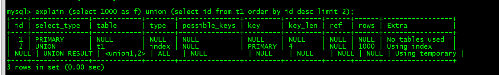

# 部署安装


## [yum安装mysql 5.6](https://segmentfault.com/a/1190000007667534)(centos 6)

- 对系统版本要求低，5.7要求高

https://segmentfault.com/a/1190000007667534

~~~mysql
create database test;
~~~


~~~shell
centos6.8
yum -y install mysql mysql-server mysql-devel //从yum库中的安装mysql
rpm -qi mysql-server //验证是否安装成功
 service mysqld start //启动mysql服务
输入命令： 
 mysql -u root
mysql -u root -p

建立远程root用户

GRANT ALL PRIVILEGES ON *.* TO 'root'@'%' IDENTIFIED BY '123456' WITH GRANT OPTION;

flush privileges;

修改密码
更改mysql密码，要FLUSH PRIVILEGES; 才生效
mysql -u root 
mysql> use mysql; 
mysql> update user set password=password('123456') where user='root'; 
mysql> FLUSH PRIVILEGES; 
mysql> quit; 
# service mysqld restart

mysql -u root -p  123456

sudo apt-get install mysql-client mysql-server
sudo service mysql status
sudo service mysqld start

/etc/init.d/networking restart
select user, plugin from mysql.user;	
update mysql.user set authentication_string=PASSWORD('123456'), plugin='mysql_native_password' where user='root';

~~~


~~~shell

 mysql> create database  dream;
Query OK, 1 row affected (0.01 sec)

mysql> use dream;
Database changed

mysql+5.7+设置远程登录
在ubuntu14.04上安装好mysql5.7之后，本地可以连接mysql服务器。
远程就不行。

注释掉在/etc/mysql/mysql.conf.d/mysqld.cnf里面的bind-address = 127.0.0.1

GRANT ALL PRIVILEGES ON *.* TO 'root'@'%' IDENTIFIED BY 'root' WITH GRANT OPTION;

~~~

## ubuntu mysql 5.7(centos7)

https://cloud.tencent.com/developer/article/1392435

~~~shell
sudo apt-get autoremove --purge mysql-server-5.0
sudo apt-get remove mysql-server
sudo apt-get autoremove mysql-server
sudo apt-get remove mysql-common //这个很重要
上面的其实有一些是多余的
dpkg -l |grep ^rc|awk '{print $2}' |sudo xargs dpkg -P
sudo apt-get install mysql-server
sudo apt-get install mysql-client
sudo apt-get install php5-mysql 
// 安装php5-mysql 是将php和mysql连接起来
一旦安装完成，MySQL 服务器应该自动启动。您可以在终端提示符后运行以下命令来检查 MySQL 服务器是否正在运行：
sudo netstat -tap | grep mysql

 mysql -V
mysql  Ver 14.14 Distrib 5.7.29, for Linux (x86_64) using  EditLine wrapper
root@work:~# 


mysqladmin -uroot -p password 123456 


#查看mysql状态
/etc/init.d/mysql status 或者 service mysql status
#启动mysql
/etc/init.d/mysql start 或者 service mysql start
#停止mysql
/etc/init.d/mysql stop 或者 service mysql stop
#重新启动mysql
/etc/init.d/mysql restart 或者 service mysql restart
查看mysql服务说明启动成功

————————————————
版权声明：本文为CSDN博主「南有乔木灬」的原创文章，遵循 CC 4.0 BY-SA 版权协议，转载请附上原文出处链接及本声明。
原文链接：https://blog.csdn.net/wudawei071193/java/article/details/100777206

 /etc/init.d/networking restart
~~~


# 


# 案例

## 第一天


- 请使用一条语句 统计各班的男生和女生人数

SELECT class_id, gender, COUNT(*) num FROM students GROUP BY class_id, gender;

请使用一条SELECT查询查出每个班级男生和女生的平均分：

```mysql
select class_id, gender,AVG(score)
 from students
 group by class_id,gender
 
https://www.liaoxuefeng.com/wiki/1177760294764384/1179611448454560

https://github.com/michaelliao/learn-sql/blob/master/mysql/init-test-data.sql
```


~~~mysql

explain (select 1000 as f) union (select id from t1 order by id desc limit 2);

mysql> explain select id%10 as m, count(*) as c from t1 group by m;
+----+-------------+-------+-------+---------------+------+---------+------+------+----------------------------------------------+
| id | select_type | table | type  | possible_keys | key  | key_len | ref  | rows | Extra                                        |
+----+-------------+-------+-------+---------------+------+---------+------+------+----------------------------------------------+
|  1 | SIMPLE      | t1    | index | PRIMARY,a     | a    | 5       | NULL | 1000 | Using index; Using temporary; Using filesort |
+----+-------------+-------+-------+---------------+------+---------+------+------+----------------------------------------------+


~~~




# 测试数据

- 第一天

~~~mysql

create table t1(id int primary key, a int, b int, index(a));

delimiter ;;
create procedure idata()
begin
declare i int;
set i=1;
while(i<=1000)do
insert into t1 values(i, i, i);
set i=i+1;
end while;
end;;
delimiter ;
call idata();
~~~


~~~mysql
CREATE TABLE `teacher` (
  `id` int(11) NOT NULL AUTO_INCREMENT,
  `name` varchar(32) NOT NULL,
  `age` int(11) NOT NULL,
  PRIMARY KEY (`id`)
) ENGINE=InnoDB AUTO_INCREMENT=3 DEFAULT CHARSET=utf8mb4;

INSERT  INTO teacher(id,NAME,age) VALUES (1,'seven',18);
INSERT  INTO teacher(id,NAME,age) VALUES (2,'qingshan',20);
INSERT  INTO teacher(id,NAME,age) VALUES (3,'wangchuanyi',3);


create table dream.user(
   id int auto_increment,
   id_card VARCHAR(1000) NOT NULL,
   name VARCHAR(1000) NOT NULL,
   age int,
   PRIMARY KEY (`id`),
   INDEX(`name`)
)ENGINE=InnoDB DEFAULT CHARSET=utf8;


insert into user(id_card,name,age) values('429006xxxxxxxx2134','张三',22),('429006xxxxxxxx2135','李四',26),('129006xxxxxxxx3136','王五',28),('129106xxxxxxxx3337','赵六',17),('129106xxxxxxxx3349','孙XX',43),('129106xxxxxxxx3135','马大哈',39),('129106xxxxxxxx3134','王一',55),('139106xxxxxxxx2236','张三',7),('139106xxxxxxxx2130','张三',31),('439106xxxxxxxx2729','张三',29),('439106xxxxxxxx2734','李明',78),('429106xxxxxxxx1734','张三',96),('129106xxxxxxxx1737','张三',89),('129106xxxxxxxx1132','张三',3),('129106xxxxxxxx1197','张三',11),('129106xxxxxxxx1184','张三',14);


ALTER TABLE user ADD INDEX id_card_name_age (`name`,`age`);

show index from user;

show index from user;
 select * from information_schema.optimizer_trace \G;
explain select name,age from user order by name, age  \G;


explain select id_card,name,age from user order by age limit 3 \G


ALTER TABLE user ADD INDEX id_card_name_age (`name`,`age`);
explain select name,max(age)from user group by name,age  \G;

mysql> explain select max(age)from user group by age  \G;
*************************** 1. row ***************************
           id: 1
  select_type: SIMPLE
        table: user
   partitions: NULL
         type: index
possible_keys: id_card_name_age
          key: id_card_name_age
      key_len: 3007
          ref: NULL
         rows: 17
     filtered: 100.00
        Extra: Using index; Using temporary; Using filesort
1 row in set, 1 warning (0.01 sec)

ERROR: 
No query specified

 CREATE TABLE `t` (
`id` int(11) NOT NULL,
`k` int(11) DEFAULT NULL,
PRIMARY KEY (`id`)
) ENGINE=InnoDB;
insert into t(id, k) values(1,1),(2,2);

mysql -h 127.0.0.1 -P 4000 -u root -D test
START TRANSACTION;
select * from t;
hello transaction
commit;


start transaction;                 |              start transaction;
select * from t;                   |               select * from t; 
update t set k=k+1 where id=1;      |              update t set k=k+1 where id=1; 
commit;                             |
                                     |             commit; -- 事务提交失败，回滚
~~~


### 


# bug

- [mysql重启后或者第二天创建表不存在了](https://blog.csdn.net/weixin_43979716/article/details/105783805?utm_medium=distribute.pc_relevant.none-task-blog-baidujs-1)

  

