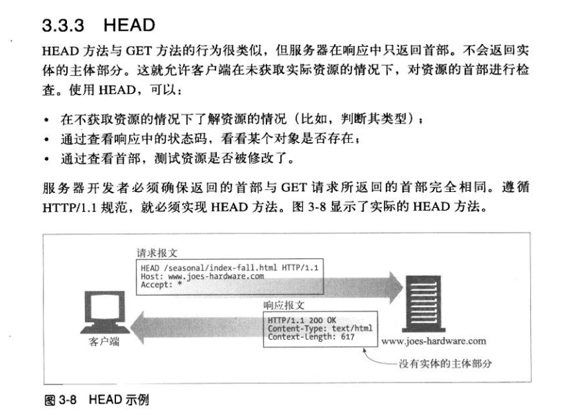
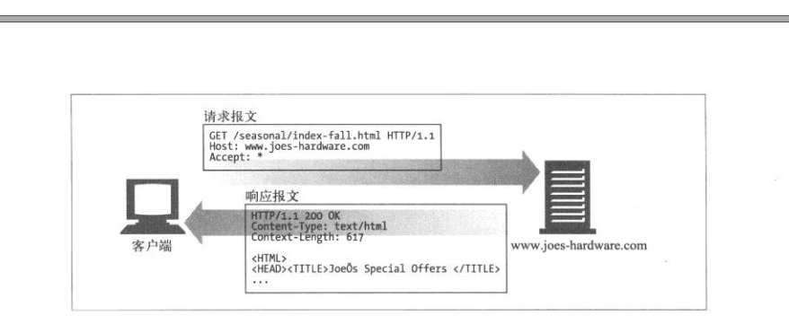
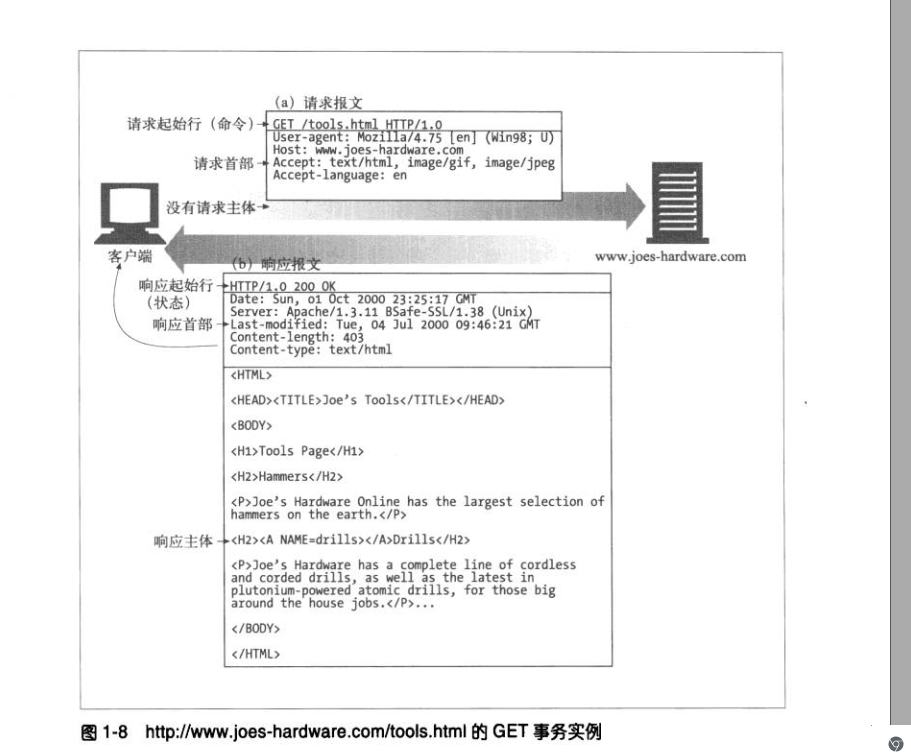
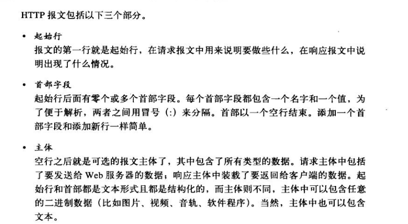
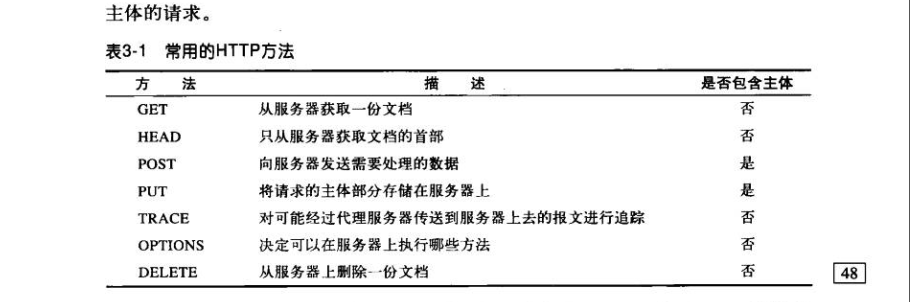

# 基础知识

# day1

## 1.1资料

- HTTP权威指南（中文版） 1 ，3，15章节 

- http://www.ruanyifeng.com/blog/2011/09/curl.html

- Hypertext Transfer Protocol (HTTP/1.1): Semantics and Content

  https://tools.ietf.org/html/rfc7231#page-25

- https://developer.mozilla.org/en-US/docs/Web/HTTP/Methods/PUT

- 

## 1.2 输出


### 请求类型

[HTTP request methods](https://developer.mozilla.org/en-US/docs/Web/HTTP/Methods)

- get 

- head
- post
- put 

~~~shell
curl -v --head  https://wangcy6.github.io/ 	 
//请求和响应的包只有head，没有body

curl -v -X GET  https://wangcy6.github.io/  
//请求只有head.
curl -v -X POST  https://wangcy6.github.io/ 
405 Not Allowed
出现405错误的原因是nginx不允许post静态页
~~~






~~~shell
Content-Length: 13238 确定主题长度的规则
Content-Type: text/html; charset=utf-8
~~~






### 区别



1..message body

2. ```
   specific semantics
   ```

The **HTTP `GET` method** requests a representation of the specified resource. Requests using `GET` should only retrieve data.

| Request has body                                             | No   |
| :----------------------------------------------------------- | ---- |
| Successful response has body                                 | Yes  |
| [Safe](https://developer.mozilla.org/en-US/docs/Glossary/Safe) | Yes  |
| [Idempotent](https://developer.mozilla.org/en-US/docs/Glossary/Idempotent) | Yes  |
| [Cacheable](https://developer.mozilla.org/en-US/docs/Glossary/Cacheable) | Yes  |
| Allowed in HTML forms                                        | Yes  |

The **HTTP `HEAD` method** requests the headers that are returned if the specified resource would be requested with an HTTP [`GET`](https://developer.mozilla.org/en-US/docs/Web/HTTP/Methods/GET) method. Such a request can be done before deciding to download a large resource to save bandwidt

| Request has body                                             | No   |
| :----------------------------------------------------------- | ---- |
| Successful response has body                                 | No   |
| [Safe](https://developer.mozilla.org/en-US/docs/Glossary/Safe) | Yes  |
| [Idempotent](https://developer.mozilla.org/en-US/docs/Glossary/Idempotent) | Yes  |
| [Cacheable](https://developer.mozilla.org/en-US/docs/Glossary/Cacheable) | Yes  |
| Allowed in [HTML forms](https://developer.mozilla.org/en-US/docs/Web/Guide/HTML/Forms) | No   |

The **HTTP PUT request method** creates a new resource or replaces a representation of the target resource with the request payload.

| Request has body                                             | Yes  |
| :----------------------------------------------------------- | ---- |
| Successful response has body                                 | No   |
| [Safe](https://developer.mozilla.org/en-US/docs/Glossary/Safe) | No   |
| [Idempotent](https://developer.mozilla.org/en-US/docs/Glossary/Idempotent) | Yes  |
| [Cacheable](https://developer.mozilla.org/en-US/docs/Glossary/Cacheable) | No   |
| Allowed in [HTML forms](https://developer.mozilla.org/en-US/docs/Web/Guide/HTML/Forms) | No   |


### 代码

~~~c++
void dns_down_https::push_transMsg_curl(char* param)
{     

      if (param ==NULL){
	  	return ;
      	}
      /**
	    JSON *root1;
		root1 = cJSON_CreateObject();
		if(root1 ==NULL)
		{
		   return ;
		}
		cJSON_AddStringToObject(root1, "order_num", "111111111111111111");
		cJSON_AddStringToObject(root1, "product_id", "22222222");
		cJSON_AddStringToObject(root1, "product_name", "3333");
		cJSON_AddStringToObject(root1, "product_image", "44444");
		cJSON_AddNumberToObject(root1, "product_price", 20);
		cJSON_AddStringToObject(root1, "product_first_category", "5555");
		cJSON_AddStringToObject(root1, "product_second_category", "6666");
		//cJSON_AddStringToObject(root, JSON_MSGBODY, msgTrans.msgBody.c_str());
		char *out1 = cJSON_PrintUnformatted(root1);
     **/
	//char* param="{\"order_num\":\"112233\",\"product_id\":9999,\"product_name\":1,\"product_image\":1,\"product_price\":1,\"product_first_category\":1,\"product_second_category\":1}";

	string url;
	url.append("curl -X POST ");
	url.append("-H \"Content-Type:application/json \" ");
	
	url.append("'http://api-guide-out.atguat.com.cn/order/saveGoods?&platform=ios&auth=");
	uint8_t *data = (uint8_t *) malloc(sizeof(uint8_t) *128);
	auth(data);
	url.append((char*)data);
	url.append("'");
	//-H "Content-Type:application/json"
	
	
	
    url.append(" -d '");
    url.append(param);
	url.append("'");
    cout<<"url ="<<url;
	system(url.c_str());
	
}
//一个20行的内容，分20次发送。
void dns_down_httpserver::not_found(st_netfd_t _fd)
{
	char buf[1024];

	sprintf(buf, "HTTP/1.0 404 NOT FOUND\r\n");
	st_write(_fd, buf, strlen(buf), 0);
	sprintf(buf, SERVER_STRING);
	st_write(_fd, buf, strlen(buf), 0);
	sprintf(buf, "Content-Type: text/html\r\n");
	st_write(_fd, buf, strlen(buf), 0);
	sprintf(buf, "\r\n");
	st_write(_fd, buf, strlen(buf), 0);
	sprintf(buf, "<HTML><TITLE>Not Found</TITLE>\r\n");
	st_write(_fd, buf, strlen(buf), 0);
	sprintf(buf, "<BODY><P>The server could not fulfill\r\n");
	st_write(_fd, buf, strlen(buf), 0);
	sprintf(buf, "your request because the resource specified\r\n");
	st_write(_fd, buf, strlen(buf), 0);
	sprintf(buf, "is unavailable or nonexistent.\r\n");
	st_write(_fd, buf, strlen(buf), 0);
	sprintf(buf, "</BODY></HTML>\r\n");
	st_write(_fd, buf, strlen(buf), 0);
}
void dns_down_httpserver::bad_request(st_netfd_t _fd)
{
	char buf[1024];

	sprintf(buf, "HTTP/1.0 400 BAD REQUEST\r\n");
	st_write(_fd, buf, strlen(buf), 0);
	sprintf(buf, "Content-type: text/html\r\n");
	st_write(_fd, buf, strlen(buf), 0);
	sprintf(buf, "\r\n");
	st_write(_fd, buf, strlen(buf), 0);
	sprintf(buf, "<P>Your browser sent a bad request.\r\n ");
	st_write(_fd, buf, strlen(buf), 0);

}


int dns_down_httpserver::get_line(st_netfd_t &_stSock, char *buf, int _bufSize)
{

	int i = 0;
	int j = 0;
	char c = '\0';
	int n;
	int _nb_read = 0;

	//read header
	while ((i < _bufSize - 1) && (c != '\n'))
	{
		_nb_read = st_read(_stSock, &c, 1, SRS_CONSTS_RTMP_RECV_TIMEOUT_US);

		if (_nb_read < 0)
		{

			if (_nb_read < 0 && errno == ETIME) {
				//printf("socket timeout \n");
				continue;
			}
			//printf("read error close socket\n");
			HTTPSERVER_LOG_HEAD << " read error close socket";

			return -1;
		}

		/* DEBUG printf("%02X\n", c); */
		if (_nb_read > 0)
		{
			if (c == '\r')
			{
				_nb_read = st_read(_stSock, &c, 1, SRS_CONSTS_RTMP_RECV_TIMEOUT_US);

				if (_nb_read < 0)
				{

					if (_nb_read < 0 && errno == ETIME) {
						//printf("socket timeout \n");
						continue;
					}
					//printf("read error close socket\n");
					HTTPSERVER_LOG_HEAD << " read error close socket";

					return -1;
				}

				/* DEBUG printf("%02X\n", c); */
				if ((_nb_read > 0) && (c == '\n'))
					st_read(_stSock, &c, 1, SRS_CONSTS_RTMP_RECV_TIMEOUT_US);
				else
					c = '\n';
			}
			buf[i] = c;
			i++;
		}
		else
			c = '\n';
	}
	buf[i] = '\0';
	return 0;
	//read_header;

}

int  dns_down_httpserver::get_context_length(char *_data)
{
	//get length:
	string _strFindLength = _data;
	int _ContextLength = -1;
	int _findpos = _strFindLength.find(HTTP_HEAD_CONTEXT_LENGTH);
	if (string::npos != _findpos)
	{
		_strFindLength = _strFindLength.substr(_findpos, _strFindLength.size());
		_findpos = _strFindLength.find('\r');
		if (string::npos != _findpos)
		{
			_strFindLength = _strFindLength.substr(0, _findpos);
			_findpos = _strFindLength.find(':');
			if (string::npos != _findpos)
			{
				_strFindLength = _strFindLength.substr(_findpos + 1, _strFindLength.size());
				_ContextLength = atoi(_strFindLength.c_str());

			}
		}
	}
	return _ContextLength;
}


int dns_down_httpserver::SendRegistInfo(st_netfd_t _fd)
{
	char send_str[2048] = { 0 };

	strcat(send_str, "POST ");
	strcat(send_str, REGIST_API);
	strcat(send_str, "Content-Type: application/json\r\n");

	

	//form a new text
	cJSON *_rootNewdata;
	_rootNewdata = cJSON_CreateObject();
	cJSON_AddStringToObject(_rootNewdata, "type", _strRole.c_str());
	cJSON_AddStringToObject(_rootNewdata, "ip",m_strdHttpIP.c_str() );
	cJSON_AddStringToObject(_rootNewdata, "outIp",m_strOutIp.c_str() 

	char *out = cJSON_PrintUnformatted(_rootNewdata);
	cJSON_Delete(_rootNewdata);

	char content_header[100];
	sprintf(content_header, "Content-Length: %d\r\n", strlen(out));
	strcat(send_str, content_header);
	strcat(send_str, "\r\n");
	strcat(send_str, out);
	HTTPSERVER_LOG_HEAD << " register to boss " << send_str;
                            
	int _nb_write = st_write(_fd, send_str, strlen(send_str), 0);


	free(out);
	return _nb_write;

}
~~~

