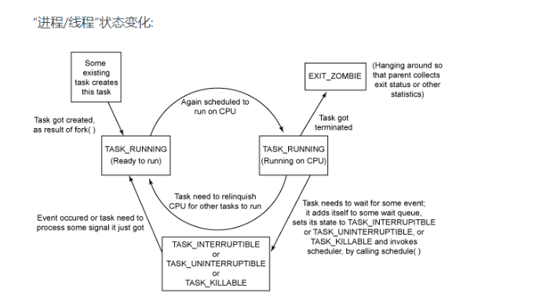
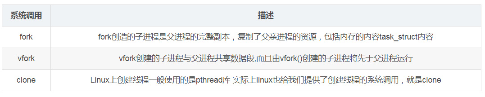
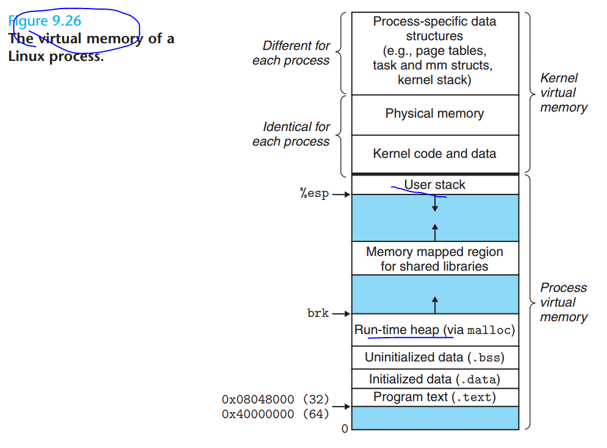
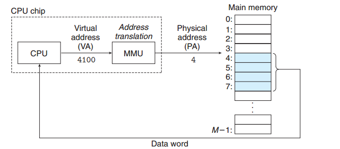

# 第一天 进程和线程的区别

###  缘起

修正：这面简单问题-->这么简单的问题。

###  分析

#### 结论：

进程和线程的主要区别应该是在**创建的时候** **线程** **需要共享了（父子）进程的资源  ，初次之外 应该是一样的**。

在liunx系统中 没有进程和线程的区别 统称 “task” 进程标志（task_struct） 进行统一描述

#### 继续分析：

严格意义上讲, 并没有进程,线程的区别

Linus Torvalds 增加在邮件说写到

> Both threads and processes are really just one thing: a "context of
> execution". Trying to artificially distinguish different cases is just
> self-limiting. 
>
> A "context of execution", hereby called COE, is just the conglomerate of 
> all the state of that COE. That state includes things like CPU state 
> (registers etc), MMU state (page mappings), permission state (uid, gid) 
> and various "communication states" (open files, signal handlers etc).

COE :执行上下文

一个进程所包含的资源(或者称之为状态)有, 

- CPU状态(比如寄存器), 

- 内存状态(Memory management unit, 内存映射),

-  权限状态(用户是谁, 在哪个组里), 

- 以及一些其他的可通信的状态, 比如打开的文件, 接受的信号等.

1. 进程：
   - CPU state: registers etc   （1）
   - MMU state: page mappings，记录当前进程的虚拟内存地址到物理内存地址的映射的信息。 （2）
   - permission state: uid, gid （3）
   - various “communication states”: open files, signal handlers etc （4）
2. 线程：
   - CPU state: registers
   - - possibly some other minial state
   - all others: shared from process（共享的范围 什么？  2  3  4 ）

可以看到，进程和线程都是'COE', ( *stay at a high level discussion.*) 

线程和进程的有各自的 CPU state （栈抽象成cpu） ------不相同 

线程：

MMU state，permission stat， various “communication states是共享进程的。---相同

**截止到目前 你看到进程和线程还是有区别的，线程共享资源，进程不共享资源 这不是区别吗？**

a light-weight process (LWP) 

Linux下内核其实本质上没有线程的概念, Linux下线程其实上是与其他进程共享某些资源的进程而已。但是我们习惯上还是称他们为线程或者轻量级进程 线程是进程的子集 

>The way Linux thinks about this (and the way I want things to work) is that
>there _is_ no such thing as a "process" or a "thread". There is only the
>totality of the COE (called "task" by Linux). 
>
>Different COE's can share parts
>of their context with each other, and one _subset_ of that sharing is the
>traditional "thread"/"process" setup, but that should really be seen as ONLY
>a subset (it's an important subset, but that importance comes not from
>design, but from standards: we obviusly want to run standards-conforming
>threads programs on top of Linux too). 
>
>Linux思考这个问题的方式(以及我希望工作的方式)是这样的
>
>没有所谓的“进程”或“线程”。只有
>
>COE的总体(Linux称为“任务”)。不同的COE可以共享部件
>
>它们之间的上下文，而共享的一个_subset_是
>
>传统的“线程”/“进程”设置，但实际上应该只将其视为
>
>一个子集(它是一个重要的子集，但是这个重要性不是来自它
>
>设计，但从标准:我们显然希望运行符合标准的
>
>线程程序也在Linux之上)。

#### 继续分析   clone函数

#### 进程和线程的创建

进程的创建的 而fork（）本身是由clone（）实现的

> clone(SIGCHLD,0);

线程创建：pthread_create-->clone

> clone(CLONE_VM|CLONE_FS|CLONE_FILES|CLONE_SIGHAND,0);

用strace 跟踪pthread_create创建过程：

> clone(child_stack=0x7fd4174b8ff0, flags=CLONE_VM|CLONE_FS|CLONE_FILES|CLONE_SIGHAND|CLONE_THREAD|CLONE_SYSVSEM|CLONE_SETTLS|CLONE_PARENT_SETTID|CLONE_CHILD_CLEARTID, parent_tidptr=0x7fd4174b99d0, tls=0x7fd4174b9700, child_tidptr=0x7fd4174b99d0) = 16477

clone参数的对应作用如下： 
CLONE_VM：父子进程共享地址空间 

CLONE_FS：父子进程共享文件系统信息 
CLONE_FILES：父子进程共享打开的文件 
CLONE_SIGHAND：父子进程共享信号处理函数及被阻断的信号

- 进程：可以共享，也可以不共享（have or  not have ）

- 线程共享了父子进程之间的各种资源 a light-weight process (LWP) （must）

#### 塔山：

-  http://man7.org/linux/man-pages/man2/clone.2.html
- http://lkml.iu.edu/hypermail/linux/kernel/9608/0191.html
- Linux进程线程源码浅析
- Linux 中的各种栈：进程栈 线程栈 内核栈 中断栈

#### 作业：协程呢 （从COE 程序运行空间角度分析）? 

 协程，又称微线程，纤程。英文名Coroutine

> A coroutine is a **function** that can **suspend** its execution (yield) until the given given **Yield Instruction** finishes.

协程：

- CPU state: registers etc   （各自的寄存器 ！！！！）
- MMU state: page mappings，（共享线程）
- permission state: uid, gid （不需要，属于应用层，系统不知道）
- various “communication states”: open files, signal handlers etc （共享线程）

【待处理 有点难】

Protothreads：[一个“蝇量级” C 语言协程库](http://coolshell.cn/articles/10975.html)
libco:[来自腾讯的开源协程库libco介绍](http://www.cnblogs.com/bangerlee/p/4003160.html)，[官网](http://code.tencent.com/libco.html)
coroutine:[云风的一个C语言同步协程库](https://github.com/cloudwu/coroutine/),[详细信息](http://blog.codingnow.com/2012/07/c_coroutine.html)

目前看到大概有四种实现协程的方式：

· 第一种：利用glibc 的 ucontext组件(云风的库)

· 第二种：使用汇编代码来切换上下文([实现c协程](http://www.cnblogs.com/sniperHW/archive/2012/06/19/2554574.html))

· 第三种：利用C语言语法switch-case的奇淫技巧来实现（Protothreads)

· 第四种：利用了 C 语言的 setjmp 和 longjmp（ [一种协程的 C/C++ 实现](http://www.cnblogs.com/Pony279/p/3903048.html),要求函数里面使用 static local 的变量来保存协程内部的数据）

塔山

- C++协程(1):协程原理及实现方式概述
- 浅谈我对协程的理解
- 源漫画：什么是协程？[程序员小灰](https://mp.weixin.qq.com/s/57IERpGIlvRwYCh6vSbMDA) 写的

#### 扩展阅读： 整天说堆栈，堆栈是啥意思

- 堆栈都是虚拟地址

- 虚拟地址都会缺页

- 多核下多进程多线程

塔山

- 9.7 深入理解计算机系统：Case Study: The Intel Core i7/Linux Memory System （正在学习中）
- Understanding the Java Memory Model （正在学习中）

#### 熟练度: 

> 目前处于第一想象 自己不知道，别人知道，该如何办呢？ 求讨论

# 求指教

## 微信公共账号：

## 知识星球（付费的，不要加入 ）

