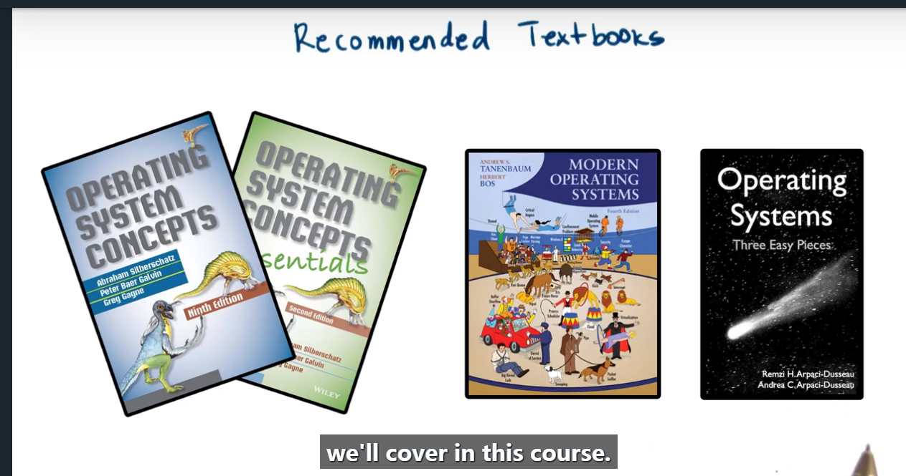

> 这里主要记录学习和探索过程。来验证正确方法才能有正确的结果。

# 走神一会

**你所寻找的东西正在寻找你。-鲁米**

What you seek is seeking you.

**你生来就有一对翅膀。为什么更喜欢一边爬行一边生活？– 鲁米**

You were born with wings. Why prefer to crawl through life?

**你不是一滴水在海洋中。你是整个海洋在一滴水中。 – 鲁米**

You are not a drop in the ocean. You are the entire ocean in a drop.

**在你的提问中寻找答案。-鲁米**

Look for the answer inside your question.

# book

# 知识图谱

## 陈咬金的三板斧

#### 第一斧：技术本质是什么？

#### 第二斧：考虑哪些问题？

- 线程可重入
- 线程与信号
- 线程与fork

#### 第三斧：如何使用？

