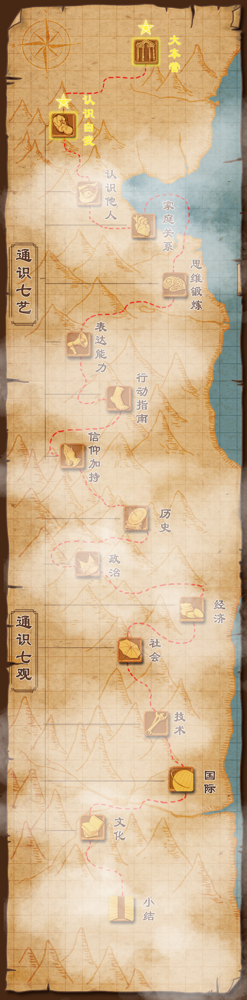

## 今日面试题 （2019-10-09）

### [raft在网络分区情况下如何选举领导？](https://github.com/wangcy6/weekly/issues/19) 👉 [去答题](https://github.com/wangcy6/weekly/issues/19)

# 题目汇总

第一题：(数据结构) [问题：谈谈你对B+Tree的理解?](daily-interview/3.你对B+Tree的理解.md) -- [答案](https://mp.weixin.qq.com/s/gM97XLcB0JMI_a2m8UuNpg)

第二题：(操作系统-网络))[问题 手绘TCP状态机?](daily-interview/3.你对B+Tree的理解.md) --[答案](https://mp.weixin.qq.com/s/zVGKBkZ_jzOrowS5k0a7rg)
~~~
There are two reasons for the TIME_WAIT state:
一、保证TCP协议的全双工连接能够可靠关闭
To implement TCP's full-duplex connection termination reliably
二、保证这次连接的重复数据段从网络中消失
To allow old duplicate segments to expire in the network
~~~

# 周报

## 2019

**八月**：[第 1 期](https://www.jianshu.com/p/681b70df9320):[第 2期](https://www.jianshu.com/p/a735b8ae3ac3)  [第 3期](https://www.jianshu.com/p/4d3f6062b97):[第 4期](https://mp.weixin.qq.com/s/JguScQhyAeAQK5ZFxqey7w)

# 食用指南

##  第一部分、daily-interview 每日一题 

每日一题 ，如果你看到好的题目，欢迎通过 [issue](https://github.com/wangcy6/weekly/issues/) 提交。

- 不要以工作忙为借口而荒废了自己，请记住“学如逆水行舟，不进则退”。

- 坚持每天花10分钟左右学习。每天进步一点点，成功就会在眼前。

- 不要等到火烧眉毛狂刷题，平时多烧香，面试才不慌。

##  第二部分、 ARTS --每周总结 
 记录过去一周发生的事情  👉 [去查看](https://github.com/wangcy6/weekly/tree/master/ARTS)

## 第三部分、 KM(Knowledge Map)  知识地图

程序员技能图谱 https://github.com/TeamStuQ/skill-map 发展路线👉 [从新手到大师](https://github.com/wangcy6/weekly/tree/master/KM)

### 第四部分、CM(Cognitive Map)  认知地图

 每周 推荐一本书 提高认知  👉 [去查看](https://github.com/wangcy6/weekly/tree/master/CM)

### KM(Knowledge Map)  知识地图

## CM(Cognitive Map)  认知地图

# 如何参与：

- QQ群：

​        234303445

- 微信号：

  

  

