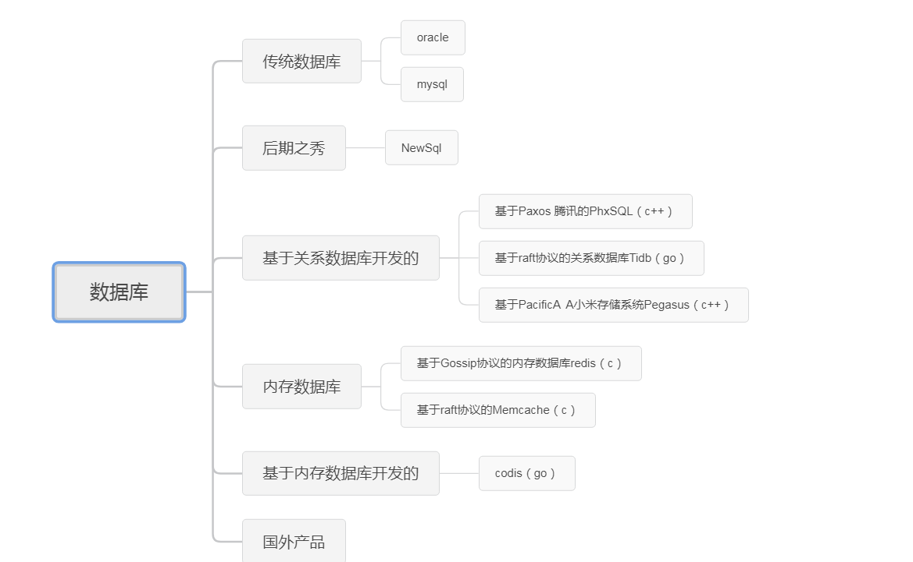

# 正在进行（2019-10）

推荐2本书，c++性能优化指南和 提高c++性能编程技术，就像看小说一样，不需要消耗脑细胞，更不需要复杂的语法和理论。我就认为好书阅读需要3天时间。（虽然n前年下载了，到现在才看）。看完也什么没记住，没有后遗症。

# 第一大类 技术类书单（百度网盘）

# 一 、数据库学习过程

第一本书：MySQL技术内幕：InnoDB存储引擎

# 算法

### 操作系统学习之旅

> 分为3个步骤（教科书，内核原理，性能优化）

#### 教科书

- operating-system-concepts-10th

   网盘地址

- 配合看视频

  哈尔滨工业大学 李志军

  [操作系统之基础](https://mooc.study.163.com/course/1000002004?tid=2402971010&_trace_c_p_k2_=965528dbff2b43adb6e77d0b130274c7#/info)

  [操作系统之进程与线程](https://mooc.study.163.com/course/1000002008?tid=2402970013&_trace_c_p_k2_=ff0eda87eebe4de7b6787c141fd047da#/info)

  [操作系统之内存管理](https://mooc.study.163.com/course/1000003007?tid=2402971009&_trace_c_p_k2_=66694c9b3bd44683bb37abce46dd010a#/info)

  [操作系统之外设与文件系统](https://mooc.study.163.com/course/1000003007?tid=2402971009&_trace_c_p_k2_=66694c9b3bd44683bb37abce46dd010a#/info)

#### 内核原理

> 不要怕，其实都是 if else 语法，
>
> 别人能写出来，只要跟着看就行了

####  性能优化

# 二、分布式学习之旅

> 学习方法：三个阶段
>
> 跟着阅读书籍和论文，阅读产品源码，参与贡献
>
> 也可以直接用起来解决业务中实际问题。

## 左耳朵耗子推荐经典资料

### 基础理论

- CAP 定理

- Fallacies of Distributed Computing

###  经典资料

- Distributed systems theory for the distributed systems engineer

- FLP Impossibility Result

- An introduction to distributed systems

- Distributed Systems for fun and profit

- Distributed Systems: Principles and Paradigms

- Scalable Web Architecture and Distributed Systems

- Principles of Distributed Systems

- Making reliable distributed systems in the presence of software errors

- Designing Data Intensive Applications

### 根据下面列表 由浅入深的理解

- [面向分布式系统工程师的分布式系统理论](http://ju.outofmemory.cn/entry/101946)（译）([Distributed systems theory for the distributed systems engineer](https://www.the-paper-trail.org/post/2014-08-09-distributed-systems-theory-for-the-distributed-systems-engineer/))

  #### 入门第一步

  以下4篇材料出色地解释了构建分布式系统会遇到的一些挑战，共同概述了一系列分布式系统工程师必须要解决的技术上的难题，为之后章节中更深入的研究做好准备。

  - [好玩又实在的分布式系统理论](http://book.mixu.net/distsys/)是一本简短的书籍，其内容覆盖了分布式系统领域的一些基本议题，包括时间的作用及不同的复制策略。CAP 定理

    

  - [为分布式系统领域新人整理的笔记](http://www.somethingsimilar.com/2013/01/14/notes-on-distributed-systems-for-young-bloods/) - 不是理论对理论地讲述，而是做一个非常好非常实用的平衡，让你对其余材料的阅读能够落地。

  - [分布式系统研究综述报告](http://citeseerx.ist.psu.edu/viewdoc/summary?doi=10.1.1.41.7628) - 一篇经典的论文，解释了为什么不能将所有远程交互都模拟成和本地对象一样。

  - [关于分布式计算的若干谬论](http://en.wikipedia.org/wiki/Fallacies_of_Distributed_Computing) - 分布式计算方面的8点谬论，提醒系统设计者可能会忘记的几类事情。

    The [fallacies](https://en.wikipedia.org/wiki/Fallacy) are:[[1\]](https://en.wikipedia.org/wiki/Fallacies_of_distributed_computing#cite_note-8-Fallacies-1) 谬论总结如下：

    1. The [network](https://en.wikipedia.org/wiki/Computer_network) is reliable.网络是可靠的
    2. [Latency](https://en.wikipedia.org/wiki/Latency_(engineering)) is zero.延迟为0
    3. [Bandwidth](https://en.wikipedia.org/wiki/Throughput) is infinite.带宽是无限的
    4. The network is [secure](https://en.wikipedia.org/wiki/Computer_security).网络是安全的
    5. [Topology](https://en.wikipedia.org/wiki/Network_topology) doesn't change.拓扑结构不会改变
    6. There is one [administrator](https://en.wikipedia.org/wiki/Network_administrator).至少有一个管理员
    7. Transport cost is zero.传输无需任何代价
    8. The network is homogeneous.所有的网络都是同质的

  

- [Distributed Systems for fun and profit](http://book.mixu.net/distsys/single-page.html)

这是一本免费的电子书。作者撰写此书的目的是希望以一种更易于理解的方式，讲述以亚马逊的 Dynamo、谷歌的 BigTable 和 MapReduce 等为代表的分布式系统背后的核心思想

全书分为五章，讲述了扩展性、可用性、性能和容错等基础知识，FLP 不可能性和 CAP 定理，探讨了大量的一致性模型；讨论了时间和顺序，及时钟的各种用法。随后，探讨了复制问题，如何防止差异，以及如何接受差异。此外，每章末尾都给出了针对本章内容的扩展阅读资源列表，这些资料是对本书内容的很好补充。

- [可扩展的 Web 架构和分布式系统](http://nettee.github.io/posts/2016/Scalable-Web-Architecture-and-Distributed-Systems/)[Scalable Web Architecture and Distributed Systems] （中 英文）

这是一本免费的在线小册子，其中文翻译版为[可扩展的 Web 架构和分布式系统](http://nettee.github.io/posts/2016/Scalable-Web-Architecture-and-Distributed-Systems/)。

本书主要针对面向的互联网（公网）的分布式系统，但其中的原理或许也可以应用于其他分布式系统的设计中。作者的观点是，通过了解大型网站的分布式架构原理，小型网站的构建也能从中受益。本书从大型互联网系统的常见特性，如高可用、高性能、高可靠、易管理等出发，引出了一个类似于 Flickr 的典型的大型图片网站的例子

- **面向软件错误构建可靠的分布式系统**[[Making reliable distributed systems in the presence of software errors](https://github.com/theanalyst/awesome-distributed-systems/blob/master/README.md)] （英文）

这本书的书名直译过来是在有软件错误的情况下，构建可靠的分布式系统，Erlang 之父乔·阿姆斯特朗（Joe Armstrong）的力作。

虽然书中的内容是以构建 20 世纪 80 年代的电信系统为背景，但是这种大规模分布式的系统开发思路，以及对系统容错能力的核心需求，与互联网时代的分布式系统架构思路出奇一致。书中对问题的抽象、总结，以及解决问题的思路和方案，有深刻的洞察和清晰的阐释，所以此书对现在的项目开发和架构有极强的指导和借鉴意义。

- **数据密集型应用系统设计** **[Designing Data-Intensive Applications]**（英文）

  

  作者马丁·科勒普曼（Martin Kleppmann）在分布式数据系统领域有着很深的功底，并在这本书中完整地梳理各类纷繁复杂设计背后的技术逻辑，不同架构之间的妥协与超越，很值得开发人员与架构设计者阅读。

  

  

  

- **分布式系统原理与范型（第2版）**（[Scalable Web Architecture and Distributed Systems](http://www.aosabook.org/en/distsys.html)）

​        

 本书是由计算机科学家安德鲁·斯图尔特·塔能鲍姆（Andrew S. Tanenbaum）

 和其同事马丁·范·斯蒂恩（Martin van Steen）合力撰写的，是分布式系统方面的经典教材。

- An introduction to distributed systems
- [FLP Impossibility Result](https://groups.csail.mit.edu/tds/papers/Lynch/jacm85.pdf)

FLP 不可能性的名称起源于它的三位作者，Fischer、Lynch 和 Paterson。它是关于理论上能做出的功能最强的共识算法会受到怎样的限制的讨论

### 论文
- raft
阅读[ Dynamo 论文](http://www.allthingsdistributed.com/files/amazon-dynamo-sosp2007.pdf)和帕特·赫尔兰（Pat Helland）的经典论文[ Life Beyond Transactions ](http://www.cloudtran.com/pdfs/LifeBeyondDistTRX.pdf)能获很得大启发。

## 阅读产品源码

### 

# 三、 编程基础

## 代码规范

## c++

- 推荐2本书，c++性能优化指南和 提高c++性能编程技术，就像看小说一样，不需要消耗脑细胞，更不需要复杂的语法和理论。我就认为好书阅读需要3天时间。（虽然n前年下载了，到现在才看）。看完也什么没记住，没有后遗症。

## 操作系统

- 性能之巅：洞悉 系统，企业，云计算
- 深入Linux内核架构
- 深入理解计算机系统
- 鸟哥的Linux
- Wireshark 网络分析的艺术

# 四、深度学习 

# 五、 云计算

# 第二大类 非技术类书单（百度网盘）

# 一、每周阅读一本书

###  格局 (2019年 第 39周 )

#### 简介

**作者:** 吴军
**出版社:** 中信出版社
**副标题:** 格局的大小决定成就的顶点
**出版年:** 2019-9

一个人明确了自己所在的位置和方向后，根据自己的能力掌握好节 奏，已经在格局上领先于同辈人。

如果用一个词来概括本书的内容，就是“格局”；如果用10个字来概括 获得大格局的方法，那就是位置、方向、方法、步伐和节奏。任何 人，不论起点高低，只要能认清自己的位置，找准方向，用正确的方 法做事，提高进步的速度，同时把握好节奏，几年后就会看到一个格 局比今天大很多的自己 ，一 个让自己感到不枉此生的自己。

#### 读书笔记

待补充中

#### 电子书信息

格局：格局的大小决定成就的顶点 – 吴军 pdf+azw3+epub+mobi+txt+docx

待补充中

###  被讨厌的勇气（2019年 第 38周）

#### 简介

副标题: “自我启发之父”阿德勒的哲学课

编剧用悬疑剧的方式来讲阿德勒的《个体心理学》和岸见一郎写的《被讨厌的勇气》

你是否常常对繁琐的生活感到乏味？

你是否时时为复杂的人际关系感到疲惫？

你是否认为人生的意义越来越模糊难见？

这一切的答案尽在这本《被讨厌的勇气》中

#### 精彩观点

- 人的烦恼不幸都来自于人际关系
- 所谓的自由，就是被别人讨厌
- 无论过去发生什么事情，**你现在的状态取决于你如何赋予既有事件的意义**

#### 读书笔记

[读后感分享链接](https://mp.weixin.qq.com/s/p-9yegxinVzR9aFkpKBoFA)

[知乎评论](https://www.zhihu.com/question/40399625)

#### 电子书信息

**文件类型：**azw3，mobi，pdf

网盘地址：

> 链接：https://pan.baidu.com/s/1d-pounIbP9NzIATAfsBeHw 
> 提取码：ojgl 

## 等待探索

## 
