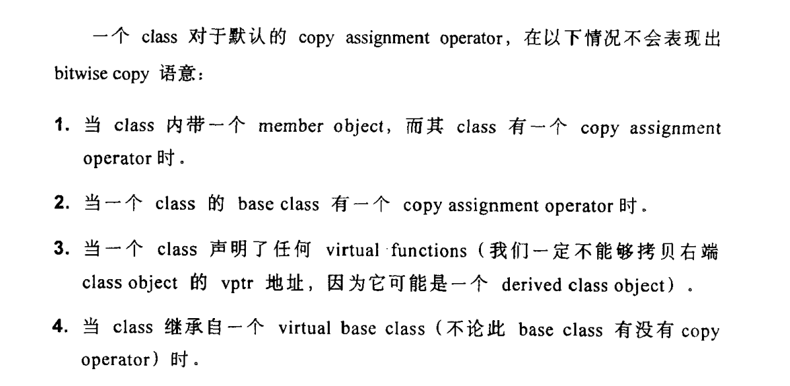

# FQA

 ## Object-oriented programming (c++)


  

### 一、 在c++的构造函数内调用虚函数可以吗？

   小王：

在构造函数内 可以调用虚函数，但是不推荐（一句话描述结果）

解释：

因为一个虚函数调用过程是 通过基类指针或者引用触发的例如

this->vptr[index] ，

> 从普通语法看判断 ptr为null还是不null

一、 首先判断 虚表 存在不存在，

在编译阶段，一个类多少个虚函数 已经确定，系统为每个类产生固定大小的虚表，在类的构造函数【没有问题】

二、 判断虚指针是否初始化。

虚指针初始化是在构造函数体内函数执行之前【没有问题】


具体情况  [深度探索C++对象模型](https://mp.weixin.qq.com/s/pAoIe9m2Oat7d8c_ZW5Qyg)


三、 但是不推荐这么做【有问题了】

是因为，在类的构造函数内，对象还没有初始化完毕，就相当于构造函数还还没有执行完毕，

就开始调用普通成员函数，会造成无法预估的后果。类比静态函数，虽然可以在类没有构造时候被调用，但是只能影响范围静态成员变量。错误的做法，从语法上做限制。


> 另外，调用虚函数，并没有发挥虚函数的机制，只是普通函数调用而已。


### 二、 c++在拷贝构造过程中，深拷贝和浅拷贝有什么区别？

小王： 

前者会生成默认拷贝构造函数，后者不会。

> 深拷贝和浅拷贝 是c++ 根据类成员不同 提供默认2个不同行为，（一句结束）

浅拷贝就是bitwisecopy，类比memcopy，不需要生成拷贝构造函数,安全创建一个对象

深拷贝是memberwise copy，根据成员不同调用对应拷贝构造函数的等，安全创建一个对象。


正如：




### 三、  指针和引用区别 是什么，[各自使用场景是什么](https://www.zhihu.com/question/37608201)？

1. 指针和引用从定义上2个不同类型。指针 ！=引用 
2. 各自优势

引用：在类的拷贝构造函数和运算符重载方面 使用无歧义--引用就是变量

指针：返回值可以返回null。在链表 tree方面优势（指针和变量2个不同对象）


### ref

-  https://stackoverflow.com/questions/3279543/what-is-the-copy-and-swap-idiom 
-  https://people.cs.clemson.edu/~rlowe/cs1070/notes/copy_constructor.pdf 


### 四、虚函数（virtual）可以是内联函数（inline）吗？


> [Are "inline virtual" member functions ever actually "inlined"?](http://www.cs.technion.ac.il/users/yechiel/c++-faq/inline-virtuals.html)

- 虚函数可以是内联函数，内联是可以修饰虚函数的，但是当虚函数表现多态性的时候不能内联。
- 内联是在编译器建议编译器内联，而虚函数的多态性在运行期，编译器无法知道运行期调用哪个代码，因此虚函数表现为多态性时（运行期）不可以内联。虚函数唯一性能瓶颈无法内敛。
- `inline virtual` 唯一可以内联的时候是：编译器知道所调用的对象是哪个类（如 `Base::who()`），这只有在编译器具有实际对象而不是对象的指针或引用时才会发生。

虚函数内联使用

```c++
#include <iostream>  
using namespace std;
class Base
{
public:
	inline virtual void who()
	{
		cout << "I am Base\n";
	}
	virtual ~Base() {}
};
class Derived : public Base
{
public:
	inline void who()  // 不写inline时隐式内联
	{
		cout << "I am Derived\n";
	}
};

int main()
{
	// 此处的虚函数 who()，是通过类（Base）的具体对象（b）来调用的，编译期间就能确定了，所以它可以是内联的，但最终是否内联取决于编译器。 
	Base b;
	b.who();

	// 此处的虚函数是通过指针调用的，呈现多态性，需要在运行时期间才能确定，所以不能为内联。  
	Base *ptr = new Derived();
	ptr->who();

	// 因为Base有虚析构函数（virtual ~Base() {}），所以 delete 时，会先调用派生类（Derived）析构函数，再调用基类（Base）析构函数，防止内存泄漏。
	delete ptr;
	ptr = nullptr;

	system("pause");
	return 0;
} 
```


### 五、inline 内联函数

推荐阅读<<提高C++性能的编程技术>>

#### 特征

- 相当于把内联函数里面的内容写在调用内联函数处；
- 相当于不用执行进入函数的步骤，直接执行函数体；
- 相当于宏，却比宏多了类型检查，真正具有函数特性；
- 编译器一般不内联包含循环、递归、switch 等复杂操作的内联函数；
- 在类声明中定义的函数，除了虚函数的其他函数都会自动隐式地当成内联函数。

#### 使用

inline 使用

```c++
// 声明1（加 inline，建议使用）
inline int functionName(int first, int second,...);

// 声明2（不加 inline）
int functionName(int first, int second,...);

// 定义
inline int functionName(int first, int second,...) {/****/};

// 类内定义，隐式内联
class A {
    int doA() { return 0; }         // 隐式内联
}

// 类外定义，需要显式内联
class A {
    int doA();
}
inline int A::doA() { return 0; }   // 需要显式内联
```

#### 编译器对 inline 函数的处理步骤

1. 将 inline 函数体复制到 inline 函数调用点处；
2. 为所用 inline 函数中的局部变量分配内存空间；
3. 将 inline 函数的的输入参数和返回值映射到调用方法的局部变量空间中；
4. 如果 inline 函数有多个返回点，将其转变为 inline 函数代码块末尾的分支（使用 GOTO）。

#### 优缺点

优点

1. 内联函数同宏函数一样将在被调用处进行代码展开，省去了参数压栈、栈帧开辟与回收，结果返回等，从而提高程序运行速度。
2. 内联函数相比宏函数来说，在代码展开时，会做安全检查或自动类型转换（同普通函数），而宏定义则不会。
3. 在类中声明同时定义的成员函数，自动转化为内联函数，因此内联函数可以访问类的成员变量，宏定义则不能。
4. 内联函数在运行时可调试，而宏定义不可以。

缺点

1. 代码膨胀。内联是以代码膨胀（复制）为代价，消除函数调用带来的开销。如果执行函数体内代码的时间，相比于函数调用的开销较大，那么效率的收获会很少。另一方面，每一处内联函数的调用都要复制代码，将使程序的总代码量增大，消耗更多的内存空间。

2. inline 函数无法随着函数库升级而升级。inline函数的改变需要重新编译，不像 non-inline 可以直接链接。

   

3. 是否内联，程序员不可控。内联函数只是对编译器的建议，是否对函数内联，决定权在于编译器


 

> 由于编者水平有限，缺点和疏漏在所难免，恳请大家不吝指正，万分感激 

### 六、 What is the difference between variable declaration and variable definition? 