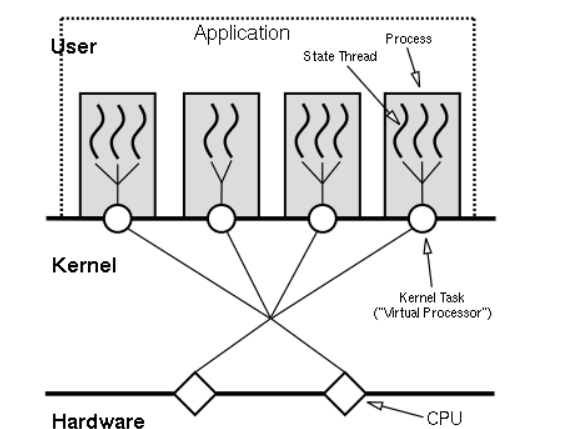

# 走神一会

你生而有翼，为何竟愿一生匍匐前进，形如虫蚁？

**「学而不思则罔、思而不学则殆」**的意思是：

想顺利的学会**「内思」**要与**「关系」**思考方式结合起来练。

否则，直接学**「内思」**，初学者会陷入练习的困境，这就是**罔**。

而只依靠**「关系」**思考方式，又会带来很大的危害，这就是**殆**。
作者：心智玩家的简书链接：https://www.jianshu.com/p/2940cf732b94来源

**「内思」**，用元神意识直接「看」意识影像，是需要经过一段时间的练习以后，才能达到的状态。没有经过练习，不容易做到。

**历史渊源**

首先介绍一下这个库的历史渊源，从代码贡献者来看，ST不是个人作品，而是有着雄厚的商业支持和应用背景，比如服务器领域，在[这里](http://state-threads.sourceforge.net/news.html)你可以看到ST曾作为Apache的多核应用模块发布。

其诞生最初是由网景（Netscape）公司的MSPR（Netscape Portable Runtime library）项目中剥离出来，后由SGI（Silicon Graphic Inc）还有Yahoo!公司（前者是主力）开发维护的独立线程库。

版本方面，作为[SourceForge](http://sourceforge.net/projects/state-threads/files/)上开源项目， 

由2001年发布v1.0以来一直到2009年v1.9稳定版后未再变动。

在平台移植方面，从Makefile的配置选项中可知ST支持多种Unix-like平台，还有专门针对Win32的源码改写。

源码例子中，提供了web server、proxy以及dns三种编程实例供参考。

**可以说代码质量应该是相当的稳定和可靠的。**

# 卡片

> 核心总结，看到这里就可以结束了。如果你不明白，说明我写的还不正确

| 协程库                                                       | 语言                                                         | 开发者                                               |
| ------------------------------------------------------------ | ------------------------------------------------------------ | ---------------------------------------------------- |
| [state threads library](https://github.com/ossrs/state-threads) | 3000行[C代码](https://github.com/wangcy6/reading_code_note/tree/master/liunx/st) | [历史渊源](https://coolshell.cn/articles/12012.html) |
| [**Libtask**](https://swtch.com/libtask/)                    | **a Coroutine Library for C and Unix**                       |                                                      |

# 摘要

State Threads 是为互联网应用程序库，

它拥有多线程编程范式的简单（一个线程支持一个并发连接）以及事件驱动状态机架构的性能和可伸缩性。继承了 *Multi-Process*, *Multi-Threaded*, and *Event-Driven State Machine* architectures优点。

是如何Scheduling，

ST的多核架构核心是：Multi-Process EDSM。

**ST只负责自身thread调度，进程管理是应用程序的事情，** The application designer has full control of how many processes to create ，用户来决定fork多少进程，每个进程分配多少资源 。类似*GOMAXPROCS*

The State Threads library combines the advantages of all of the above architecture

## How does ST take advantage of multiple CPUs?

Process management is not in the ST's scope but instead is left up to the application. The application designer has full control of how many processes to create and what resources, if any, to share among them via standard inter-process communication (IPC) facilities

>  你根本回答不了，哑口无言，你解决方式看libevent多线程的例子

# 学习记录

 ## 一、doc

#### 阅读文档1 ，累计盘茄次数 3    耗时 120分钟

理解 **ST本质上仍然是基于[EDSM模型](https://coolshell.cn/articles/12012.html)，但旨在取代传统的异步回调方式** ,**为[互联网应用程](https://github.com/zfengzhen/Blog/blob/master/article/%E4%B8%BA%E4%BA%92%E8%81%94%E7%BD%91%E5%BA%94%E7%94%A8%E7%A8%8B%E5%BA%8F%E8%80%8C%E7%94%9F%E7%9A%84State%20Threads%5B%E5%B8%B8%E8%A7%81%E5%90%8E%E5%8F%B0%E6%9E%B6%E6%9E%84%E6%B5%85%E6%9E%90%5D.md)序而生[的State Threads](https://www.cnblogs.com/NerdWill/p/6166220.html)** 

 

涉及内容

**State Threads Library Documentation**

- [**Introductory paper**](http://state-threads.sourceforge.net/docs/st.html)
- [**Complete reference**](http://state-threads.sourceforge.net/docs/reference.html)
- [**Programming notes**](http://state-threads.sourceforge.net/docs/notes.html)
- [**Frequently Asked Questions and answers (FAQ)**](http://state-threads.sourceforge.net/docs/faq.html)

关键词：

-  ST scheduler （不懂）

  > the ST scheduler is hidden inside the library and invisible to an application writer. 

-   traditional EDSM (不懂)

  >  event-driven state machines (EDSM)  

-  virtual processor (不懂)

  >  ST的多核架构 

-  ，**ST的threads可以并发地线性地处理I/O事件** （不懂）
-  execute state   event wait queue  

-  setjmp/longjmp （不懂）

MP applications have poor load scalability.

MP applications have very good system scalability

- 看了一下代码和运行一个例子 懂了

### 阅读文档2   ，累计盘茄次数 3    耗时 100分钟

  理解  **Libtask: a Coroutine Library for C and Unix**  含义

涉及内容

-  http://swtch.com/libtask/ 

## 二、 code 

~~~c++

void *_st_idle_thread_start(void *arg)
{
    _st_thread_t *me = _ST_CURRENT_THREAD();
 
    while (_st_active_count > 0) {
        /* Idle vp till I/O is ready or the smallest timeout expired */
        _ST_VP_IDLE();
 
        /* Check sleep queue for expired threads */
        _st_vp_check_clock();
 
        me->state = _ST_ST_RUNNABLE;
        _ST_SWITCH_CONTEXT(me);
    }
 
    /* No more threads */
    exit(0);
 
    /* NOTREACHED */
    return NULL;
}

/*
 * Switch away from the current thread context by saving its state 
 * and calling the thread scheduler
 */
#define _ST_SWITCH_CONTEXT(_thread)       \
    ST_BEGIN_MACRO                        \
    if (!MD_SETJMP((_thread)->context)) { \
      _st_vp_schedule();                  \
    }                                     \
    ST_END_MACRO
 
/*
 * Restore a thread context that was saved by _ST_SWITCH_CONTEXT 
 * or initialized by _ST_INIT_CONTEXT
 */
#define _ST_RESTORE_CONTEXT(_thread)   \
    ST_BEGIN_MACRO                     \
    _ST_SET_CURRENT_THREAD(_thread);   \
    MD_LONGJMP((_thread)->context, 1); \
    ST_END_MACRO
 
void _st_vp_schedule(void)
{
    _st_thread_t *thread;
 
    if (_ST_RUNQ.next != &_ST_RUNQ) {
        /* Pull thread off of the run queue */
        thread = _ST_THREAD_PTR(_ST_RUNQ.next);
        _ST_DEL_RUNQ(thread);
    } else {
        /* If there are no threads to run, switch to the idle thread */
        thread = _st_this_vp.idle_thread;
    }
    ST_ASSERT(thread->state == _ST_ST_RUNNABLE);
 
    /* Resume the thread */
    thread->state = _ST_ST_RUNNING;
    _ST_RESTORE_CONTEXT(thread);
}
~~~

- st_read

~~~c
ssize_t st_read(_st_netfd_t *fd, void *buf, size_t nbyte, st_utime_t timeout)
{
  ssize_t n;

  while ((n = read(fd->osfd, buf, nbyte)) < 0) {
    if (errno == EINTR)
      continue;
    if (!_IO_NOT_READY_ERROR)
      return -1;
    /* Wait until the socket becomes readable */
    if (st_netfd_poll(fd, POLLIN, timeout) < 0)
      return -1;
  }

  return n;
}

/*
 * Wait for I/O on a single descriptor.
 */
int st_netfd_poll(_st_netfd_t *fd, int how, st_utime_t timeout)
{
  struct pollfd pd;
  int n;

  pd.fd = fd->osfd;
  pd.events = (short) how;
  pd.revents = 0;

  if ((n = st_poll(&pd, 1, timeout)) < 0)
    return -1;
  if (n == 0) {
    /* Timed out */
    errno = ETIME;
    return -1;
  }
  if (pd.revents & POLLNVAL) {
    errno = EBADF;
    return -1;
  }

  return 0;
}

int st_poll(struct pollfd *pds, int npds, st_utime_t timeout)
{
  struct pollfd *pd;
  struct pollfd *epd = pds + npds;
  _st_pollq_t pq;
  _st_thread_t *me = _ST_CURRENT_THREAD();
  int n;

  if (me->flags & _ST_FL_INTERRUPT) {
    me->flags &= ~_ST_FL_INTERRUPT;
    printf("********************************eintr point 1\n");
    errno = EINTR;
    return -1;
  }

  if ((*_st_eventsys->pollset_add)(pds, npds) < 0)
{
    printf("**************point 3 \n");
    return -1;
}
  pq.pds = pds;
  pq.npds = npds;
  pq.thread = me;
  pq.on_ioq = 1;
  _ST_ADD_IOQ(pq);
  if (timeout != ST_UTIME_NO_TIMEOUT)
    _ST_ADD_SLEEPQ(me, timeout);
  me->state = _ST_ST_IO_WAIT;

  _ST_SWITCH_CONTEXT(me);

  n = 0;
  if (pq.on_ioq) {
    /* If we timed out, the pollq might still be on the ioq. Remove it */
    _ST_DEL_IOQ(pq);
    (*_st_eventsys->pollset_del)(pds, npds);
  } else {
    /* Count the number of ready descriptors */
    for (pd = pds; pd < epd; pd++) {
      if (pd->revents)
	n++;
    }
  }

  if (me->flags & _ST_FL_INTERRUPT) {
    me->flags &= ~_ST_FL_INTERRUPT;
    printf("**********************eintr point 2 \n");
    errno = EINTR;
    return -1;
  }

  return n;
}
~~~

State Threads library 

## 5. How does ST take advantage of multiple CPUs?

st源码VP等全局变量使得，st只支持单线程。

由于团队业务的一些特殊性，需要st支持多线程，将st的全局变量进行响应的封装，可以将st改造成多线程版本

我自己根本不明白，只能查看文章

[Multi-Threaded Libevent Server Example](https://roncemer.com/software-development/multi-threaded-libevent-server-example/)

[libevent / epoll number of worker threads?](https://stackoverflow.com/questions/20915738/libevent-epoll-number-of-worker-threads)

http://darmawan-salihun.blogspot.com/2015/09/multithreaded-libeventlibevent2-server.html

https://github.com/gambellhq/samples/tree/master/libevent2-thread-code

https://github.com/gambellhq/samples/tree/master/libevent2-thread-code

## 4 How is ST different from POSIT threads/user-level thread libraries?

4. 多线程

   

最近在看memcached的源码，觉得它那种libevent+多线程的服务器模型真的很不错，我将这个模型封装成一个C++类，根据我的简单测试，这个模型的效率真的很

# 三、项目

- task 编译成动态库和静态库 30分钟

~~~c
git clone https://github.com/wangcy6/state-threads.git
cd state-threads
make linux-debug //不同平台
state-threads/obj/
libst.so.1.9
libst.a

 cd examples/
 make linux-debug //不同平台
 EXAMPLES    = $(OBJDIR)/lookupdns $(OBJDIR)/proxy $(OBJDIR)/server  
    
    
./lookupdns www.baidu.com  www.google.com  www.bing.com
    
~~~

# 

# 参考

Libevent手册

   http://www.wangafu.net/~nickm/libevent-book/

多核

1 http://www.cppblog.com/converse/archive/2015/05/11/71809.html

2 https://cloud.tencent.com/developer/article/1194247

-  https://app.yinxiang.com/shard/s39/nl/8226829/8eae84ea-a1ca-4e0e-94c6-cfb3661f913a 

- The C10K problem  http://www.kegel.com/c10k.html 

  