### FQA

Q1 

ps 命令查看进程状态信息时候，

发现 出现 [ksoftirqd/3]  [kworker/3:0H] 这样信息，

查询说这是内核线程， ksoftirqd-处理器软中断(和tasklet)的内核线程

ps - report a snapshot of the current processes.

问题

难道说线程就是进程吗，不依赖进程可以独立的运行？

Q2:

内核线程没有独立的地址空间

A2:

内核线程的真正含义是：内核线程没有独立的地址空间，地址空间的mm域为空NULL,他们没有用户上下文。《linux内核设计与实现30页、250页》

### 小王 学进程

Creating Processes  shell --clone

Lightweight processes 

CPU上下文切换的场景，根据任务不同分为以下场景：

1. 进程上下文切换
2. 线程上下文切换
3. 中断上下文切换（硬件中断而触发）
4. 特权模式切换（通过系统调用的方式）

> 当发生进程调度时，进行进程切换就是上下文切换(context switch)。

一个进程的上下文可以分为三个部分:用户级上下文、寄存器上下文以及系统级上下文。

- 用户级上下文: 正文、数据、用户堆栈以及共享存储区；

- 寄存器上下文: 通用寄存器、程序寄存器(IP)、处理器状态寄存器(EFLAGS)、栈指针(ESP)；

- 系统级上下文: 进程控制块task_struct、内存管理信息(mm_struct、vm_area_struct、pgd、pte)、内核栈。

###  # 调度

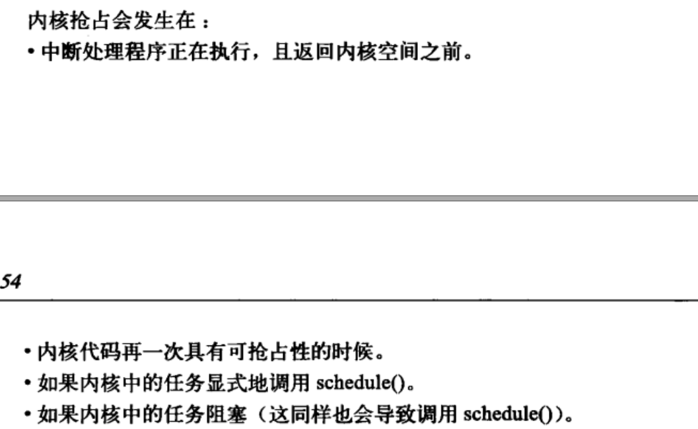

**What is kworker?** `kworker` means a Linux kernel process doing "work" (processing system calls). 

## # code

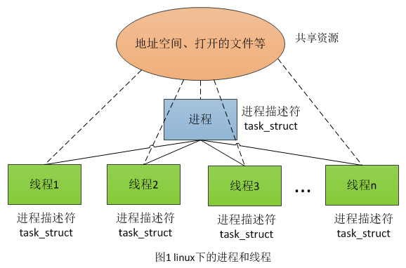

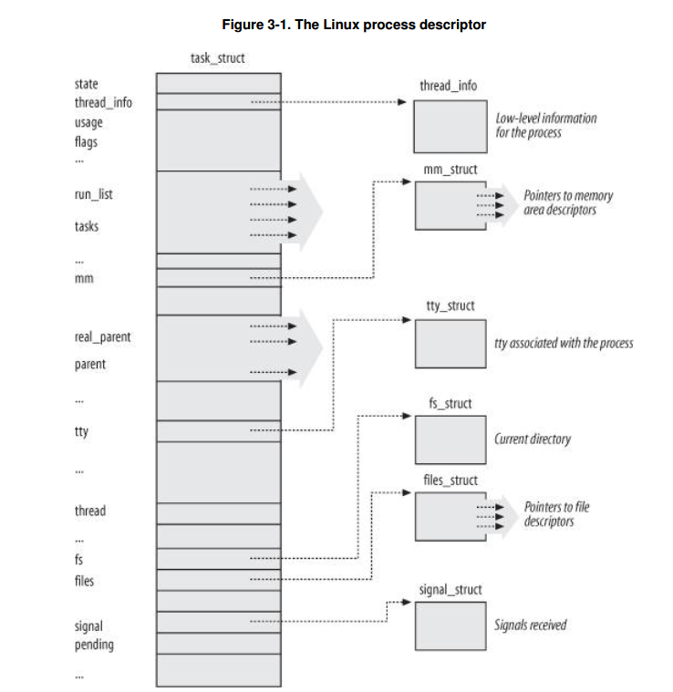

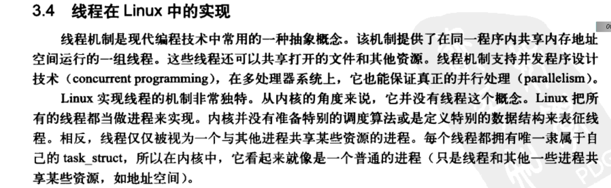

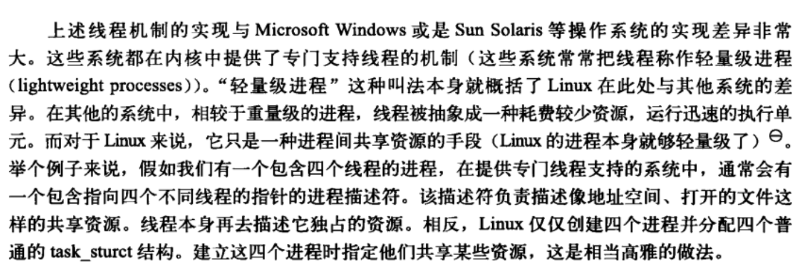

每个进程都有一个单独的内核栈

内核中的堆和栈没有严格的地址区分

### 读书截图

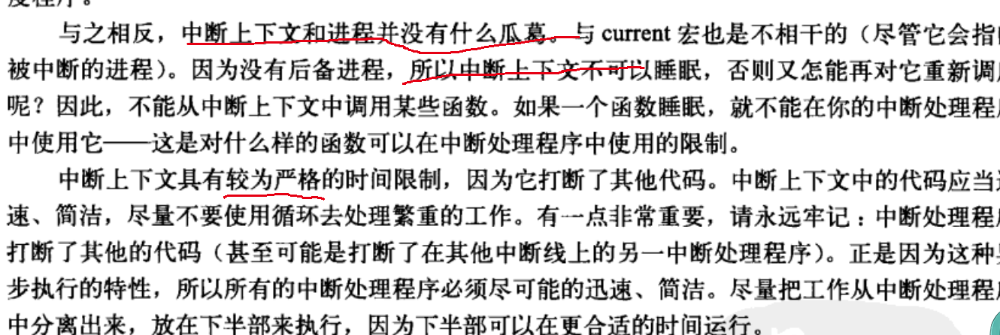

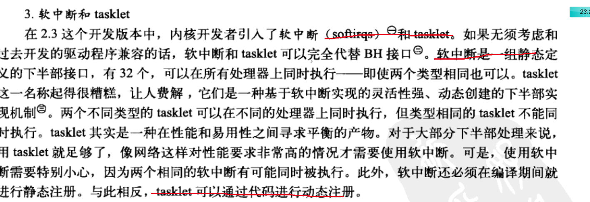

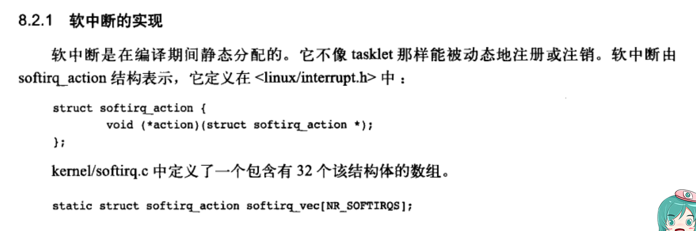

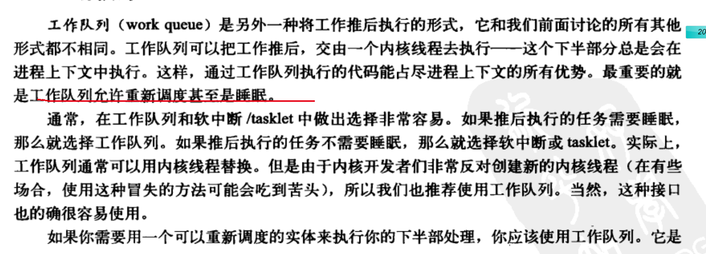

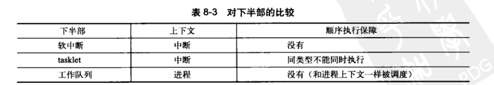	softirq actions cannot be started asynchronously 

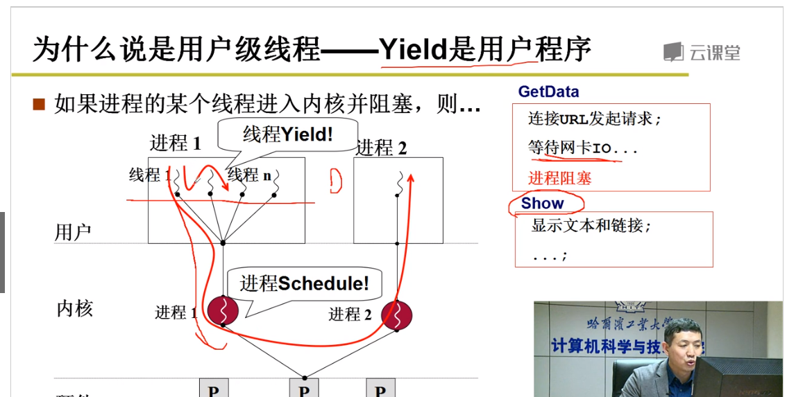

libco协程的共享协程栈模式使得单机很容易接入千万连接，只需创建足够多的协程即可。通过libco共享栈模式创建1千万的协程（E5-2670 v3 @ 2.30GHz * 2, 128G内存），每10万个协程共享的使用128k内存，整个稳定echo服务的时候总内存消耗大概为66G。

### 动手操作

cat  /proc/570/stack

cat /proc/interrupts

### 小王 偷偷写这么几句话

线程是操作系统能够调度和执行的基本单位，在Linux中也被称之为轻量级进程

线程只是一个与其他进程共享某些资源的进程

###  

cat  /proc/570/stack

## 

### 参考

- # 初窥腾讯开源的libco库

- # 漫画：什么是协程

- https://blog.csdn.net/codetz/article/details/51244684

- # Linux内核中的下半部机制之工作队列(workqueue)

- [Linux进程管理之task_struct结构体](https://www.cnblogs.com/zxc2man/p/6649771.html)

- # 再谈slab

- 怎么理解linux内核栈？

- 浅谈Linux线程模型 https://zhuanlan.zhihu.com/p/57349087

-  Understanding the Linux Kernel, 3rd Edition

   Chapter 3 , Chapter 7,   Chapter 9

- kthread_should_stop
- 内存管理：虚拟地址空间布局

​    https://zhuanlan.zhihu.com/p/75823660

- 进程与线程的一个简单解释https://zhuanlan.zhihu.com/p/75215197

- 用户级线程和内核级线程的区别

- 操作系统 -- 线程 (https://zhuanlan.zhihu.com/p/69330399)