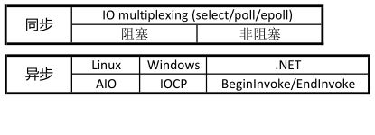
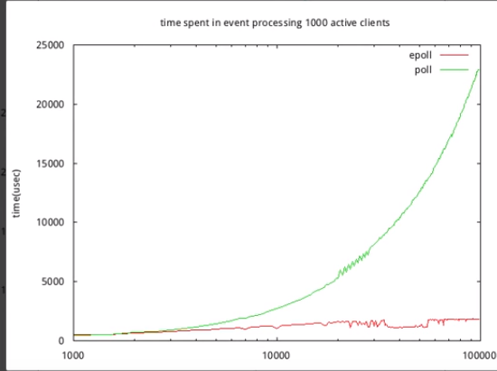

这就是你价值，用不一向的角度回答老问题。

> 别人回答了，那是入门时候，随笔写博客时候，应付项目时候。
>
> 别人迭代了，别人不会重写一本书，一个项目，一个博客纠正。
>
> 你对你认知负责，你需要对你理解负责


## 一、问题


设计一个epoll服务。


## 二、你的思考（10秒闪过）


#### 拦路虎1：大脑一片空白 不知道如何下手。浮现了五种网络IO模型 6.2 I/O Models  （[UNIX Network Programming - The Sockets Networking](https://app.yinxiang.com/shard/s39/res/d1ee9365-dfac-47c9-be7e-f36345ae67b2)） 



有出现了 C10k问题设计, 从一个线程一个链接，发展到Reactor/Proctor 多线程涉及

最后想到应用。为了处理阻塞事件，redis nodes， st 分离出不同队列处理

menarche 通过 分离 多个Reactor，Netty（多） 与 [libevent](https://github.com/libevent/libevent)(单)

但是一片空白 不知道如何下手 的，思考5个小时，还是毫无头绪


画外音：

>  你给自己一个假设，服务器是单线程，只有read send这个2个操作，这最基本模型，这个通过了，才能考虑其他的


#### 拦路虎2：大脑一片空白。大文件怎么做到的，需要考虑什么问题。 思考5小时，被吓住了

- 一个视频文件传输，和普通http，tcp 请求有什么区别
- 一般的通http，tcp 请求服务是怎么涉及的
- 一般的通http，tcp 请求怎么请求的
- 大文件传输是怎么涉及
- epoll(nginx,redis,tomcat)是如何处理的，做了什么措施
- https://www.zhihu.com/question/22840801


画外音：

>  你给自己一个假设，一个大文件1 G传输，


#### 拦路虎3  想到各种技巧，异步，断线续传。


#### 解决办法3 ：

你会想一下你看到，你写的代码怎么样的，就是很简单 c++代码，我看到都是很简单。

无论在复杂的失去，c++总是很简单方式实现，这高效地方，只要c语言写的，就是高效。

1. for epoll_wait
2.  非阻塞 
3. 缓冲区


- 我自己的代码

  ~~~c++
  #define MAXREADBUF 1400
  class dns_down_connect
  {
  public:
  	char	      m_ReadBuf[MAXREADBUF];
  	char          m_revBuf[READBUFLENG];
      int           m_ReadNum;
      int			  m_revBufWriterPtr;
  
  };
  
  void * connect_thread_fun(void * arg)
  {
  
  	while (1)
  		memset(pthis->m_ReadBuf, 0, MAXREADBUF);
  		nb_read = st_read_fully(pthis->m_stfd, (void *)pthis->m_ReadBuf, pthis->m_ReadNum, SRS_CONSTS_RTMP_RECV_TIMEOUT_US);
  
  		if (nb_read != pthis->m_ReadNum) {
  
  			if (nb_read < 0)
  			{
  				if (nb_read < 0 && errno == ETIME) {
  					continue;
  				}
  			}
  			pthis->m_thread = NULL;
  			st_thread_exit(NULL); //exit 
  		}
  		pthis->OnRead(nb_read);
  		
  	}
  
  }
  
  //获取数据包的长度
  _nextDataLen = *(int32 *)(m_revBuf + _dealPtr + NISMSGTYPELENG);
  swap(&_nextDataLen, sizeof(int32)); //获取数据包的长度
  
  if (_leftdatalen >= _nextDataLen + NISMSGHEADSIZE)		//一个完整包的长度
  {
  	OnMsg(m_revBuf + _dealPtr, _nextDataLen + NISMSGHEADSIZE);
  	
  	_dealPtr += _nextDataLen + NISMSGHEADSIZE; //如果一次读取多个报文，
  	_leftdatalen = m_revBufWriterPtr - _dealPtr;
  	_nextDataLen = 0;
  	continue;
  }
  
    while ((wd = ::write(fd, httpRes.data() + con.written, left)) > 0) {
          con.written += wd;
          left -= wd;
          if (output_log)
              printf("write %d bytes left: %lu\n", wd, left);
      };
      if (left == 0) {
          //        close(fd); // 测试中使用了keepalive，因此不关闭连接。连接会在read事件中关闭
          cons.erase(fd);
          return;
      }
      if (wd < 0 && (errno == EAGAIN || errno == EWOULDBLOCK))
          printf("write errno == EAGAIN || errno == EWOULDBLOCK \n");
          return;
  

  ~~~
  
  - redis
  
  ~~~c
  /*
   * 负责传送命令回复的写处理器
   */
  void sendReplyToClient(aeEventLoop *el, int fd, void *privdata, int mask) {
  
      while(c->bufpos > 0 || listLength(c->reply)) {
  
          if (c->bufpos > 0) {
              // 写入内容到套接字
              // c->sentlen 是用来处理 short write 的
              // 当出现 short write ，导致写入未能一次完成时，
              // c->buf+c->sentlen 就会偏移到正确（未写入）内容的位置上。
              nwritten = write(fd,c->buf+c->sentlen,c->bufpos-c->sentlen);
              // 出错则跳出
              if (nwritten <= 0) break;
              // 成功写入则更新写入计数器变量
              c->sentlen += nwritten;
              totwritten += nwritten;
  
              /* If the buffer was sent, set bufpos to zero to continue with
               * the remainder of the reply. */
              // 如果缓冲区中的内容已经全部写入完毕
              // 那么清空客户端的两个计数器变量
              if (c->sentlen == c->bufpos) {
                  c->bufpos = 0;
                  c->sentlen = 0;
              }
          } 
          /* Note that we avoid to send more than REDIS_MAX_WRITE_PER_EVENT
           * bytes, in a single threaded server it's a good idea to serve
           * other clients as well, even if a very large request comes from
           * super fast link that is always able to accept data (in real world
           * scenario think about 'KEYS *' against the loopback interface).
           *
           * 为了避免一个非常大的回复独占服务器，
           * 当写入的总数量大于 REDIS_MAX_WRITE_PER_EVENT ，
           * 临时中断写入，将处理时间让给其他客户端，
           * 剩余的内容等下次写入就绪再继续写入
           *
           * However if we are over the maxmemory limit we ignore that and
           * just deliver as much data as it is possible to deliver. 
           *
           * 不过，如果服务器的内存占用已经超过了限制，
           * 那么为了将回复缓冲区中的内容尽快写入给客户端，
           * 然后释放回复缓冲区的空间来回收内存，
           * 这时即使写入量超过了 REDIS_MAX_WRITE_PER_EVENT ，
           * 程序也继续进行写入
           */
          if (totwritten > REDIS_MAX_WRITE_PER_EVENT &&
              (server.maxmemory == 0 ||
               zmalloc_used_memory() < server.maxmemory)) break;
      }
  
      // 写入出错检查
      if (nwritten == -1) {
          if (errno == EAGAIN) {
              nwritten = 0;
          } else {
              redisLog(REDIS_VERBOSE,
                  "Error writing to client: %s", strerror(errno));
              freeClient(c);
              return;
          }
      }
  
      }
  }
  ~~~
  
  


虽然你无法用语言描述出来 

你很确定，并且肯定你答案在什么地方。


> 你假设单线程
>
> 只处理读取和发送任务，
>
> 如何读取的的。
>
> A 每个链接系统内核都默认缓冲区
>
> B 每个链接 应用也有接受 和发送缓冲区。
>
> 当A慢时候，B记录具体情况。
>
> all 代码都是这样写的，我从来接见过不这样写的。


虽然你无法用语言描述出来 

你很确定，并且肯定你答案在什么地方。


虽然你无法用语言描述出来 

你很确定，并且肯定你答案在什么地方。


### 拦路虎4 虽然你感觉正确的，但是你还是无法描述具体忽视问题是什么 

#### 考察对象

非阻塞操作，执行完毕 马上返回结果，如果不是期望读取 或者发送结果，采用while 循环。

这就是茅盾地方，while 是阻塞的那里， 你去期望的 不阻塞那里，

非阻塞的socke发送和接收的数据不一致

非阻塞的socke发送和接收的数据不一致

画外音

>  你考虑的各种网络模型 还有多线程模式 lib Event 还有Netty框架帮助完成了，但是居然每次读写怎么用靠自己。这才是问题管家

## 三、你的回答（限制在1分钟，5句话，12秒一句）


假如epoll 实现，大文件传输的服务，其实普通服务也是这样的（自己完全被这样特殊需求，给吓住了，忘记你自己是怎么写的，all服务器都是这样做的）

- 为每个连结建立处理类

  发送缓冲区，带发送数据长度，最大数据长度/，累计发送长度

  接受缓冲区，已经接受送数据，最大剩余长度/

  

  1. 非阻塞发送

  2. 如果遇到错误 返回-1 ，

     如果信号中断 continue ，其他的EAGIN ||EWOUDblock  BREAKL Break。

  3. 为了防止大文件一直发送，限制每次最大发送数据.

      i   with nonblocking file descriptors; and
      
      ii  by waiting for an event only after read(2) or write(2) return EAGAIN.
      
  

  

  #### 你发现的最大障碍

  

  别看你现在思路清晰，三天过后 ，到了考场，离开自己电脑，离开 公司，彻底忘记


## 四、鸡蛋里挑骨头（第一句话回答关键了吗，后面有具体场景吗？或者关键词补充吗）

> 里面有3点，你回答一点，还是完全通过book 还有老师 ，领导告诉你点，你思考在那里


## 五、你自己满意了吗,认为过关了

1. 10秒内单，如果大脑一片空白，对里面里面基础用法（不行）

2. 进一步 提问，原理，异常等毫无总结，（不行）

3. 你必须停下来深入看看看别人怎么做的（学习吧）


## 六、下一个问题是什么（这不是结束，只是一个系统的开始）

#### 1 Netty（多） https://netty.io/

#### 2 与 [libevent](https://github.com/libevent/libevent)(单)


#### 3 epoll:


~~~c
/*
 * This structure is stored inside the "private_data" member of the file
 * structure and represents the main data structure for the eventpoll
 * interface.
 */
struct eventpoll {
	/* Protect the access to this structure */
	spinlock_t lock;
	struct mutex mtx;

	/* 用于收集调用了epoll_wait()系统调用的用户态应用程序 */
	wait_queue_head_t wq;

	/* Wait queue used by file->poll() */
	wait_queue_head_t poll_wait;

	/* 用于收集已经就绪了的item对象 */
	struct list_head rdllist;

	/* 用来挂载struct epitem类型对象的红黑树的根 */
	struct rb_root rbr;

	/*
	 * 这个单向链表也是用来收集就绪了item对象的，那这个成员什么时候会被使用呢?
	 * 这个成员是在对rellist成员进行扫描操作获取就绪事件返还给用户态时被用来存放
	 * 扫描期间就绪的事件的。为什么需要这样做呢?因为在对rellist扫描期间需要保证
	 * 数据的一致性，如果此时又有新的就绪事件发生，那么就需要提供临时的空间来存
	 * 储，所以ovflist就扮演了这个角色。
	 */
	struct epitem *ovflist;
	struct wakeup_source *ws;
	struct user_struct *user;

	/* struct eventpoll类型对象对应的文件对象 */
	struct file *file;
	int visited;
	struct list_head visited_list_link;
}

https://tqr.ink/2017/10/05/implementation-of-epoll/
epoll是Linux内核为处理大批量文件描述符而设计的IO多路复用机制，它能显著提高程序在存在大量并发连接而只有少部分活跃连接情况下的系统CPU利用率
 https://github.com/torvalds/linux/blob/master/fs/eventpoll.c 


~~~

https://www.youtube.com/watch?v=LJwCMWGMM2c




## 七、如果自己没有做过类型项目，参考别人经验，自己重新设计，需要考虑知识点是什么？

> 用自己知识重新解释一遍来发现自己理解中无趣。


- https://juejin.im/post/5b555f055188251af25700aa(图解：HTTP 范围请求，助力断点续传、多线程下载的核心原理)

https://www.jianshu.com/p/f898eda58ed2

 别人提到案例

 拖动视频

```
http 是短链接：
Content-Length=106786028 
Content-Range=bytes 2000070-106786027/106786028 

HTTP断点续传原理: Range & Content-Range

flow;
http://www.cyub.vip/2017/06/12/HTTP%E6%96%AD%E7%82%B9%E7%BB%AD%E4%BC%A0
一个最简单的断点续传流程如下：
curl -v -H 'Range:bytes=0-9' http://localhost:8080 //本文中的栗子请求的数据索引是包前又包后的
复制代码
p:暂停下载
c:继续下载
s -xx:修改下载速度

```

我自己理解

content_range  client

 

https://www.zhihu.com/question/49947156

https://github.com/zeromq/libzmq/blob/master/src/epoll.cpp#L148


## 八、如果自己没有做过类型项目，自己直接写demo，最容易忽视地方是什么？


## 参考

https://www.infoq.cn/article/communication-redis-clientserver


# 如何像nginx一样高效的发送大文件

https://zhuanlan.zhihu.com/p/21619218

https://www.zhihu.com/question/22840801

 先了解epoll编程，项目中raw_example下面有例子
. 先阅读readme，还有文档
. 按照例子编写几个程序，试试
. poller对epoll进行了简单的封装，出来一个可移植的接口
. event_base是整个框架
. conn是tcp的连接与服务器