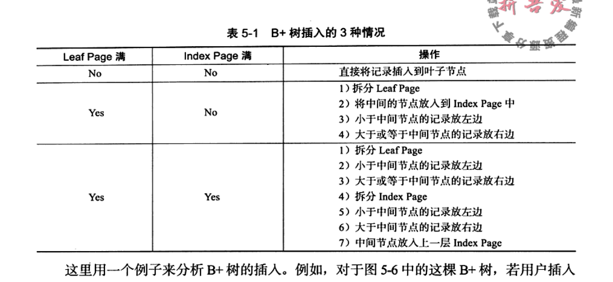

### 对话

老王：最近怎么没精打采的呢？

小王：最近面试卡住了，B+ tree 没回答上来

老王：不对呀，你不早就学过吗，经典教程都写这呢？

小王：别提啦，脑中一片空白。

当时情况是这样的！

--------------------------------------------------------------------------

大王：谈谈你对B+ tree理解？

小王：这个我知道，就是数据全部在叶子节点上，同一层次 ！

大王；然后呢。。。。

小王：支支吾吾 说不上来了。

大王：还有没有补充的

小王：查询效率很高。

大王：怎么查询的？

小王：。。。。。。。

大王：过，就到这里把。


好把，我来讲一讲


### （老王） 我演示一下如何查找

 

- 查找元素6


- 查找元素12 


- 查找元素17 （慢速）


### （小王）我知道如何查找了


  查询tree_search (k, root) 逻辑 

1. 如果root为null，直接返回查询失败。
2. 如果是root是叶子节点，if k=ki，返回查找成功，不然就失败。
3. root 如果是非叶子节点。

  循环遍历   如果 k <key1

​       从对应子树 继续寻找tree_search (k, root.1.child) 递归遍历

4. 循环遍历结束。k 大于任何一个key。递归最有一个子树

    tree_search (k, root.last.child)

   

```c++
Function: tree_search (k, node)
  if node is a leaf then
    return node;
  switch k do
  case k ≤ k_0
    return tree_search(k, p_0);
  case k_i < k ≤ k_{i+1}
    return tree_search(k, p_{i+1});
  case k_d < k
    return tree_search(k, p_{d});
```


小王：

我有一个疑问，查询元素12时候，明明中间元素 已经存在，为什么还要继续查询走到叶子节点才算结束，

这不是浪费时间吗？（### 对话

老王：最近怎么没精打采的呢？

小王：最近面试卡住了，B+ tree 没回答上来

老王：不对呀，你不早就学过吗，经典教程都写这呢？

小王：别提啦，当时脑中一片空白。

当时情况是这样的！

--------------------------------------------------------------------------

大王：谈谈你对B+ tree理解？

小王：这个我知道，就是数据全部叶子节点上，在同一层次 ！

大王；然后呢。。。。

小王：支支吾吾 说不上来了。

大王：还有没有补充的

小王：查询效率很高。

大王：怎么查询的？

小王：。。。。。。。

大王：过，就到这里把。


好把，我来讲一讲


### （老王） 我演示一下如何查找

 

- 查找元素6


- 查找元素12 


- 查找元素17 （慢速）


### （小王）我知道如何查找了


  查询tree_search (k, root) 逻辑 

1. 如果root为null，直接返回查询失败。
2. 如果是root是叶子节点，if k=ki，返回查找成功，不然就失败。
3. root 如果是非叶子节点。

  循环遍历   如果 k <key1

       从对应子树 继续寻找tree_search (k, root.1.child) 递归遍历

4. 循环遍历结束。k 大于任何一个key。递归最有一个子树

    tree_search (k, root.last.child)

   

```c++
Function: tree_search (k, node)
  if node is a leaf then
    return node;
  switch k do
  case k ≤ k_0
    return tree_search(k, p_0);
  case k_i < k ≤ k_{i+1}
    return tree_search(k, p_{i+1});
  case k_d < k
    return tree_search(k, p_{d});
```


小王：

我有一个疑问，查询元素12时候，明明中间元素 已经存在，为什么还要继续查询走到叶子节点才算结束，

这不是浪费时间吗？


老王：

观察很仔细呀，漫画算法：什么是 B+ 树。

程序员小灰已经给出解释了，你不是看过一次，怎么忘记了！

Internal nodes store search key values


小王：

我确实看过，不过对里面一句话根本不明白  


有K个元素，K个指针 ，一个节点对应一个指针呀, 这个不对呀，2个元素会拆分3个指针呢？


### （老王） 先别急着问为什么，我演示一下插入操作


在叶子节点 (1 2 3) 上插入新元素 4 ，B  tree 结果是：


在叶子节点 (1 2 3) 上插入新元素 4 ，B+  tree 结果是：


顺序插入元素： 1 2  3 4 5 6 7 9 10 11 创建 4 阶 B+ tree 完整演示（慢速）


### （小王）我知道如何插入了


插入关键字k的步骤

1. 选择到叶子节点，然后插入对应位置
2. 对叶子节点做平衡检查，如果超过上界，选择中间元素+1位置这个key进行拆分到paernt节点上去。
3. 继续对父节点做做平衡检查。如果超过上界，选择中间元素+1位置这个key进行拆分到paernt节点上去
4. 重复步骤 3 


### （老王）请看下面删除演示

 

删除元素 5


删除元素 7


（小王）这个有点复杂，需要借助相邻的元素，这个操作我描述不出来

基本分为三个步骤

1. 从叶子节点查询到该元素，然后删除
2. 判断是是否低于最低数量，从该节点借一个记录代替自己。如果没有从邻居借去一个代替自己
3. 重复步骤 2

但是漏洞很多，无法具体描述。开始支支吾吾了

 

(老王) 你说对，这个情况比较复杂。未完待续


### 最后，小王偷偷写下这么几句话


   B+ tree 是一个  M 阶平衡搜索树 （Balanced multiway search trees）

1. 为了维持平衡，每个非叶子节点中子树个数上下界： M/2<=x <<M。也就是说 每个结点最多有m-1个关键字

2. 每次对叶子节点 中key的 插入，删除等操作会引起关键字超过上下界，因此需要继续进行拆分或者合并操作。分裂是树长高的唯一途径。

3. 因为全部信息都存储到叶子节点，这就为什么每次查询，插入，删除等操从找到叶子节点开始。

   

 

B+ tree  特点


哈哈哈 


你一已经猜到 一个4阶B+tree，一个节点最多允许 3个key，4个子树指针。


因为B+ tree 结构是递归的，我只专心看最小子问题，就是一个节点组成


```c
typedef struct BTNode{
        int keynum;       /// 结点中关键字的个数，ceil(ORDER/2)-1<= keynum <= ORDER-1
		KeyType key[ORDER-1];         /// 关键字向量为key[0..keynum - 1]
		struct BTNode* child[ORDER];   /// 孩子指针向量为child[0..keynum]
		char isLeaf;         /// 是否是叶子节点的标志
	}BTNode;
```


### FQA

- 一个M阶的B+tree，M是什么意思，是节点个数，还是指针个数？目前我定义来看是孩子的最大个数?
- 每个节点 n个key和m个指针 ，n和m一定相等吗？不一定


### 参考

[B+ treeFrom Wikipedia](https://en.wikipedia.org/wiki/B%2B_tree
)

[MySQL索引背后的数据结构及算法原理](http://blog.codinglabs.org/articles/theory-of-mysql-index.html)

[漫画算法：什么是 B+ 树](https://www.jianshu.com/p/1f2560f0e87f)）


老王：

观察很仔细呀，漫画算法：什么是 B+ 树。

程序员小灰已经给出解释了，你不是看过一次，怎么忘记了！


小王：

我确实看过，不过对里面一句话根本不明白  


有K个元素，K个指针 ，一个节点对应一个指针呀, 这个不对呀，2个元素会拆分3个指针呢？


### （老王） 先别急着问为什么，我演示一下插入操作


在叶子节点 (1 2 3) 上插入新元素 4 ，B  tree 结果是：


在叶子节点 (1 2 3) 上插入新元素 4 ，B+  tree 结果是：


顺序插入元素： 1 2  3 4 5 6 7 9 10 11 创建 4 阶 B+ tree 完整演示（慢速）


### （小王）我知道如何插入了



插入关键字k的步骤

1. 选择到叶子节点，然后插入对应位置
2. 对叶子节点做平衡检查，如果超过上界，选择中间元素+1位置这个key进行拆分到paernt节点上去。
3. 继续对父节点做做平衡检查。如果超过上界，选择中间元素+1位置这个key进行拆分到paernt节点上去
4. 重复步骤 3 


### （老王）请看下面删除演示

 

删除元素 5


删除元素 7


（小王）这个有点复杂，需要借助相邻的元素，这个操作我描述不出来

基本分为三个步骤

1. 从叶子节点查询到该元素，然后删除
2. 判断是是否低于最低数量，从该节点借一个记录代替自己。如果没有从邻居借去一个代替自己
3. 重复步骤 2

但是漏洞很多，无法具体描述。开始支支吾吾了

 

(老王) 你说对，这个情况比较复杂。未完待续


### 最后，小王偷偷写下这么几句话


   B+ tree 是一个  M 阶平衡搜索树 （Balanced multiway search trees）

1. 为了维持平衡，每个非叶子节点中子树个数上下界： M/2<=x <<M。也就是说 每个结点最多有m-1个关键字
2. 每次对叶子节点 中key的 插入，删除等操作会引起关键字超过上下界，因此需要继续进行拆分或者合并操作。
3.  因为全部信息都存储到叶子节点，这就为什么每次查询，插入，删除等操从找到叶子节点开始。


哈哈哈 


你一已经猜到 一个4阶B+tree，一个节点最多允许 3个key，4个子树指针。

非根节点的**关键字**数量范围：`m/2 <= k <= m-1`。

因为B+ tree 结构是递归的，我只专心看最小子问题，就是一个节点组成


```c
typedef struct BTNode{
        int keynum;       /// 结点中关键字的个数，ceil(ORDER/2)-1<= keynum <= ORDER-1
		KeyType key[ORDER-1];         /// 关键字向量为key[0..keynum - 1]
		struct BTNode* child[ORDER];   /// 孩子指针向量为child[0..keynum]
		char isLeaf;         /// 是否是叶子节点的标志
	}BTNode;
```


### 小王FQA


为什么B+树可以满足要求？

**1) B+-tree****的磁盘读写代价更低******

**B+-tree**的内部结点并没有指向关键字具体信息的指针。因此其内部结点相对B 树更小。如果把所有同一内部结点的关键字存放在同一盘块中，那么盘块所能容纳的关键字数量也越多。一次性读入内存中的需要查找的关键字也就越多。相对来说IO读写次数也就降低了。

举个例子，假设磁盘中的一个盘块容纳16bytes，而一个关键字2bytes，一个关键字具体信息指针2bytes。一棵9阶B-tree(一个结点最多8个关键字)的内部结点需要2个盘快。

而**B+ \**树内部结点只需要1个盘快。当需要把内部结点读入内存中的时候，B 树就比**B+ **树多一次盘块查找时间(在磁盘中就是盘片旋转的时间)。

**2) B+-tree****的查询效率更加稳定******

由于非终结点并不是最终指向文件内容的结点，而只是叶子结点中关键字的索引。所以任何关键字的查找必须走一条从根结点到叶子结点的路。所有关键字查询的路径长度相同，导致每一个数据的查询效率相当。


B+ tree 既然这么好，为什么不想红黑树一样存储在内存，这样效率不是更高吗？【ok】

一个B+树的节点,就是一页4k，其实站内存很大的。


- 一个M阶的B+tree，M是什么意思，是节点个数，还是指针个数？目前我定义来看是孩子的最大个数?
- 每个节点 n个key和m个指针 ，n和m一定相等吗？不一定


## B+树与文件系统 原

  https://www.infoq.cn/article/algorithms-behind-modern-storage-systems 

 https://juejin.im/post/5c99f0556fb9a070e82c1fcf 

 https://juejin.im/post/5bbbf7615188255c59672125 

 https://www.zhihu.com/question/19887265 

 [https://leonlibraries.github.io/2017/05/18/%E4%BB%8ELSM%E5%88%B0HBase/](https://leonlibraries.github.io/2017/05/18/从LSM到HBase/) 

### 参考

- 流程图

  https://shimo.im/mindmaps/rCPHvck6vwXVy3tx

- [B+ treeFrom Wikipedia](https://en.wikipedia.org/wiki/B%2B_tree
  )

- 算法导论 18章

- [MySQL索引背后的数据结构及算法原理](http://blog.codinglabs.org/articles/theory-of-mysql-index.html)

- [漫画算法：什么是 B+ 树](https://www.jianshu.com/p/1f2560f0e87f)

- 代码实现（https://github.com/SirLYC/BPTree）

