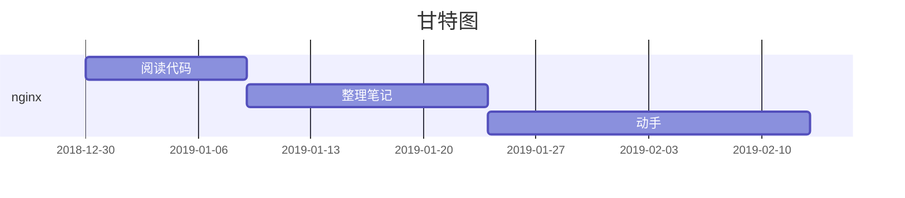
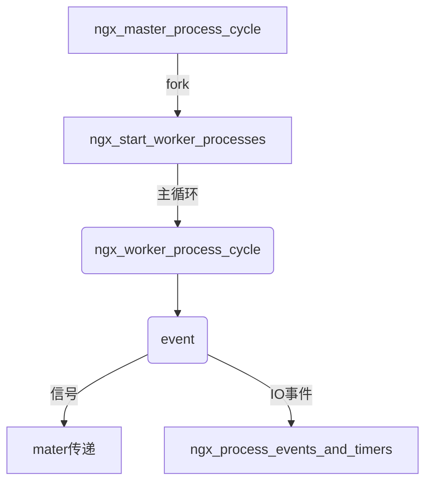
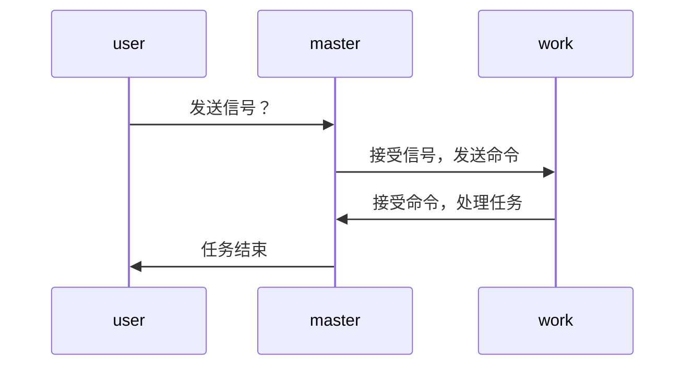
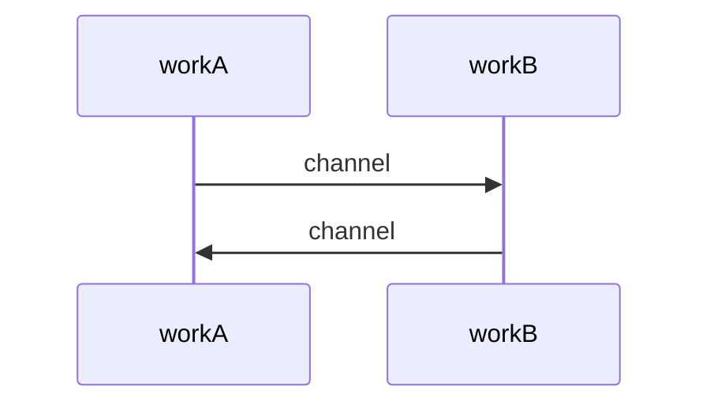

##  plan 
解决问题：

Q1 别人都看烂了，你为什么现在还看？
A1 : 别人懂了，你还没有懂，尤其是
     UNIX® Network Programming 上的东西 没有看懂，
     以前跳过去不看，现在慢慢偿还
     

### 1.代码注释

### 2.文档注释
https://www.kancloud.cn/digest/understandingnginx

http://tengine.taobao.org/book/

说明：day1 可能是多天

##  day1  Nginx 启动过程 begin
代码位置：src\os\unix\ngx_process_cycle.c

- psatck nginx: worker process
#0  0x00007fe7561431a3 in __epoll_wait_nocancel () from /lib64/libc.so.6
#1  0x0000000000431a6f in ngx_epoll_process_events ()
#2  0x0000000000429772 in ngx_process_events_and_timers ()
#3  0x000000000042fff9 in ngx_worker_process_cycle ()
#4  0x000000000042e846 in ngx_spawn_process ()
#5  0x000000000042f3bb in ngx_start_worker_processes ()
#6  0x00000000004306f6 in ngx_master_process_cycle ()
#7  0x000000000040c785 in main ()

- psatck nginx: master process
#0  0x00007fe75608c81a in sigsuspend () from /lib64/libc.so.6
#1  0x00000000004307f5 in ngx_master_process_cycle ()
#2  0x000000000040c785 in main ()

### day1 输出  end
- nginx使用了三种消息传递方式：共享内存、套接字、信号。
- Nginx主要使用了三种同步方式：原子操作、信号量、文件锁
同步机制这个是难点，尤其是共享内存【待处理】

进程间通信机制
>master进程与worker进程间

>worker进程之间

共享内存 遗留：【待处理】
channl  遗留：【待处理】
lua worker  遗留：【待处理】

* * *

塔山

[Nginx--master进程的信号处理] 【ok】(https://don6hao.github.io/blog/2015/01/05/nginx-master-handle-signal.html)

[Nginx--进程间的消息传递](https://don6hao.github.io/blog/2015/01/04/nginx-ipc.html) 

【Nginx源码研究】Nginx的事件模块介绍

Nginx 工作进程运行示意图

Nginx源码分析与实践---进程间通信机制（[共享内存](https://blog.csdn.net/ZX714311728/article/details/65630655)）
【待处理，不重要】
nginx源码分析--[进程间通信机制](https://blog.csdn.net/yusiguyuan/article/details/41324541) & 同步机制 【待处理，重要】

nginx 进程间通信-socketpair

https://wangxuemin.github.io/2016/01/25/Nginx%20%E5%B7%A5%E4%BD%9C%E8%BF%9B%E7%A8%8B%E8%BF%90%E8%A1%8C%E7%A4%BA%E6%84%8F%E5%9B%BE/
* * *

## day 2

代码位置：src\event\ngx_event.c
- void ngx_process_events_and_timers(ngx_cycle_t *cycle)

- “惊群”，看看nginx是怎么解决它的

## day3 浅谈内存池技术

- 类STL的内存池技术
- nginx内存池技术

如果申请的内存块大于128字节，就将申请的操作移交std::new去处理；

如果申请的区块大小小于128字节时，就从本分配器维护的内存池中分配内存。

该Allocator最小的分配单位为8Byte，其内部维护了一个长度为维护128/8=16的空闲链表数组，

每个链表管理着固定大小的内存

- _S_free_list[0] ——–> 8 byte
- _S_free_list[1] ——–> 16 byte
- _S_free_list[2] ——–> 24 byte
- _S_free_list[3] ——–> 32 byte
- … …
- _S_free_list[15] ——-> 128 byte

std::allocator 

https://www.youtube.com/watch?v=LIb3L4vKZ7U&t=428s

http://blog.yaoyumeng.com/2014/08/31/Memory_Pool