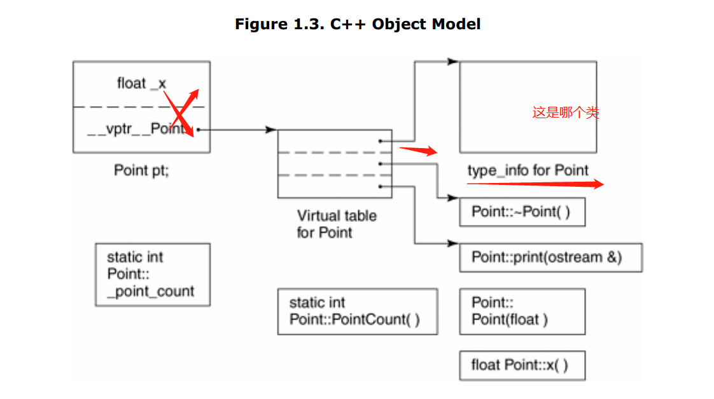
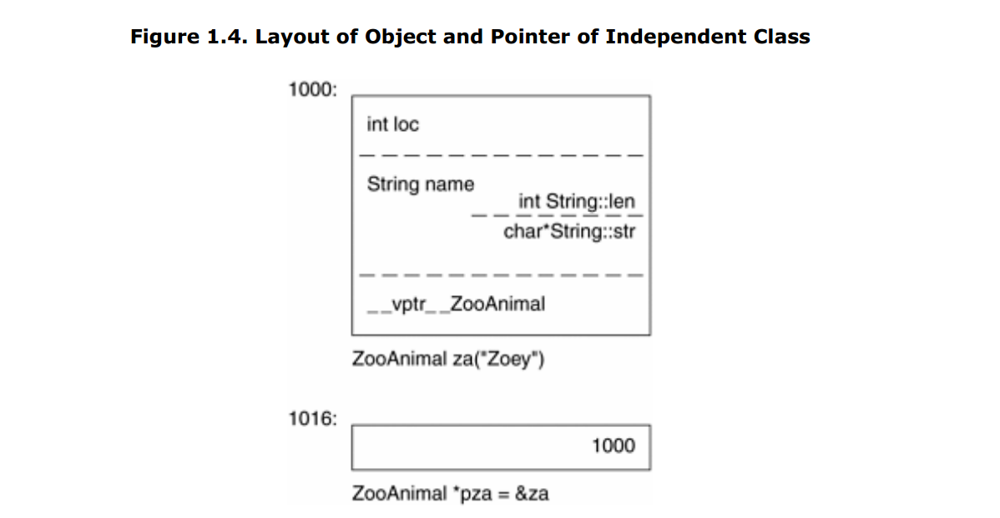

# **关于对象(Object Lessons)** #
***

## **1. C++对象模型(The C++ Object Model)** ##
## c++ class 

- 成员：
  Nonstatic data member被配置在每一个class Object之内, 

  static data member则被存放在所有的class Object之外,

  

- 函数
  所有的函数不管是(static抑或者
  nonstatic)都被存放在class Object之外,

​       虚函数存放在一个虚表指针中.


### 


**1.1 对virtual function的支持**


 ```c++
1 每个class产生一堆指向virtual function的指针(指向成员函数的指针),
    被存放在一个称作vtbl(virtual table)的表中(指向成员函数的)
     
2 每个class object被添加了一个指针, 指向相关的vtbl, 通常这个指针被称为
    vptr, 
vptr的设置和重置都由每个class的构造函数(constructor), 析构函数
(destructor)和赋值函数(copy assignment运算符)自动完成; 


 3 每个class所关联的 type_info object(用来支持Runtime type identification
  
   RTTI) 也经由virtual table被指出来, 通常放在表格的第一个solt处.
     
 The type_info object associated with each class in support of runtime
type identification (RTTI) is also addressed within the virtual table, usually within the table's first slot
 ```
> ### **1.2 示意图** ###
> ______                         ___________
> |  m_  |                -----> | type_info |
> |------|                |      |___________|
> | vptr |----->______    |
> |______|     |______|----          ____________________
>      |______|------------>| virtual function 1 |
>      |______|-------      |____________________|
>                    |       ____________________
>                    |      | virtual function 2 |
>                    ------>|____________________|
>
> ### 1.3 C++中的struct** ###
>
> 1) struct应该只用在定义C类型的数据集合的情况下
>
> 2) C++中凡处在同一个access section的数据, 肯定保证以其声明次序出现在内存
> 布局中, 但是当被放在多个access sections的情况下, 排列次序就不一定了。
>
> 3) C struct在C++中的一个合理用途是当你要传递"一个复杂的class Object的全
> 部或部分"到某个C函数中去时, struct声明可以将数据封装起来, 并保证拥有
> 与C兼容的看见布局; 
> 这项保证只在组合的情况下才存在;


> ### **1.4 C++支持的程序设计典范** ###
> 1) 程序模型(procedural model), 像C语言一样
> 2) 抽象数据类型模型(abstract data type model, ADT)
> 所谓"抽象", 是和一组表达式(public接口)一起提供
> 3) 面向对象模型(object-oriented model)
> 有一些彼此相关的类型, 通过一个抽象的base class(用来提供共通接口)被封
> 装起来;
> 只有通过pointer或reference的间接处理, 才支持OO程序设计所需的多态性;


> ### **1.5 C++支持多态的方法** ###
> 1) 经由一组隐含的转化操作(把一个derived class指针转化为一个指向其plublic
> base type的指针)

> Through a set of implicit conversions, such as the conversion of a derived class pointer to a pointer of
> its public base type:
> shape *ps = new circle(); 


> 2) 经由virtual function机制

> Through the virtual function mechanism:
> ps->rotate(); 


> 3) 经由dynamic_cast和typeid运算符

> Through the dynamic_cast and typeid operators:
> if ( circle *pc =
> dynamic_cast< circle* >( ps )) ... 


> ### **1.6 class Object的内存大小** ###
> 1) 其nonstatic data members的总和大小;
>
> 
>
> 2) 加上任何alignment的需求而填补(padding)上去的空间;
>
> 
>
> 3) 加上为了支持virtual而由内部产生的任何额外负担;

​    

> ### **1.7 加上多态之后** ###
>
> 
>
> 1) 基类指针(pb)所指的object类型可以决定(虚函数-vfun)所调用的实体, 
>
> 类型信息的封装并非在pb之中
>
> 而是在link之中, link在object的vptr和vptr所指的
> virtual table之间

旁边：

> 
>
> 2) 当一个base class Object被直接初始化为一个derived class Object时, 
> derived Object会被切割, 以便塞入到较小的base type内存中, derived type
> 将没有留下任何信息, 多态将失效

https://stackoverflow.com/questions/41094195/memcpy-derived-class-to-base-class-why-still-called-base-class-function

> ```c
> RTTI（运行时类型信息）
> 
> The answer to the second question is that the compiler intercedes in the initialization and assignment of one
> class object with another. 
>     
>  The compiler must ensure that if an object contains one or more vptrs, those vptr
> values are not initialized or changed by the source object(一个类的大小是不能被改变的的)
> 
> 
> [不会添加额外信息]
> ```


指针初始化 和对象初始化区别

- 指针初始化和赋值 不修改指针地址，而是修改指针地址的内容

  ​      base*=&d

  ​      base*=&m

  So a cast in general is a kind of compiler directive. In most cases, it does **not alter the actual addres**s a
pointer contains. Rather, 

it alters only the interpretation of the size and composition of the memory being
addressed. 




- 对象拷贝构造，赋值 修改对象成员（vptr）

