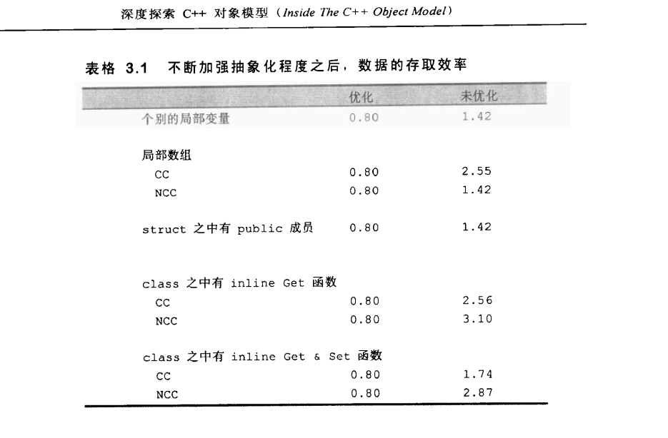
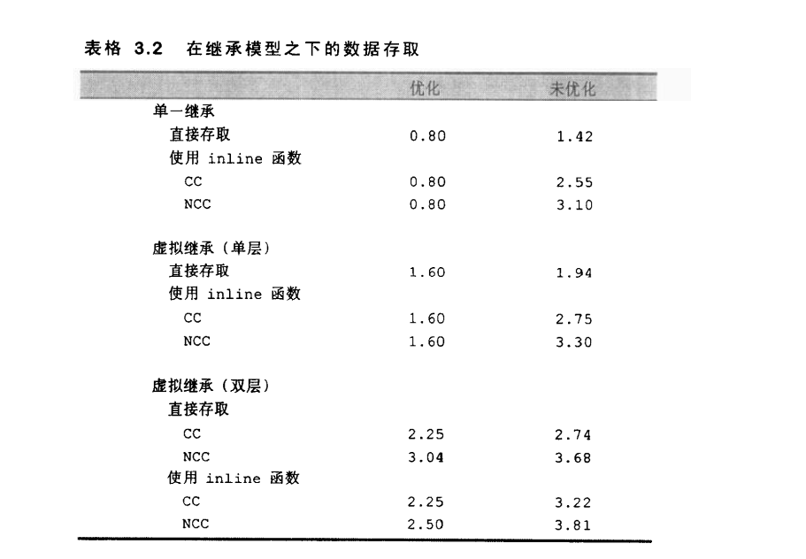
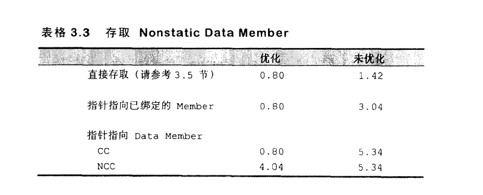

# **Data语意学(The Semantics of Data)** #
***

        例子:
        //! C++
        class X {};
        class Y : public virtual X {};
        class Z : public virtual X {};
        class A : public Y, public Z {};
        在主流的C++编译器上, 各个类的大小分别为: sizeof(X)=1, sizeof(Y)=4, 
    sizeof(Z)=4, sizeof(A)=8;
        而类Y和类Z的大小受3个因素的影响:
        1) 语言本身所造成的额外负担
           当语言支持虚基类时, 就会导致一些额外负担; 在子类中, 其反映在某种
           形式的指针上, 它要么是指向虚基类子对象, 要么指向一个相关的表格; 
           表格中不是存放虚基类子对象的地址就是其偏移量
        2) 编译器对于特殊情况所提供的优化处理
           虚基类X的子对象的1字节也出现在类Y和Z上, 传统上它被放在子类的固定
           部分的尾端;
           某些编译器会对空虚基类提供特殊处理;
        3) Alignment的限制
           类Y和Z限制是5字节, 但是在大部分及其上, 结构体大小受到alignment的 
           限制, 使得它们更有效率地在内存中读取;
        
        空虚基类提供了一个虚接口, 没有定义任何数据; 在新近的编译器上, 一个空
    虚基类被视为子类对象最开头的一部分, 即没有花费任何的额外空间(因为既然有
    了成员, 就不需要原本为了空类而安插的一个char了).
        一个虚基类子对象只会在子类中存在一份实体, 不管它在类继承体系中出现了
    多少次, 类A的大小由下列几点决定:
        1) 被共享的唯一一个class X实体, 大小为1字节
        2) 基类Y的大小, 减去因虚基类X而配置的大小, 为4字节; 类Z相同
        3) 类A自己的大小
        4) 类A的alignment数量(如有的话); 因此大小为12字节
        而对于对空虚基类做了处理的编译器, 类X实体中的1字节将被拿掉, 那么字节
    对齐的3字节就不必要了, 则大小为8字节;
        C++对象模型尽量以空间优化和存取速度优化的考虑来表现非静态数据成员, 
    并且保持和C语言struct数据配置的兼容性, 它将数据直接存放在每一个类对象之
    中; 对继承而来的非静态数据成员也是如此; 静态数据成员被放置在程序的一个全
    局数据段中, 不会影响个别类对象的大小; 不管该类被产生出多少个对象, 静态数
    据成员永远只存在一份实体;
        每一个类对象必须有足够的大小以便容纳它所有的非静态数据成员:
        1) 由编译器自动加上的额外数据成员, 以便支持语言特性
        2) 因为alignment(边界调整)的需求

## **1. Data Member的绑定(The Binding of a Data Member)** ##
    1) 一个inline函数实体, 在整个class声明未被完全看见之前是不会被评估求值的
    
    2) 一个inline函数在class声明之后就立刻被定义的话, 那么就还是对其评估求值
       即是说, 当遇见以下代码:
        //! C++
        extern int x;
        class Point3D{
        public:
          float X(void) const 
          {
            return x;
          }
        private:
          float x;
        };
        
        Point3D::x 
        
        对成员函数本身的分析会直到整个类的声明都出现了才开始, 因此在一个内联
        的成员函数之内的一个数据成员绑定操作会在整个类声明完成之后才发生
        

## **2. Data Member的布局(Data Member Layout)** ##
    1) 同一个access section(就是private, public, protected等区段)中, 成员的
       排列只需复合"较晚出现的成员在类对象中有较高的地址"; 即是各个成员并不
       一定得连续排列
       
    2) 在类成员之间可能会填补一些边界调整的字节
    
    3) 编译器还可能合成一些内部使用的数据成员, 以便支持整个对象模型; 而vptr
       就是这样的, 会把vptr安插在每一个"内含虚函数的class"的对象内;
       vptr可被放在明确声明的成员最后, 也可以放在一个类对象的最前端, 这个视
       具体的编译器而定;
       
    4) C++标准允许将多个访问区段之中的数据成员自由排列, 而不用在乎她们出现在
       class声明中的次序(目前主流的编译器都是将一个以上的访问区段连锁在一起,
       依照声明的次序成为一个连续的区段)

## **3. Data Member的存取** ##
> ### **3.1 静态成员变量(Static Data Members)** ###
>     1) 每一个静态数据成员只有一个实体, 存放在程序的数据段之中; 每次程序读取
>        静态成员就会被内部转化为对该唯一的extern实体的直接操作
>        
>     2) 存取静态成员并不需要通过类对象
>     
>     3) 当静态成员是一个从复杂继承关系中继承来的成员, 程序之中也只有唯一的实
>        体, 其存取路径仍然是直接的
>        
>     4) 取一个静态数据成员的地址, 会得到一个指向其数据类型的指针, 而不是一个
>        指向其类成员的指针, 因为静态成员并不包含在一个类对象内
>        
>     5) 当多个类都声明了一个相同名字的静态成员, 编译器为了解决名字冲突使用了
>        一种name-mangling的手法, 而该手法有两个要点:
>        一种算法, 推导出独一无二的名称;
>        那些独一无二的名称可以轻易被推导回原来的名称;
>        
> ### **3.2 非静态数据成员(Nonstatic Data Members)** ###
>     1) 直接存放在每个类对象之中
>     
>     2) 经由明确的(explicit)或暗喻的(implicit)来存取它们(无其他方法)
>     
>     3) 在一个成员函数中直接处理一个非静态成员, 那么"implicit类对象"就会发生;
>        表面上是对成员变量的直接存取, 实际上经由this指针来完成的;
>     4) 每个非静态成员变量的偏移量在编译时期即可获知, 甚至成员属于一个基类的
>        子对象(派生自单一或多重继承串联)也是一样;
>        存取一个非静态数据成员, 其效率和存取一个C结构成员或是一个非继承类的
>        成员是一样的;
>     5) 成员是一个结构成员, 一个类成员, 单一继承, 多重继承的情况下效率都是完
>        全相同的
>     6) origin.x = 0 与 pt->x = 0 的差异(假设origin和pt均为Point3D对象)
>        当Point3D是一个子类, 而在其继承结构中有一个虚基类, 并且被存取的成员是
>        一个从该虚基类继承而来的成员时, pt就说不清楚指向哪个具体的类类型了, 
>        所以这个存取操作必须延至执行期, 经由一个额外的间接导引才能够解决。
>     
>     

## **4. "继承"与Data Members** ##

问题：

What are the possible pitfalls of transforming two independent classes into a type/subtype relationship
through inheritance? 

将两个独立的类转换为类型/子类型关系可能存在哪些陷阱

通过继承?

> ### **4.1 只要继承不要多态(Inheritance without Polymorphism)** ###
>         //! C++
>         class Base1 {
>           int val;
>           char bit1;
>         };
>         class Base2 : public Base1 {
>           char bit2;
>         };
>         class Child : public Base2 {
>           char bit3;
>         };
>     1) 由上面的例子中我们可以看到在Child类的大小, MSVC下其值为16字节, 而在
>        GCC下其值为8字节 
>        
>     2) MSVC下Base1的大小由于bit1会补齐成为8字节, 同理Base2会由于bit2补齐为12
>        字节, 同理Child则会因为bit3补齐成为16字节 
>     3) GCC下, 如果"基类字对象在子类中的原样性"收到破坏, 那么编译器会把基类对
>        象原本的填补空间让出来给子类成员使用, 那么大小将为8字节 
> ### **4.2 加上多态(Adding Polymorphism)** ###
>     1) 当我们在一个类中加上虚函数的时候, 虽然类支持了弹性, 但是却为类带来空
>        间和存取时间的额外负担:
>             导入一个和该含有虚函数的类有关的虚表, 原来存放它所声明的每一个虚
>         函数的地址, 该表的元素数目是被声明的虚函数的数目, 再加上一个和两个
>         slots;
>             在每个类对象中导入一个vptr, 提供执行期的连接, 使每个对象能找到相
>         应的虚表;
>             加强构造函数, 使它能够为vptr设定初值, 让它指向类所对应的虚表; 在
>         子类和每一个基类的构造函数中, 重新设定vptr的值;
>             加强析构函数, 使它能消除"指向类之相关虚表"的vptr;
>     2) 现在编译器的做法把vptr放在类对象的尾端, 可以保留基类C结构的对象布局, 
>        则允许在C程序代码中也能使用
>     3) 而某些编译器(MSVC)将vptr放在类对象的起始处, 对"在多重继承之下, 通过指
>        向类成员的指针调用虚函数", 会带来一些帮助; 而vptr放在前端, 代价则是丧
>        失了C语言的兼容性
>        
> ### **4.3 多重继承(Multiple Inheritance)** ###
>     1) 在继承体系下, 如把vptr放在类对象的起始处, 如果基类没有虚函数而子类有,
>        那单一继承的自然多态将被打破; 而在此情况下, 把一个子对象转换为其基类
>        型, 则需要编译器介入, 用以调整地址(因为vptr插入)
>     2) 对一个多重派生对象, 将其地址指定给"最左端(即第一个)基类的指针", 情况
>        将和单一继承时相同, 因为二者都指向相同的起始地址; 需付出的成本只有地
>        址的指定操作而已; 至于第二个或后继的基类的地址指定操作, 则需要将地址
>        修改过, 加上(或减去, 如果downcast的话)介于中间的基类子对象的大小
>     3) 某些编译器则设计了优化技术, 只要后继的基类声明了一个虚函数, 而第一个
>        基类没有, 就把多个基类的次序进行调整; 这样就可以在子类对象中少产生一
>        个vptr 
>     4) 如果要存取后继基类中的一个成员, 不需要付出额外的成本, 因为成员的位置
>        在编译时就固定了, 因此存取成员只需要一个简单的offset运算, 就像单一继
>        承一样简单——不管是经由一个指针, 一个引用或是一个对象来存取
> ### **4.4 虚拟继承(Virtual Inheritance)** ###
>     1) 类如果内含一个或多个虚基类子对象, 如istream, 将被分割为两部分: 一个不
>        变局部和一个共享局部;
>        不变局部中的数据, 不管后继如何衍化总是有固定的offset, 所以这部分数据
>        可以直接存取;
>        共享局部, 所表现的就是虚基类子对象, 这部分数据的位置会因为每次的操作
>        而有变化, 所以他们只可以被间接存取;
>        
>     2) 一个类如果有一个或多个虚基类, 就会由编译器安插一个指针, 指向虚基类表,
>        而真正的虚基类指针则被放在该表中;
>     3) 或者(另一种方法), 在虚函数表中放置虚基类的offset 
>     
>     4)虚基类最有效的一种运用形式是: 一个抽象的虚基类没有任何的成员数据 
>     

### 最好不要使用virutal继承设计一个类

### 

### 3.6 Pointer to Data Members 

1 指针指向成员变量

https://blog.csdn.net/crayondeng/article/details/16868351ha

函数指针：

普通函数： 直接去地址

类成员普通函数：this->获取地址

类成员虚函数: (this->获取地址+this->偏移量)

> 类成员虚函数 在内存结构中地址存储的偏移量 ，在类结构之内

> 类成员普通函数 在内存中存储地址，在类结构之外

2 效率如何

 

