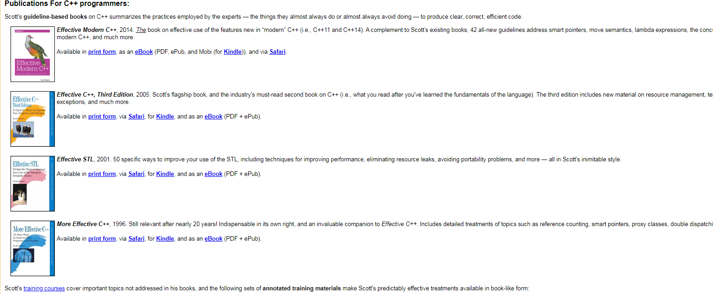

# 知识卡

- https://aristeia.com/books.html Scott Meyers

[https://app.yinxiang.com/shard/s39/nl/8226829/8ed41f09-f358-4903-bf44-110fd578f1b3//res/178e21b8-33e3-4f53-a3d7-0f75121be5d3/Effective%20c%2B%2B.pdf](https://app.yinxiang.com/shard/s39/nl/8226829/8ed41f09-f358-4903-bf44-110fd578f1b3//res/178e21b8-33e3-4f53-a3d7-0f75121be5d3/Effective c%2B%2B.pdf)

- 

https://github.com/taeguk/Effective-Cpp-Series

https://github.com/kelthuzadx/EffectiveModernCppChinese

https://blog.csdn.net/fatalerror99/

# Effective C++ TO_DO 

## Effective C++

#### 一、让自己习惯C++ (Accustoming Yourself to C++ 11)

1. 视C++ 为一个语言联邦 11（View C++ as a federation of languages 11)
2. 尽量以const, enum, inline替换#defines（Prefer consts,enums, and inlines to #defines.)
3. 尽可能使用const（Use const whenever possible.)
4. 确定对象被使用前已先被初始化（Make sure that objects are initialized before they're used.)

#### 二、构造/析构/赋值运算 (Constructors, Destructors, and Assignment Operators)

5. 了解C++ 那些自动生成和调用的函数（Know what functions C++ silently writes and calls.)  
6. 若不想使用编译器自动生成的函数，就该明确拒绝（Explicitly disallow the use of compiler-generated functions you do not want.)
- [x] 7. 为多态基类声明virtual析构函数（Declare destructors virtual in polymorphic base classes.)     
8. 别让异常逃离析构函数（Prevent exceptions from leaving destructors.)
9. 绝不在构造和析构过程中调用virtual函数（Never call virtual functions during construction or destruction.)
10. 令operator= 返回一个reference to *this （Have assignment operators return a reference to *this.）
11. 在operator= 中处理“自我赋值” （Handle assignment to self in operator=)
12. 复制对象时勿忘其每一个成分 （Copy all parts of an object)

#### 三、资源管理 (Resource Management)

- [x] 13. 以对象管理资源 （Item 13: Use objects to manage resources  )
14. 在资源管理类中小心coping行为 （Think carefully about copying behavior in resource-managing classes)
15. 在资源管理类中提供对原始资源的访问（Provide access to raw resources in resource-managing classes)
16. 成对使用new和delete时要采取相同形式 （Use the same form in corresponding uses of new and delete)
17. 以独立语句将newed对象置入智能指针 （Store newed objects in smart pointers in standalone statements)

#### 四、设计与声明 (Designs and Declarations)

18. 让接口容易被正确使用，不易被误用  （Make interfaces easy to use correctly and hard to use incorrectly)
19. 设计class犹如设计type  （Treat class design as type design)
20. 以pass-by-reference-to-const替换pass-by-value  （Prefer pass-by-reference-to-const to pass-by-value)
21. 必须返回对象时，别妄想返回其reference  （Don't try to return a reference when you must return an object)
22. 将成员变量声明为private  （Declare data members private)
23. 以non-member、non-friend替换member函数  （Prefer non-member non-friend functions to member functions)
24. 若所有参数皆需类型转换，请为此采用non-member函数  （Declare non-member functions when type conversions should apply to all parameters)
25. 考虑写出一个不抛异常的swap函数  （Consider support for a non-throwing swap)

#### 五、实现 (Implementations)

26. 尽可能延后变量定义式的出现时间  （Postpone variable definitions as long as possible)
27. 尽量不要进行强制类型转换  （Minimize casting)
28. 避免返回handles指向对象内部成分  （Avoid returning "handles" to object internals)
29. 为“异常安全”而努力是值得的  （Strive for exception-safe code)
30. 透彻了解inlining  （Understand the ins and outs of inlining)
31. 将文件间的编译依存关系降至最低  （Minimize compilation dependencies between files)

#### 六、继承与面向对象设计 (Inheritance and Object-Oriented Design)

32. 确定你的public继承塑模出is-a关系  （Make sure public inheritance models "is-a.")
33. 避免遮掩继承而来的名称  （Avoid hiding inherited names)
34. 区分接口继承和实现继承  （Differentiate between inheritance of interface and inheritance of implementation)
35. 考虑virtual函数以外的其他选择  （Consider alternatives to virtual functions)
36. 绝不重新定义继承而来的non-virtual函数  （Never redefine an inherited non-virtual function)
37. 绝不重新定义继承而来的缺省参数值  （Never redefine a function's inherited default parameter value)
38. 通过复合塑模出has-a或"根据某物实现出"  （Model "has-a" or "is-implemented-in-terms-of" through composition)
39. 明智而审慎地使用private继承  （Use private inheritance judiciously)
40. 明智而审慎地使用多重继承  （Use multiple inheritance judiciously)

#### 七、模板与泛型编程 (Templates and Generic Programming)

41. 了解隐式接口和编译期多态 （Understand implicit interfaces and compile-time polymorphism)
42. 了解typename的双重意义 （Understand the two meanings of typename)
43. 学习处理模板化基类内的名称 （Know how to access names in templatized base classes)
44. 将与参数无关的代码抽离templates （Factor parameter-independent code out of templates)
45. 运用成员函数模板接受所有兼容类型 （Use member function templates to accept "all compatible types.")
46. 需要类型转换时请为模板定义非成员函数 （Define non-member functions inside templates when type conversions are desired)
47. 请使用traits classes表现类型信息 （Use traits classes for information about types)
48. 认识template元编程 （Be aware of template metaprogramming)

#### 八、定制new和delete (Customizing new and delete)

49. 了解new-handler的行为 （Understand the behavior of the new-handler)
50. 了解new和delete的合理替换时机 （Understand when it makes sense to replace new and delete)
51. 编写new和delete时需固守常规（Adhere to convention when writing new and delete)
52. 写了placement new也要写placement delete（Write placement delete if you write placement new)

#### 九、杂项讨论 (Miscellany)

53. 不要轻忽编译器的警告（Pay attention to compiler warnings)
54. 让自己熟悉包括TR1在内的标准程序库 （Familiarize yourself with the standard library, including TR1)
55. 让自己熟悉Boost （Familiarize yourself with Boost)

## 实践--Effective C++

## 参考

https://fuzhe1989.github.io/2017/07/27/effective-modern-cpp-chapter4-iterm18-22/