## 配合一切阅读

https://github.com/chenshuo/documents

Linux 多线程服务端编程：使用 muduo C++ 网络库

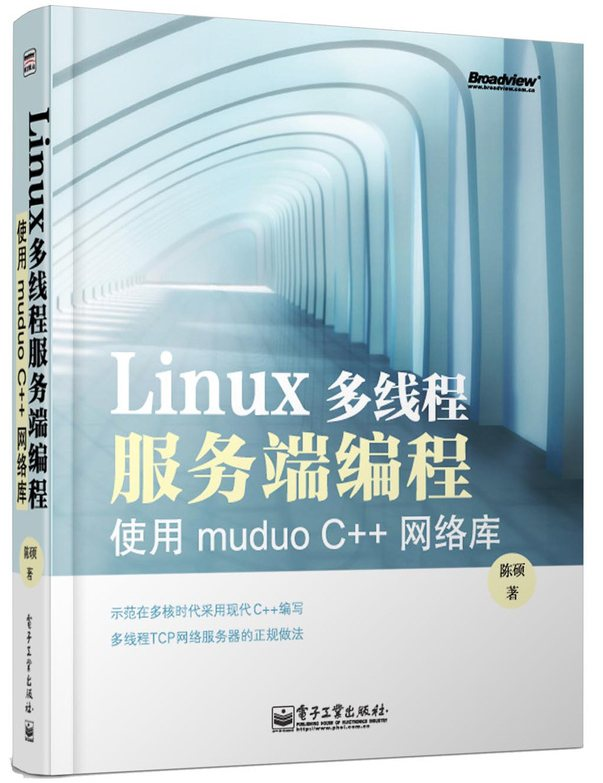

# 准备工作

Ubuntu 安装boost 库 编译

```
git clone --recursive https://github.com/boostorg/boost.git
cd boost
git checkout develop # or whatever branch you want to use
./bootstrap.sh
./b2 headers

yum install cmake3


```


代码 https://github.com/boostorg/thread

#  第一章  智能指针

### 关于std::shared_ptr的思考与探究

- 感受：看到里面很多代码，头炸了，花再多时间看看不出所以然来。!!

- 这说明 你思路不正确，你思路不清醒，更不是看多少次能解决的。

​     不是你不耐心，不是一行一行看!

- 前提条件：阅读c++沉思录 看三遍，


代码位置

~~~c++
\boost\serialization\detail\shared_ptr_nmt_132.hpp
https://www.boost.org/doc/libs/1_61_0/libs/smart_ptr/shared_ptr.htm
https://en.cppreference.com/w/cpp/memory/shared_ptr
https://gcc.gnu.org/onlinedocs/gcc-7.5.0/libstdc++/api/a15815_source.html
~~~


shared_ptr 成员：

~~~c++
private:
element_type * px;                 // contained pointer
boost::detail::shared_count pn;    // reference counter

class shared_count
{
private:
    sp_counted_base * pi_;
    friend class weak_count;
}  
 sp_counted_base:
 int use_count_;        // #shared
 int weak_count_;       // #weak + (#shared != 0)
~~~


shared_ptr 接口

~~~c++
 long use_count() const 
 {
        return pn.use_count();
 }
void swap(shared_ptr< T > & other)  // never throws
 {
        std::swap(px, other.px);
        std::swap(pn, other.pn);
 }

~~~


使用

~~~c++
class example
{
public:
  example();
  void do_something();
private:
  class implementation;
  boost::shared_ptr< implementation > _imp; // hide implementation details
};
~~~


这就是归纳总结。清晰了吧 结束。

阅读c++沉思录 看三遍是基础。

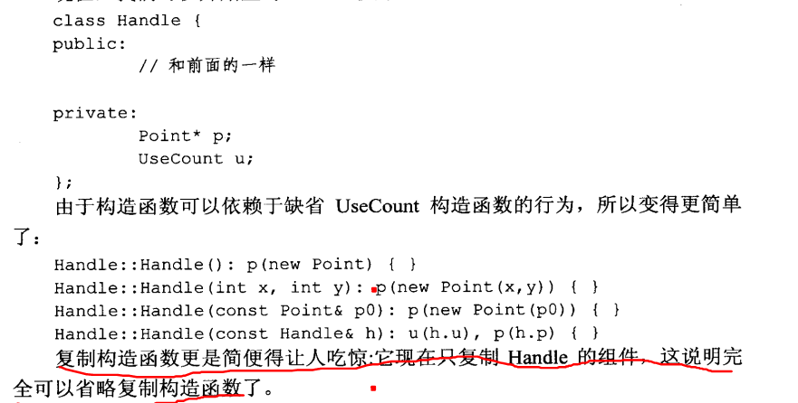


今日得到

1. shared_ptr采用引用计数方式管理裸指针，如果裸指针自己执行delete,在托管给其他shared_ptr原来shared_ptr根本不清楚。计数无效。一旦开始对资源对象使用shared_ptr，就必须一直使用。

   避免方式  std::make_shared 避免裸指针外泄。enable_shared_from_this 来使一个类能获取自身的 shared_ptr

2. .shared_ptr管理资源如果是数组，或者构造函数priate的类等，默认delete free方式无效。

   需要自定义Deleter

   需要 void reset( Y* ptr, Deleter d );
   
   ​       std::shared_ptr<int> p(new int[10],[](int *p){delete[] p;});
   
3. shared_ptr自己不销毁，导致管理资源不销毁，可weak_ptr代替监控对象的存活。

4. 用weak_ptr避免循环引用问题。

   std::weak_ptr申明一个智能对象用来观察原有指针


### 使用shared_ptr现场翻车

~~~c++
class Test {
public:
    std::shared_ptr<Test> getShared() {
        return std::shared_ptr<Test>(this);
    }
    void print()
    {
        cout<<"I am a test"<<endl;
    }
   ~Test()
    {
       cout<<" ~Test()"<<endl;
    }
};
//资源对象对与自己对应的引用计数一无所知
//多个管家 管理同一裸指针
void test_core_1()
{
    Test *ptr = new Test;
    {
        std::shared_ptr<Test> p2(ptr); 
    }
    if(ptr !=NULL)
    {
      ptr->print(); //ok 
      delete ptr; //core
    }
}
void test_core_2()
{
   std::shared_ptr<Test> p1(new Test);  // 1
   std::shared_ptr<Test> p2(p1);  // 2 OK  
   
   Test* p3 = p1.get();  
   std::shared_ptr<Test> p4(p3);  // 1  ERROR  
                                //    CRASH  
}
//多个管家 管理同一裸指针
void  test_core_3()
{
    std::shared_ptr<Test> pa = std::make_shared<Test>();
    std::shared_ptr<Test> pbad = pa->getShared();
    //core double free 
    
}
shared_ptr<int> sp(new int[10]); //翻车
//
std::shared_ptr<int> sp( new int[10], array_deleter<int>() );
std::shared_ptr<int> sp( new int[10], []( int *p ) { delete[] p; } );


class ClassB;

class ClassA {
public:
    ClassA() { cout << "ClassA Constructor..." << endl; }
    ~ClassA() { cout << "ClassA Destructor..." << endl; }
    weak_ptr<ClassB> pb;
};

class ClassB {
public:
    ClassB() { cout << "ClassB Constructor..." << endl; }
    ~ClassB() { cout << "ClassB Destructor..." << endl; }
    weak_ptr<ClassA> pa;
};

void fun() {
    shared_ptr<ClassA> spa = make_shared<ClassA>(); // ClassA 1
    shared_ptr<ClassB> spb = make_shared<ClassB>();//ClassB  1
    spa->pb = spb;//ClassA 2
    spb->pa = spa;//ClassB 2
    
}
//end  ClassA 1  /ClassB  1
int main() {
    fun();
    cout << "Will exit main function.\n";
    return 0;
}	
~~~


## 观察者模式

~~~c++
int main()
{
  Foo* p = new Foo;
  Observable subject;
  p->observe(&subject);
  subject.notifyObservers();
  delete p;
  //subject 不知道 p已经删除了。
  subject.notifyObservers();
}
int main()
{
  Observable subject;
  {
    boost::shared_ptr<Foo> p(new Foo);
    p->observe(&subject);
    subject.notifyObservers();
  } 
  //没有通知subject p已经消失
  subject.notifyObservers();
}

 element_type * px;                 // contained pointer
 boost::detail::shared_count pn;    // reference counter

sp_counted_base
{
private:

    sp_counted_base( sp_counted_base const & );
    sp_counted_base & operator= ( sp_counted_base const & );

    int use_count_;        // #shared
    int weak_count_;       // #weak + (#shared != 0)

~~~

# 第 3 章 函数对象


# Boost C++ 库


http://zh.highscore.de/cpp/boost/

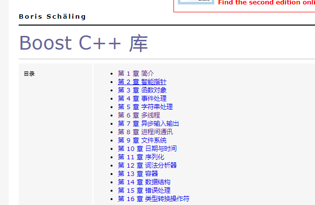


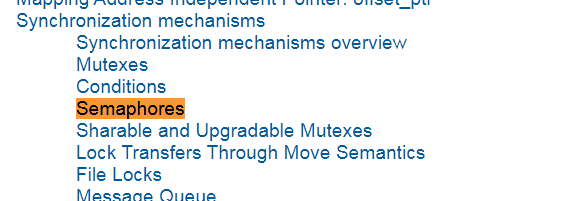


# Linux 多线程服务端编程：使用 muduo C++ 网络库

http://chenshuo.com/book/


## 第三章 多线程服务器的场合与常见的编程


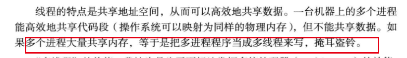

- 状态机编程

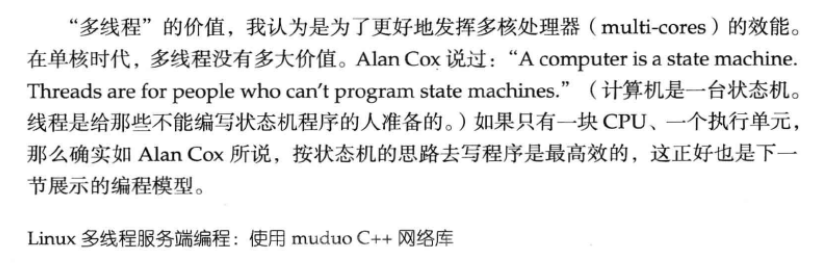


- 单线程

  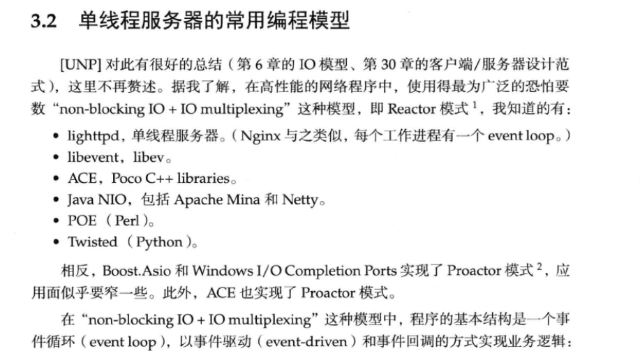

- 连接 读写 和处理 开启几个线程

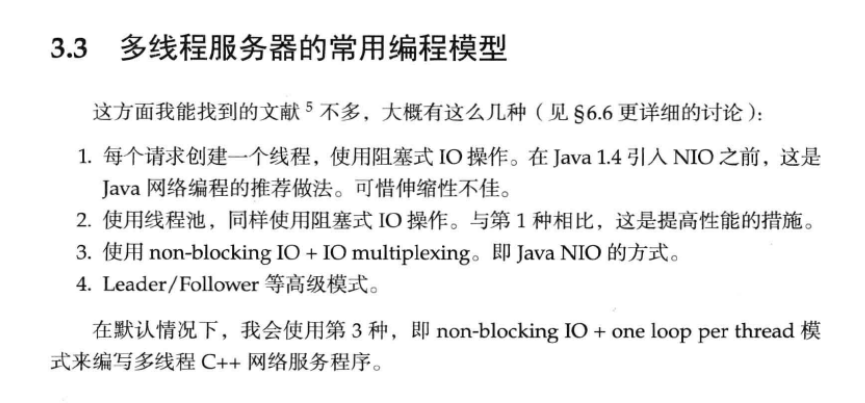

- 计算 和IO

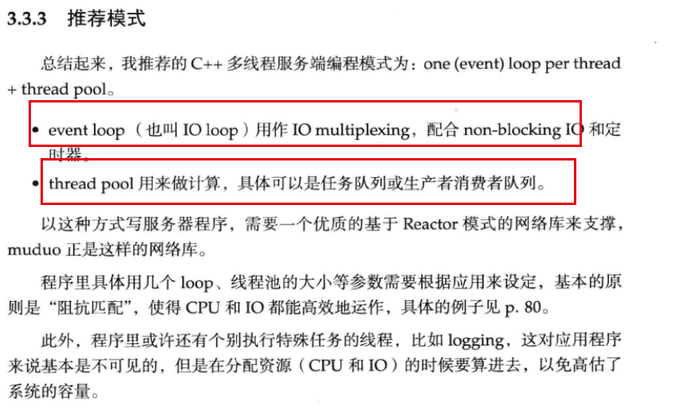


- TCP只进程通信的首选

  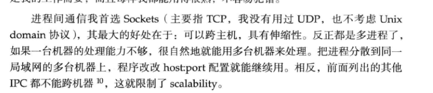

- tcp长连接通信

  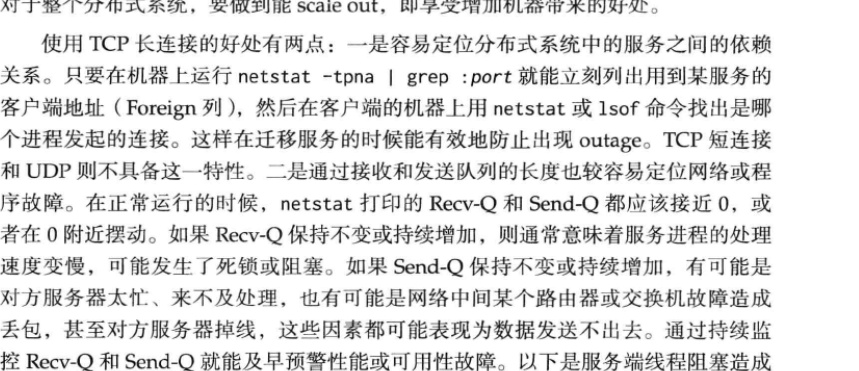


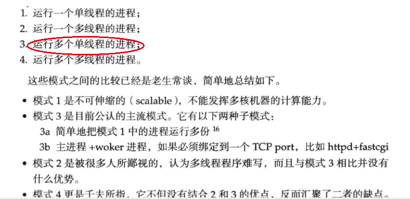


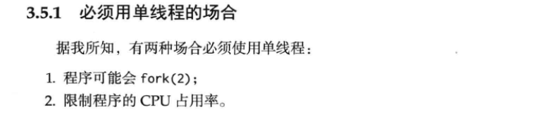

- 比可替换

  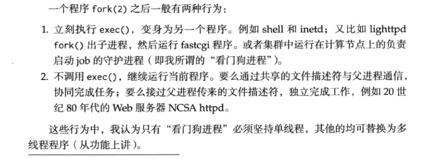

- 增加cpu 无法提交io处理

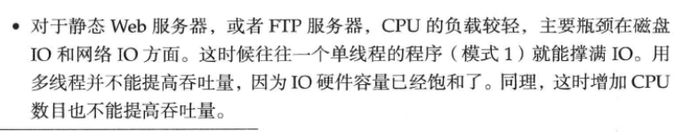

-异步


- 一个服务器一般有多少个线程 

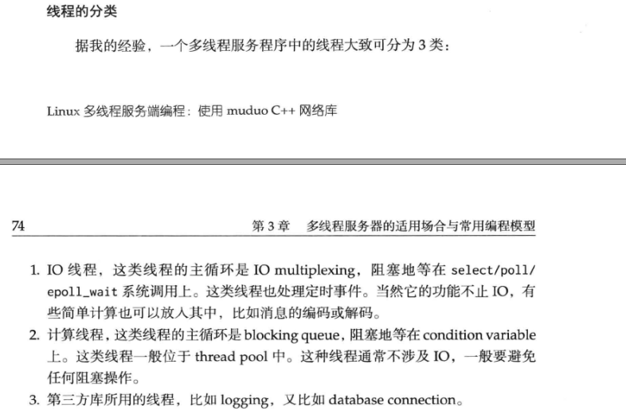

- 用户响应时间

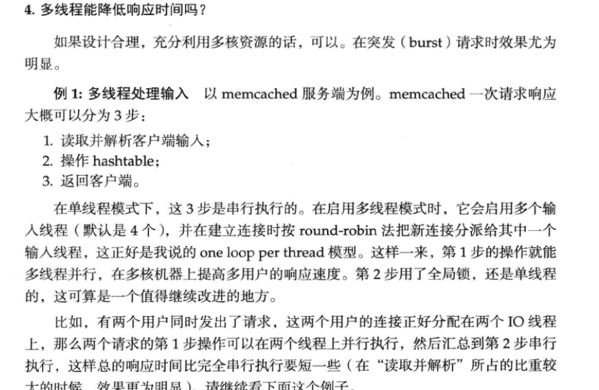

