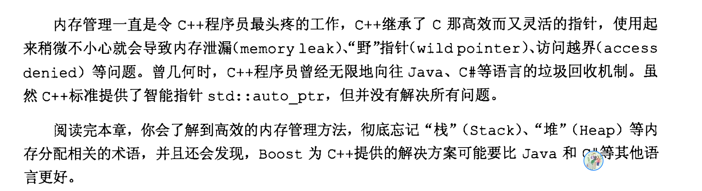
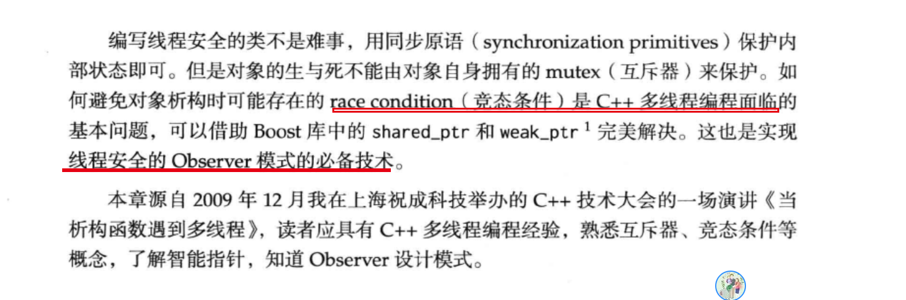
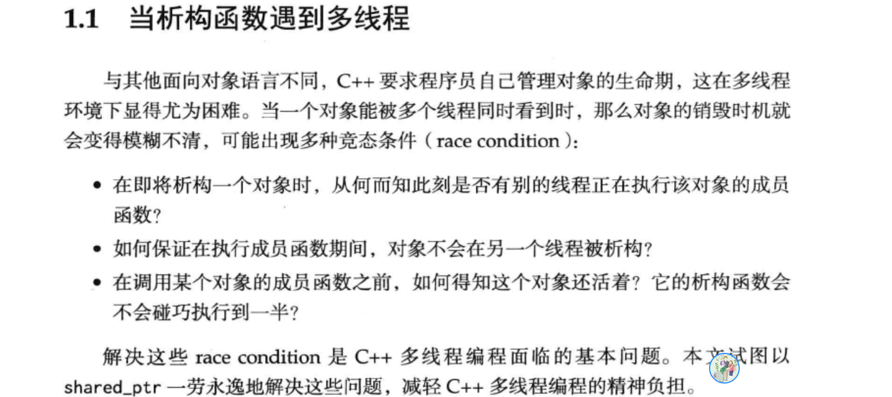
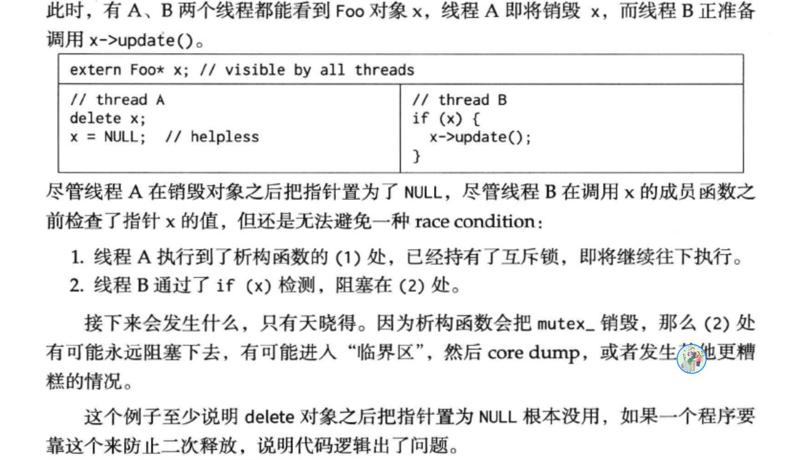

## 配合一切阅读

https://github.com/chenshuo/documents

# Linux 多线程服务端编程：使用 muduo C++ 网络库


## day1 

Ubuntu 安装boost 库 编译

```
git clone --recursive https://github.com/boostorg/boost.git
cd boost
git checkout develop # or whatever branch you want to use
./bootstrap.sh
./b2 headers

yum install cmake3
```


 ## TO_DO

### 内存管理 76page











- shared_ptr.hpp


