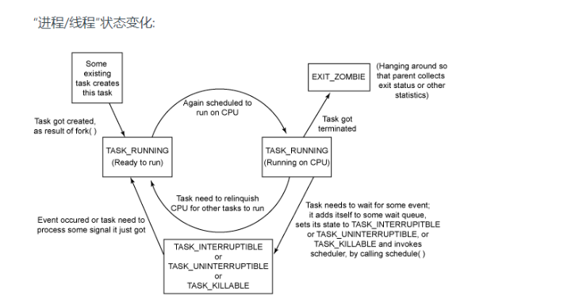
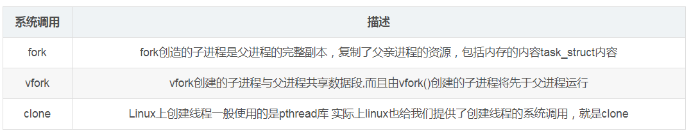
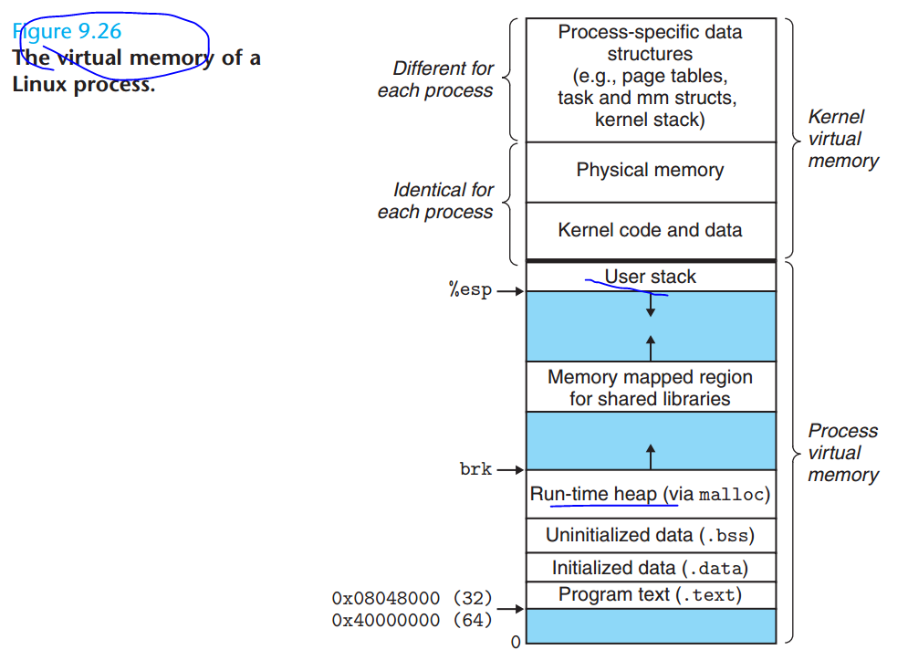
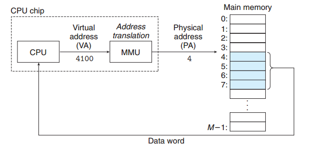
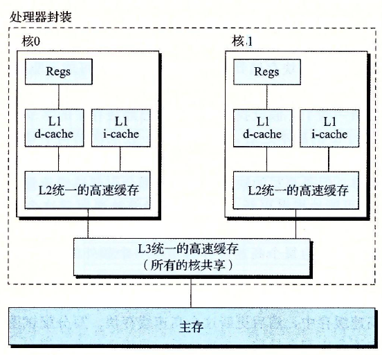
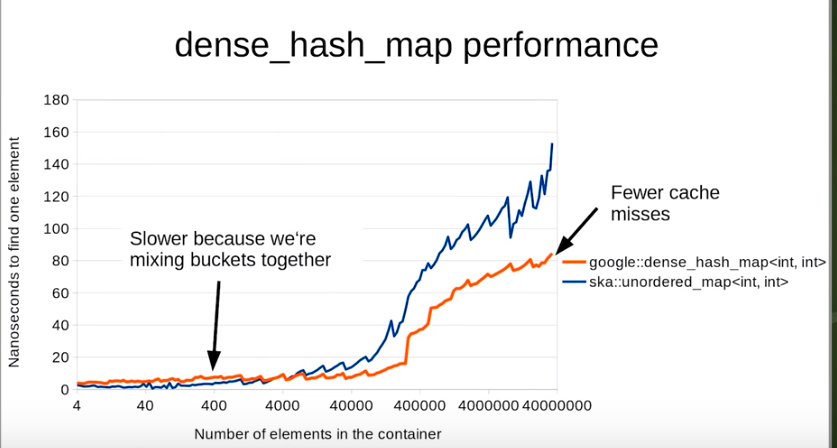
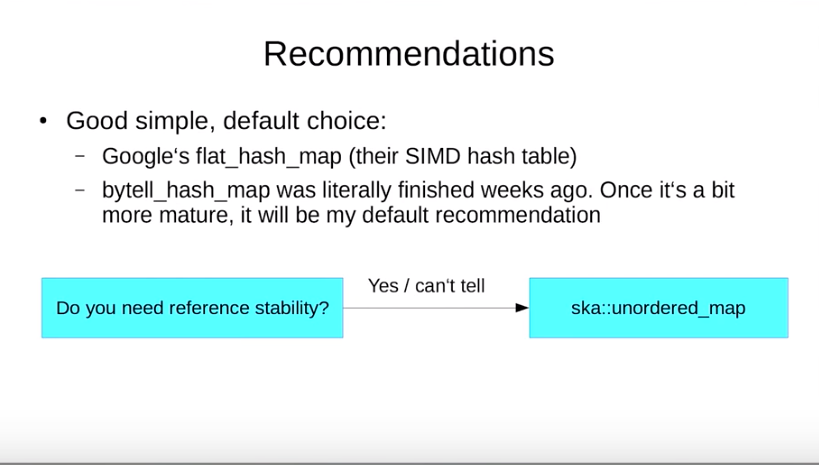
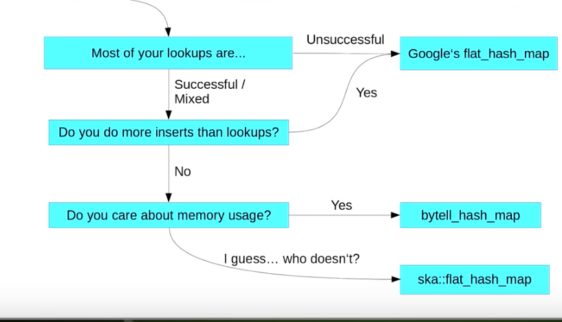
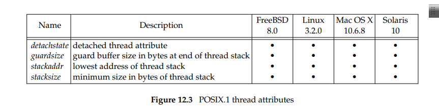

# 第一天 进程和线程的区别

###  缘起


修正：这面简单问题-->这么简单的问题。

###  分析

#### 结论：

进程和线程的主要区别应该是在**创建的时候** **线程** **需要共享了（父子）进程的资源  ，初次之外 应该是一样的**。

在liunx系统中 没有进程和线程的区别 统称 “task” 进程标志（task_struct） 进行统一描述


#### 继续分析：


严格意义上讲, 并没有进程,线程的区别

Linus Torvalds 增加在邮件说写到

> Both threads and processes are really just one thing: a "context of
> execution". Trying to artificially distinguish different cases is just
> self-limiting. 
>
> A "context of execution", hereby called COE, is just the conglomerate of 
> all the state of that COE. That state includes things like CPU state 
> (registers etc), MMU state (page mappings), permission state (uid, gid) 
> and various "communication states" (open files, signal handlers etc).

COE :执行上下文

一个进程所包含的资源(或者称之为状态)有, 

- CPU状态(比如寄存器), 

- 内存状态(Memory management unit, 内存映射),

-  权限状态(用户是谁, 在哪个组里), 

- 以及一些其他的可通信的状态, 比如打开的文件, 接受的信号等.


1. 进程：
   - CPU state: registers etc   （1）
   - MMU state: page mappings，记录当前进程的虚拟内存地址到物理内存地址的映射的信息。 （2）
   - permission state: uid, gid （3）
   - various “communication states”: open files, signal handlers etc （4）
2. 线程：
   - CPU state: registers
   - - possibly some other minial state
   - all others: shared from process（共享的范围 什么？  2  3  4 ）


可以看到，进程和线程都是'COE', ( *stay at a high level discussion.*) 

线程和进程的有各自的 CPU state （栈抽象成cpu） ------不相同 



线程：

MMU state，permission stat， various “communication states是共享进程的。---相同


**截止到目前 你看到进程和线程还是有区别的，线程共享资源，进程不共享资源 这不是区别吗？**


a light-weight process (LWP) 

Linux下内核其实本质上没有线程的概念, Linux下线程其实上是与其他进程共享某些资源的进程而已。但是我们习惯上还是称他们为线程或者轻量级进程 线程是进程的子集 


>The way Linux thinks about this (and the way I want things to work) is that
>there _is_ no such thing as a "process" or a "thread". There is only the
>totality of the COE (called "task" by Linux). 
>
>Different COE's can share parts
>of their context with each other, and one _subset_ of that sharing is the
>traditional "thread"/"process" setup, but that should really be seen as ONLY
>a subset (it's an important subset, but that importance comes not from
>design, but from standards: we obviusly want to run standards-conforming
>threads programs on top of Linux too). 
>
>Linux思考这个问题的方式(以及我希望工作的方式)是这样的
>
>没有所谓的“进程”或“线程”。只有
>
>COE的总体(Linux称为“任务”)。不同的COE可以共享部件
>
>它们之间的上下文，而共享的一个_subset_是
>
>传统的“线程”/“进程”设置，但实际上应该只将其视为
>
>一个子集(它是一个重要的子集，但是这个重要性不是来自它
>
>设计，但从标准:我们显然希望运行符合标准的
>
>线程程序也在Linux之上)。

#### 继续分析   clone函数

#### 进程和线程的创建



进程的创建的 而fork（）本身是由clone（）实现的

> clone(SIGCHLD,0);


线程创建：pthread_create-->clone

> clone(CLONE_VM|CLONE_FS|CLONE_FILES|CLONE_SIGHAND,0);

用strace 跟踪pthread_create创建过程：

> clone(child_stack=0x7fd4174b8ff0, flags=CLONE_VM|CLONE_FS|CLONE_FILES|CLONE_SIGHAND|CLONE_THREAD|CLONE_SYSVSEM|CLONE_SETTLS|CLONE_PARENT_SETTID|CLONE_CHILD_CLEARTID, parent_tidptr=0x7fd4174b99d0, tls=0x7fd4174b9700, child_tidptr=0x7fd4174b99d0) = 16477


clone参数的对应作用如下： 
CLONE_VM：父子进程共享地址空间 

CLONE_FS：父子进程共享文件系统信息 
CLONE_FILES：父子进程共享打开的文件 
CLONE_SIGHAND：父子进程共享信号处理函数及被阻断的信号


- 进程：可以共享，也可以不共享（have or  not have ）

- 线程共享了父子进程之间的各种资源 a light-weight process (LWP) （must）


#### 塔山：

-  http://man7.org/linux/man-pages/man2/clone.2.html
- http://lkml.iu.edu/hypermail/linux/kernel/9608/0191.html
- Linux进程线程源码浅析
- Linux 中的各种栈：进程栈 线程栈 内核栈 中断栈


#### 作业：协程呢 （从COE 程序运行空间角度分析）? 


 协程，又称微线程，纤程。英文名Coroutine

> A coroutine is a **function** that can **suspend** its execution (yield) until the given given **Yield Instruction** finishes.


协程：

- CPU state: registers etc   （各自的寄存器 ！！！！）
- MMU state: page mappings，（共享线程）
- permission state: uid, gid （不需要，属于应用层，系统不知道）
- various “communication states”: open files, signal handlers etc （共享线程）

【待处理 有点难】

Protothreads：[一个“蝇量级” C 语言协程库](http://coolshell.cn/articles/10975.html)
libco:[来自腾讯的开源协程库libco介绍](http://www.cnblogs.com/bangerlee/p/4003160.html)，[官网](http://code.tencent.com/libco.html)
coroutine:[云风的一个C语言同步协程库](https://github.com/cloudwu/coroutine/),[详细信息](http://blog.codingnow.com/2012/07/c_coroutine.html)

目前看到大概有四种实现协程的方式：

· 第一种：利用glibc 的 ucontext组件(云风的库)

· 第二种：使用汇编代码来切换上下文([实现c协程](http://www.cnblogs.com/sniperHW/archive/2012/06/19/2554574.html))

· 第三种：利用C语言语法switch-case的奇淫技巧来实现（Protothreads)

· 第四种：利用了 C 语言的 setjmp 和 longjmp（ [一种协程的 C/C++ 实现](http://www.cnblogs.com/Pony279/p/3903048.html),要求函数里面使用 static local 的变量来保存协程内部的数据）


塔山

- C++协程(1):协程原理及实现方式概述
- 浅谈我对协程的理解
- 源漫画：什么是协程？[程序员小灰](https://mp.weixin.qq.com/s/57IERpGIlvRwYCh6vSbMDA) 写的


#### 扩展阅读： 整天说堆栈，堆栈是啥意思


- 堆栈都是虚拟地址



- 虚拟地址都会缺页



- 多核下多进程多线程



塔山

- 9.7 深入理解计算机系统：Case Study: The Intel Core i7/Linux Memory System （正在学习中）
- Understanding the Java Memory Model （正在学习中）


# 第二天	


#### 1 随着数据量的增多
- 更快的查找速度 ：std::hash_map>std::map
- 更快的插入和删除速度：std::map>std::hash_map
- 更少的存储空间：std::map >std::hash_map

#### 2 测试查找


>一般 在少量数据情况下 map查找耗时最小，随着数据的增加，map的查找耗时
>急剧上升（这里说的一般情况 还有其他因素）
>[图片上传失败...(image-ac5c82-1547435643829)]

 ###3 测试 插入和删除操作
 hash_map（10万） map（10万） hash_map（20万） map（20万） hash_map（30万） map（30万） 
添加：   93 （少)    47 |  156   94(少)  | 203   172（map 少）
删除： 8422   32（map 少） | 33765   63 (map 少)| 76016   78（map 少）

>map在频繁的删除和插入方面 耗时更少。


STL map , nginx，linux 虚拟内存管理，他们都有红黑树的应用. 当你对搜索的效率要求较高，并且数据经常改动的情景，你可以用红黑树, 也就是 map.

https://github.com/PeterRK/DSGO/blob/master/book/pages/08-A.md

## 3. 优化空间

- map 插入的后是有序数据，需要重载  bool operator < (const Foo & cmp) const 操作
- hash函数和空间的利用（这个是重点！！）


谷歌的google:dense_hash_map耗时更少




## 4. 什么时候用map，什么时候用hash_map?
分析角度 查找（命中 还是不命中）  插入 和存储空间 这三个方面






> When to choose unordered_map instead of map

- When you have good hasher and no memory limitation

>When to choose map instead of unordered_map
- When you need Low Memory:


- When you need guaranted Performance
    std::unordered_map  complexity O(1) ~~O(n) i
       std::map because it will give you guaranteed O(log N).


## 5 塔山
- https://blog.csdn.net/a418382926/article/details/22302907

-  https://www.youtube.com/watch?v=fHNmRkzxHWs
-  


扩展阅读：

 **majflt代表major fault，中文名叫大错误（物理地址到磁盘），minflt代表minor fault，中文名叫小错误(  虚拟地址-物理地址)**


> 


- 看1个文章 关于linux进程间的close-on-exec机制

https://unix.stackexchange.com/questions/248408/file-descriptors-across-exec

O_CLOEXEC 

FD_CLOEXEC

，一般我们会调用exec执行另一个程序，此时会用全新的程序替换子进程的正文，数据，堆和栈等。此时保存文件描述符的变量当然也不存在了，我们就无法关闭无用的文件描述符了。所以通常我们会fork子进程后在子进程中直接执行close关掉无用的文件描述符，然后再执行exec


rk子进程中执行exec的时候，会清理掉父进程创建的socket。

```javascript
#ifdef WIN32
	SOCKET ss = ::socket(PF_INET, SOCK_STREAM, 0);
#else
	SOCKET ss = ::socket(PF_INET, SOCK_STREAM | SOCK_CLOEXEC, 0);
#endif

在 fork 子进程中执行 exec 的时候，会清理掉父进程创建的 socket。

```

 当然，其他的文件描述符也有类似的功能，例如文件，可以在打开的时候使用O_CLOEXEC标识（linux 2.6.23才开始支持此标记），达到和上面一样的效果。或者使用系统的fcntl函数设置FD_CLOEXEC即可。

```javascript
//方案A
int fd = open(“foo.txt”,O_RDONLY);
int flags = fcntl(fd, F_GETFD);
flags |= FD_CLOEXEC;
fcntl(fd, F_SETFD, flags);
//方案B，linux 2.6.23后支持
int fd = open(“foo.txt”,O_RDONLY | O_CLOEXEC);
```

这个句柄我在fork子进程后执行exec时就关闭”。其实时有这样的方法的：即所谓 的 close-on-exec。


# [what is the purpose to set SOCK_CLOEXEC flag with accept4() same as O_CLOEXEC](https://stackoverflow.com/questions/22304631/what-is-the-purpose-to-set-sock-cloexec-flag-with-accept4-same-as-o-cloexec)


*SOCK_CLOEXEC* : 为新打开的文件描述符设置 FD_CLOEXEC 标志位，该标志位的作用是在进程使用 fork() 加上 execve() 的时候自动关闭打开的


- 看2个文章：[Share a file descriptor between parent and child after fork and exec](https://stackoverflow.com/questions/21512334/share-a-file-descriptor-between-parent-and-child-after-fork-and-exec)

记录：

通过fork 传递文件描述符

```
File descriptors are always passed between a parent and child process
```

# 2  线程


A thread’s underlying storage can be reclaimed immediately on
termination if the thread has been detached.   


# 第10章信号


### 缘起

 background process vs background process


 

- background process interrupts

  


# 摘要

## 内存


slab是Linux操作系统的一种内存分配机制。其工作是针对一些经常分配并释放的对象，如进程描述符等，这些对象的大小一般比较小，如果直接采用伙伴系统来进行分配和释放，不仅会造成大量的内存碎片，而且处理速度也太慢。
而slab分配器是基于对象进行管理的，**相同类型的对象归为一类** (如进程描述符就是一类)，每当要申请这样一个对象，slab分配器就从一个slab列表中分配一个这样大小的单元出去，而当要释放时，将其重新保存在该列表中，而不是直接返回给伙伴系统，从而避免这些内碎片。slab分配器并不丢弃已分配的对象，而是释放并把它们保存在内存中。当以后又要请求新的对象时，就可以从内存直接获取而不用重复初始化。

Slab机制包括三个层次的数据结构：cache，slab和object

https://wooyun.js.org/drops/深入理解 glibc malloc.html)


#### 内存碎片

- 什么是内存碎片？（占用了被使用，无法再次分配）

- 如何判断内存碎片是否对我的应用程序有问题？什么样的计划最容易受到影响？

  malloc返回null

- 处理内存碎片的常用方法有哪些？

参考

1. 动不动就 32GB 以上内存的服务器真需要关心内存碎片问题吗？


# Chapter 11. Threads


A single thread can exit in three ways, thereby stopping its flow of control, without
terminating the entire process.

1. The thread can simply return from the start routine. The return value is the
   thread’s exit code.

2. The thread can be canceled by another thread in the same process.

   

3. The thread can call pthread_exit.  


### 11.6 Thread Synchronization

Three states are possible with a reader–writer lock: locked in read
mode, locked in write mode, and unlocked  


# Chapter 12. Thread Control

thread synchronization  

12.3 Thread Attributes




https://stackoverflow.com/questions/39319552/what-happens-to-a-detached-thread-inside-a-forked-process-when-the-process-dies


# Chapter 13. Daemon Processes


## SIGHUP

### SIGHUP[[编辑](https://zh.wikipedia.org/w/index.php?title=Unix信号&action=edit&section=7)]

当正操作的终端终了时，将发送 SIGHUP 信号至程序。初始目的待补充翻译 现在操作系统，该信号通常意味着使用的 [虚拟终端](https://zh.wikipedia.org/wiki/虚拟终端) 已经被关闭。许多 [守护进程](https://zh.wikipedia.org/wiki/守护进程) 在接收到该信号时，会重载他们的设置和重新打开 日志文件（logfiles），而不是去退出程序。[nohup](https://zh.wikipedia.org/wiki/Nohup) 命令用于无视该信号。

### SIGHUP信号的作用：

比如修改了 nginx 配置文件，希望不重启 nginx 就让配置生效，可以往 nginx 进程发一个 SIGHUP信号。


### 守护进程为什么要忽略SIGHUP信号？

首先创建一个会话leader进程A，接着用A创建子进程B，然后退出A，之后所有进程从B创建，保证所有以后新创建进程都不是会话 leader进程（这是为了防止终端取得进程控制权而采取的保证措施），但是，由于有一个exit进程A的操作，当A退出时，会对本会话的所有进程发送 SIGHUP信号，默认操作是全部退出，而此时是在创建守护进程过程中，必须防止B收到SIGHUP而退出，否则下面的操作就无法进行，所以这里必须对 SIGHUP进行忽略！

# 从实战出发，谈谈 nginx 信号集

https://linux.cn/article-9141-1.html

| operation  | signal                       |
| :--------- | :--------------------------- |
| reload     | SIGHUP                       |
| reopen     | SIGUSR1                      |
| stop       | SIGTERM                      |
| quit       | SIGQUIT                      |
| hot update | SIGUSR2 & SIGWINCH & SIGQUIT |

master 进程收到 `SIGHUP` 后，会重新进行配置文件解析、共享内存申请，等一系列其他的工作，然后产生一批新的 worker 进程，最后向旧的 worker 进程发送 `SIGQUIT` 对应的消息，最终无缝实现了重启操作

master 进程收到 `SIGHUP` 后，会重新进行配置文件解析、共享内存申请，等一系列其他的工作，然后产生一批新的 worker 进程，最后向旧的 worker 进程发送 `SIGQUIT` 对应的消息，最终无缝实现了重启操作

另外，通过这次的经验教训和对 nginx 信号集的认知，我们认为以下几点是比较重要的：

- 慎用 `nginx -s stop`，尽可能使用 `nginx -s quit`
- 热更新之后，如果确定业务没问题，尽可能让旧的 master 进程退出
- 关键性的信号操作完成后，等待一段时间，避免时间窗口的影响
- 不要直接向 worker 进程发送信号

[http://www.luwenpeng.cn/2018/11/24/nginx%E4%BF%A1%E5%8F%B7%E5%A4%84%E7%90%86%E5%8E%9F%E7%90%86%E5%8F%8A%E5%BA%94%E7%94%A8/](http://www.luwenpeng.cn/2018/11/24/nginx信号处理原理及应用/)

https://www.freebsd.org/doc/zh_CN/books/handbook/basics-daemons.html

http://www.ruanyifeng.com/blog/2016/02/linux-daemon.html